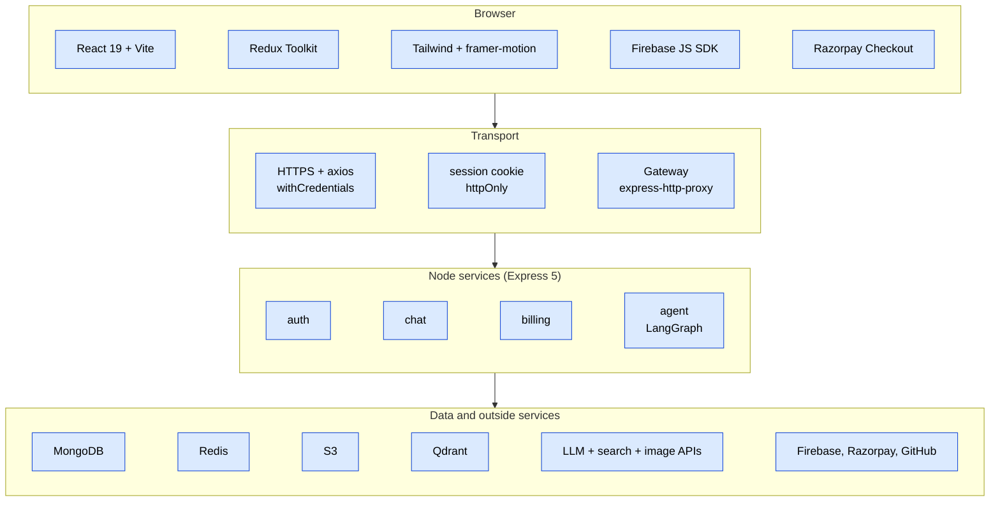

# 01 · Tech stack

**In one line:** a **MERN-style microservice** app (MongoDB, Express 5, React 19, Node.js) with **Redis** for sessions and caching, and a **LangGraph** multi-agent AI engine.

**Outside services:**
- Firebase Auth (Google / GitHub login)
- Razorpay (payments)
- OpenRouter → DeepSeek (the LLM, i.e. large language model, that writes the answers)
- Google Gemini embeddings + Qdrant (search inside PDFs)
- Tavily (web search)
- AWS S3 (generated files)
- Pollinations (image generation)
- GitHub API (repo actions)

> **About the "why":** the repo doesn't write down why each tool was chosen. The reasons below are practical reasoning that **matches how the code uses each tool**. They are not quotes from the author.

---

## The stack in layers

## One user action touches the whole stack

"Make me a PPT about solar energy" with the **PPT** agent selected:

```mermaid
flowchart LR
    A["ChatInput.jsx<br/>FormData + axios"] --> B["Gateway<br/>protect: Redis session"]
    B --> C["Agent service<br/>multer, then LangGraph"]
    C --> D["Redis rate limit<br/>+ auth deduct 10 credits"]
    D --> E["DeepSeek via OpenRouter<br/>writes slide text"]
    E --> F["pptxgenjs builds .pptx<br/>upload to S3"]
    F --> G["Chat service saves<br/>both messages in Mongo"]
    G --> H["React renders markdown<br/>with a presigned link"]

    classDef fn fill:#dcfce7,stroke:#15803d,color:#000
    class A,B,C,D,E,F,G,H fn
```

---

## Backend tools

### Node.js + Express 5 (all 5 services)

**What it does here:** every service is a small Express app (`express()` → `express.json()` → router → `app.listen`). Examples: [auth index.js](../backend/services/auth/index.js), [chat index.js](../backend/services/chat/index.js). All services use **ES modules** (`"type": "module"`) and Express **5.2.1**.

**Why it fits:**
- The work is mostly I/O: waiting on MongoDB, Redis, LLM APIs and S3. Node's event loop handles many waits cheaply.
- The same language (JavaScript) runs in the frontend and backend, so one person can own both.
- Express 5 forwards a rejected promise from an `async` handler to the error middleware on its own. The agent controller also calls `next(error)` explicitly, and its global error handler then turns `err.status` / `err.data` into the reply.

| Alternative | Why not used here |
|---|---|
| Fastify | Faster and has schema validation built in, but a smaller ecosystem. The proxy library used here is written for Express. |
| NestJS | Heavy structure (modules, DI). Too much for 5 tiny services. |
| Python FastAPI | Great AI ecosystem, but then the frontend team and backend team speak different languages. LangGraph also exists for JS, so there was no need. |
| Go | Fast, but the LangChain / LangGraph JS libraries would be lost. |

**Trade-off:** Express gives no structure or validation by default, and this project has none (see [S8](08-known-issues-and-improvements.md#s8)).

### express-http-proxy (gateway)

**What it does here:** turns the gateway into a **reverse proxy** (a server that forwards requests to other servers and sends their replies back). See [gateway index.js:60-73](../backend/gateway/index.js#L60-L73) and [proxyWithHeaders.js](../backend/gateway/utils/proxyWithHeaders.js). It uses `parseReqBody: false`, so the body (JSON or multipart file upload) streams through untouched. `proxyReqOptDecorator` adds the `x-user-id`, `x-user-email`, `x-user-avatar` and `x-github-token` headers.

**Why it fits:** one line per service. Easy to add headers. Git history shows `parseReqBody: false` fixed the multipart "boundary corruption" bug (commit `94e17d9`).

| Alternative | Why not used here |
|---|---|
| http-proxy-middleware | Installed but unused. It is equally good (and supports WebSockets). One was picked. |
| Nginx / Traefik / Kong | A real API gateway with rate limits and auth plugins, but one more thing to deploy on a free host. |
| No gateway (frontend calls each service) | 5 origins, 5 CORS configs, and auth logic in every service. |

**Trade-off:** the default path handling strips the mount prefix. That broke `/api/chat/shared` ([F5](08-known-issues-and-improvements.md#f5)).

### cors, helmet, morgan, cookie-parser (gateway; helmet and morgan also in billing)

| Package | What it does here | Why it fits |
|---|---|---|
| `cors` | Allows the React origin (`CLIENT_URL` and `http://localhost:5173`) with `credentials: true`, so the browser sends the cookie ([index.js:27-30](../backend/gateway/index.js#L27-L30)). | The frontend and gateway are on different domains, and the cookie must travel. |
| `helmet` | Sets safe HTTP headers (no-sniff, frame options, etc.). | One line of basic hardening. |
| `morgan("dev")` | Logs each request line. | Easy debugging on Render logs. |
| `cookie-parser` | Fills `req.cookies` so `protect` can read `session`. | Required for cookie sessions. It's also in auth's `package.json` but never used there ([S6](08-known-issues-and-improvements.md#s6)). |

| Alternative | Why not used here |
|---|---|
| Hand-written header / log code | More code for the same result. |
| pino / winston instead of morgan | Structured JSON logs are better in production, but more setup. |

### Redis + ioredis (shared client)

**What it does here:** one client in [shared/redis/redis.js](../backend/shared/redis/redis.js), used for four things:

| Key | Holds | TTL |
|---|---|---|
| `session:<id>` | The session JSON (user info, plan, credits) | 7 days |
| `user-session:<userId>` | The newest session ID for that user | 7 days |
| `rate:<agent>:<userId>` | Per-minute request counter | 60 s |
| `conversation:<id>` | The last 20 chat messages (LLM memory) | 24 h |

Locally it runs with [docker-compose.yml](../backend/docker-compose.yml). In production it comes from `REDIS_URL`.

**Why it fits:** it's in memory (sub-millisecond reads), so checking a session on **every** request is cheap. It has TTLs built in (sessions and rate windows clean themselves up), and atomic `INCR` for counters.

| Alternative | Why not used here |
|---|---|
| JWT (no server store) | No lookup per request, but you can't revoke a JWT at logout, and the credits inside it would go stale. |
| Store sessions in MongoDB | Slower on the hot path, and needs a TTL index. |
| In-process memory (express-session MemoryStore) | Lost on restart, and not shared by the 5 processes. |
| Memcached | No TTL-per-key data structures like lists / sets, and not as common. |

**Trade-off:** if Redis is down, every protected request fails with 500.

### MongoDB + Mongoose

**What it does here:** stores Users (auth), Conversations / Messages / SharedArtifacts (chat), and Payments (billing). See [03-database-models.md](03-database-models.md). Auth uses Mongoose **8.24**; chat, billing and agent use **9.7**.

**Why it fits:**
- Chat messages have nested, changing shapes (`artifacts[].files[]`). A document database stores them as they are.
- Easy free hosting.
- Mongoose gives schemas, defaults, `enum` and `timestamps`.

| Alternative | Why not used here |
|---|---|
| PostgreSQL | Transactions and foreign keys would help billing (atomic credit + payment update), but nested artifacts would need JSONB or extra tables. |
| Firestore | Already using Firebase, but queries are limited and costs grow with reads. |
| DynamoDB | Harder to model and query ad hoc. |

**Trade-off:** there are no cross-service transactions, and no indexes were added ([Q5](08-known-issues-and-improvements.md#q5)).

### Firebase Auth (firebase-admin on the server, firebase JS SDK in the browser)

**What it does here:** the browser runs `signInWithPopup` with Google or GitHub ([Home.jsx](../frontend/src/pages/Home.jsx)). The server checks the ID token with `getAuth(app).verifyIdToken` ([auth.controllers.js:27-29](../backend/services/auth/controllers/auth.controllers.js#L27-L29)). Admin credentials come from 3 env variables ([firebase.js](../backend/services/auth/config/firebase.js)). For GitHub, the popup also gives an OAuth **access token**, and the GitHub agent uses it.

**Why it fits:**
- No passwords to store or reset.
- Google and GitHub login in a few lines.
- The same GitHub login gives the repo token.

| Alternative | Why not used here |
|---|---|
| Passport.js + own OAuth | More code, and you handle the OAuth redirects yourself. |
| Auth0 / Clerk | A polished hosted product, but paid tiers and one more vendor. |
| Email + bcrypt passwords | Password storage, reset emails and brute-force protection all become your job. |

### Razorpay (razorpay SDK + Checkout script)

**What it does here:** `orders.create` in [billing.controller.js](../backend/services/billing/controllers/billing.controller.js#L33-L38) (amount in **paise**). Checkout pops up in the browser ([BillingDrawer.jsx](../frontend/src/components/BillingDrawer.jsx)). The server checks the HMAC-SHA256 signature of `order_id|payment_id`.

**Why it fits:** the product sells in INR (₹199 / ₹499 plans). UPI, cards and netbanking come built in, and the test mode is simple.

| Alternative | Why not used here |
|---|---|
| Stripe | Strong API and webhooks, but Indian account onboarding and UPI support are more limited for small Indian sellers. |
| PayU / Cashfree | Similar. Razorpay has the most common docs for Node. |
| Paddle / Lemon Squeezy | Merchant-of-record products, better for global SaaS than an INR app. |

**Trade-off:** no webhook is set up, so crediting depends on the browser ([S12](08-known-issues-and-improvements.md#s12)).

### axios (billing and agent, service-to-service calls; also the frontend)

**What it does here:**
- billing → auth `/internal/update-plan`
- agent → auth `/internal/deduct-credits`
- agent → chat `/save-message` and `/get-messages`
- image agent → Pollinations

**Why it fits:** you get JSON parsing, and error objects that carry `error.response.status`, which [deductCredits.js](../backend/services/agent/utils/deductCredits.js) uses.

| Alternative | Why not used here |
|---|---|
| Built-in `fetch` (Node 18+) | Would work, but no response status is thrown on 4xx, so there's more manual code. |
| gRPC | Faster, typed contracts, but heavy for 3 internal calls. |
| A message queue (RabbitMQ / BullMQ) | Better for "update plan after payment" (retries), but more infrastructure. |

### multer (agent)

**What it does here:** parses `multipart/form-data` (a form with a file) for `POST /chat`. It saves to `./temp`, allows only PDF / image / CSV, and caps files at 20 MB ([multer.js](../backend/services/agent/config/multer.js)).

**Why it fits:** it's the standard Express upload middleware and puts the file on `req.file`.

| Alternative | Why not used here |
|---|---|
| busboy directly | Lower level. Multer is built on it. |
| Direct-to-S3 presigned upload | Would avoid streaming big files through the gateway, but it's more steps for the client. |
| `memoryStorage` | No temp files to clean up ([F14](08-known-issues-and-improvements.md#f14)), but big files use RAM. |

### LangGraph + LangChain core (agent)

**What it does here:** a `StateGraph` with a **router** node, 10 agent nodes and a **planner** node. They are joined by conditional edges ([supervisor.graph.js](../backend/services/agent/graph/supervisor.graph.js)). `@langchain/core` supplies the `SystemMessage` / `HumanMessage` / `AIMessage` types. Full details: [05-agent-engine.md](05-agent-engine.md).

**Why it fits:** the project needs **branching** (pick an agent) and **loops** (Auto-Pilot: planner → router → agent → planner). A graph with shared state models this directly. The `recursionLimit` stops endless loops.

| Alternative | Why not used here |
|---|---|
| Plain `if/switch` + `while` loop | Works for today's code, but you lose the state model and the visual graph. |
| LangChain agents / tools (single agent) | One LLM picking tools is harder to control and to price per tool. |
| CrewAI / AutoGen | Python-first. |
| OpenAI Assistants API | Vendor lock-in, and the code switches providers often (the git log shows Groq → Gemini → OpenRouter). |

### LLM: DeepSeek via OpenRouter (`@langchain/openrouter`)

**What it does here:** one `ChatOpenRouter({ model: "deepseek/deepseek-chat", temperature: 0, maxTokens: 2500 })`, used by **every** agent ([model.js](../backend/services/agent/utils/model.js)). The key comes from `OPENROUTER_API_KEY`, which the library reads by itself.

**Why it fits:** OpenRouter is one API for many models, so switching models is a one-line change. Commit `1739a2c` says DeepSeek was "the only one working" after Groq and Gemini had problems. It's cheap per token.

| Alternative | Why not used here |
|---|---|
| Direct Gemini (`@google/genai`, installed) | Earlier commits used it. It was dropped after model-name / quota issues. |
| Groq (`@langchain/groq`, installed) | Very fast, but models got restricted (see the commits). |
| OpenAI GPT-4o | Strong vision and tool calling, but it costs more. |

**Trade-off:** one text-only model for everything, including **vision** ([F16](08-known-issues-and-improvements.md#f16)).

### Embeddings + vector DB: Gemini `gemini-embedding-001` + Qdrant (`@langchain/google-genai`, `@langchain/qdrant`, `@langchain/textsplitters`, `pdf-parse`)

**What it does here:** this is **RAG** (retrieval-augmented generation: find the relevant pieces of a document first, then give only those to the LLM). The flow in [pdfRag.agent.js](../backend/services/agent/agents/pdfRag.agent.js):
1. `pdf-parse` pulls out the text.
2. It's split into 1000-character chunks with 200 overlap.
3. Each chunk becomes an **embedding** (a list of numbers that captures meaning).
4. They're stored in a fresh Qdrant collection.
5. The top 5 chunks similar to the question go to the LLM.

**Why it fits:** Qdrant has a free cloud tier and a LangChain integration. Gemini embeddings are cheap and good.

| Alternative | Why not used here |
|---|---|
| pgvector | Needs Postgres, which the project doesn't have. |
| Pinecone | Managed and popular, but a paid-first product. |
| Put the whole PDF in the prompt | Simple, but long PDFs overflow the 2500-token output / context budget and cost more. |
| MongoDB Atlas Vector Search | Would reuse Mongo, but needs Atlas and a special index. |

### Tavily (`@langchain/tavily`)

**What it does here:** web search for the search agent: 5 results, images included ([tavily.js](../backend/services/agent/utils/tavily.js)). The key comes from `TAVILY_API_KEY`.

**Why it fits:** it's built for LLMs. It returns clean snippets (not raw HTML) and image URLs.

| Alternative | Why not used here |
|---|---|
| SerpAPI / Google Custom Search | Returns raw search pages, so more cleaning is needed. |
| Bing Web Search API | Retired / limited for new users. |
| Scraping | Fragile, and a legal grey area. |

### AWS S3 (`@aws-sdk/client-s3`, `@aws-sdk/s3-request-presigner`)

**What it does here:** stores generated PDF, PPTX and PNG files ([uploadToS3.js](../backend/services/agent/utils/uploadToS3.js)). It returns a **presigned URL** (a temporary link that works without login), valid for 24 h ([getDownloadUrl.js](../backend/services/agent/utils/getDownloadUrl.js)).

**Why it fits:** the bucket can stay private and still give download links. Render's free disk is temporary.

| Alternative | Why not used here |
|---|---|
| Local disk / `/uploads` | Render's free disk is wiped on redeploy. (The gateway still serves an unused `/uploads` folder.) |
| Cloudinary | Great for images, less natural for PPTX / PDF. |
| Firebase Storage / GCS | Would fit with Firebase, but the S3 SDK is the most familiar. |

### File generators: pdfkit, pptxgenjs

**What they do here:** `pdfkit` draws an A4 PDF (title, date, body, footer) into a buffer ([pdf.agent.js](../backend/services/agent/agents/pdf.agent.js)). `pptxgenjs` builds a 16:9 deck with cover, bullet, stat and conclusion slides ([ppt.agent.js](../backend/services/agent/agents/ppt.agent.js)).

**Why they fit:** pure JavaScript, no LibreOffice or headless browser needed on a small free server.

| Alternative | Why not used here |
|---|---|
| Puppeteer (HTML → PDF) | Nicer layouts, but ships a Chromium, which is heavy on a free tier. |
| docx / officegen | Other formats. pptxgenjs is the most complete PPTX library in JS. |
| Google Slides API | Needs OAuth scopes and a Google account per user. |

### Pollinations (plain HTTP)

**What it does here:** `GET https://image.pollinations.ai/prompt/<text>` returns an image, which is then uploaded to S3 ([imageGen.agent.js](../backend/services/agent/agents/imageGen.agent.js)).

**Why it fits:** free and needs no API key.

| Alternative | Why not used here |
|---|---|
| DALL·E / gpt-image | Better quality, but paid. |
| Stability AI | Paid API key. |
| Replicate | Pay-per-run, and runs are async (you poll for the result). |

**Trade-off:** no SLA, and prompts go to a third party ([Q17](08-known-issues-and-improvements.md#q17)).

### GitHub API (`@octokit/rest`)

**What it does here:** meant to list repos, read a file, or commit a file, using the user's OAuth token ([github.agent.js](../backend/services/agent/agents/github.agent.js)). Right now it's **broken**, because its imports are missing ([F2](08-known-issues-and-improvements.md#f2)).

| Alternative | Why not used here |
|---|---|
| Raw `fetch` to api.github.com | More code for pagination and auth headers. |
| GitHub App | Better permission control, but a more complex setup. |

### Dev and run tools: nodemon, Docker, docker-compose, run.ps1, VS Code tasks

- `nodemon` restarts a service when a file changes (`npm run dev`).
- Each service has a **Dockerfile** (build context = `backend/`), but nothing deploys with them. Render uses `npm start`.
- `docker-compose.yml` only starts Redis.
- [run.ps1](../run.ps1) and [.vscode/tasks.json](../.vscode/tasks.json) start all 6 processes in separate windows.

| Alternative | Why not used here |
|---|---|
| A full docker-compose stack | Would give one-command local runs, but only Redis is containerised today. |
| Turborepo / Nx monorepo | Shared scripts and caching, but overkill here. |

---

## Frontend tools

### React 19 + Vite 8

**What it does here:** a single-page app with 2 routes ([App.jsx](../frontend/src/App.jsx)). Vite gives the dev server and the production build (`vite build`, which **currently fails** because of a missing import: [F1](08-known-issues-and-improvements.md#f1)).

**Why it fits:** chat UIs are all state and re-rendering. Vite starts instantly, and `import.meta.env.VITE_*` handles config.

| Alternative | Why not used here |
|---|---|
| Next.js | SSR and SEO aren't needed behind a login, and it would clash with the separate Express backend. |
| Create React App | Deprecated and slow. |
| Vue / Svelte | Fine, but less common in interviews and job ads. |

### Redux Toolkit + react-redux

**What it does here:** 3 slices, `user`, `conversation` and `message` ([redux/](../frontend/src/redux/)), described in [06-frontend.md](06-frontend.md).

**Why it fits:** the sidebar, chat area, navbar and artifact panel all read the same conversation and message state. `createSlice` lets you write "mutating" reducers safely (Immer does the copying).

| Alternative | Why not used here |
|---|---|
| React Context + useReducer | Enough for this size, but every consumer re-renders on any change. |
| Zustand | Smaller and simpler. Redux is better known in interviews. |
| TanStack Query | Better for server data (caching, refetch). It would remove a lot of the manual fetch-then-dispatch code. |

### react-router-dom 7

**What it does here:** `/` → Home and `/shared/:shareId` → SharedArtifact. There are no route guards: the login modal is drawn on top of Home when `userData` is null.

| Alternative | Why not used here |
|---|---|
| TanStack Router | Type-safe, but newer. |
| No router | Share links need their own URL. |

### Tailwind CSS 4 (`@tailwindcss/vite`), framer-motion, lucide-react + react-icons

- **Tailwind:** utility classes everywhere, plus a few custom utilities in [index.css](../frontend/src/index.css) (`glass-panel`, `bg-space`).
- **framer-motion:** drawer slides, message fade-ins, and the "Thinking" indicator.
- **Icons:** `lucide-react` for most icons, `react-icons` for the Google / GitHub logos.

| Alternative | Why not used here |
|---|---|
| CSS Modules / styled-components | More files, or runtime cost. |
| MUI / shadcn | A component kit would speed things up, but the custom "glassmorphic space" look was hand-built. |
| CSS transitions only | Enough for fades. Exit animations (`AnimatePresence`) are much harder by hand. |

### Rendering answers: react-markdown + remark-gfm, react-syntax-highlighter, Monaco editor

- `react-markdown` + GFM (tables, lists) for AI answers ([MessageBubble.jsx](../frontend/src/components/MessageBubble.jsx)).
- Prism highlighting for code blocks.
- `@monaco-editor/react` (the VS Code editor) shows generated project files read-only in [ArtifactPanel.jsx](../frontend/src/components/ArtifactPanel.jsx).
- The preview is a **sandboxed iframe** (`sandbox="allow-scripts"`, no `allow-same-origin`), so generated code can't read the app's data.

| Alternative | Why not used here |
|---|---|
| `dangerouslySetInnerHTML` with marked | An XSS risk. react-markdown builds React elements safely. |
| CodeMirror | Lighter than Monaco, but less familiar. |
| Shiki | Nicer highlighting, but heavier / async. |

### Browser-only APIs

- **Web Speech API:** speech-to-text in [ChatInput.jsx](../frontend/src/components/ChatInput.jsx), with `en-IN`.
- **speechSynthesis:** read-aloud in [MessageBubble.jsx](../frontend/src/components/MessageBubble.jsx).
- **AbortController:** the Stop button.

These are free and need no library, but Firefox doesn't support speech recognition.

### ESLint 10 (+ react-hooks, react-refresh)

**What it does here:** `npm run lint` checks the code. It currently reports **7 errors**, including "Cannot create components during render" ([F21](08-known-issues-and-improvements.md#f21)). Nothing runs it automatically (no CI).

---

## Hosting

| Part | Host (from repo evidence) | Why this host | Why not the others |
|---|---|---|---|
| 5 backend services | **Render**, free plan ([render.yaml](../render.yaml)); URLs `*.onrender.com` are in the code | A free web-service tier, a Blueprint file for all services, and deploys from GitHub | Heroku has no free tier. Railway / Fly.io have usage-based pricing. AWS ECS is much more setup. |
| Frontend | **Vercel** (commit `59f1247` "allow authentication from Vercel"; no `vercel.json` in the repo) | Free static hosting, and preview URLs per branch | Netlify is equivalent. Render static sites would also work. |
| MongoDB | Any URI via `MONGO_URI` (the provider is not in the repo) | | |
| Redis | Any URI via `REDIS_URL` (Docker locally) | | |

**Side effects of this setup** (all visible in the code):

- **Cold starts.** Free Render services sleep. Hence [WakeUp.html](../WakeUp.html), [wakeup.js](../frontend/src/utils/wakeup.js), the "Server Waking Up" error title in [deductCredits.js](../backend/services/agent/utils/deductCredits.js), and the 15×12 s retry loop in [axios.js](../frontend/src/utils/axios.js). That loop causes [S13](08-known-issues-and-improvements.md#s13).
- **A cross-site cookie.** The frontend (Vercel) and the gateway (Render) are different sites, so the session cookie must be `SameSite=None; Secure`. Browsers that block third-party cookies break login ([Q16](08-known-issues-and-improvements.md#q16)).
- **CORS with credentials.** The origin list must be exact (`CLIENT_URL`). A wildcard `*` isn't allowed when `credentials: true`.
- **Public service URLs.** On the free plan, each service has its own public URL, so skipping the gateway is possible ([S2](08-known-issues-and-improvements.md#s2)). Commit `a5209f2` switched to public HTTPS URLs "instead of buggy internal DNS".
- **Temporary disk.** Anything saved on disk (like `./temp` uploads) is lost on restart. That's why generated files go to S3.

---

## Environment variables (names only, never values)

| Variable | Service | What it's for |
|---|---|---|
| `PORT` | all | Port to listen on (gateway default 5000; the others have none) |
| `REDIS_URL` | gateway, auth, agent (through shared/redis) | Redis connection string |
| `MONGO_URI` or `MONGODB_URL` | auth, chat, billing, agent | MongoDB connection string (first one found wins) |
| `CLIENT_URL` | gateway | Frontend origin for CORS |
| `AUTH_SERVICE`, `CHAT_SERVICE`, `AGENT_SERVICE`, `BILLING_SERVICE` | gateway | *Meant* as service URLs, but the hard-coded map wins, so they're never used ([F6](08-known-issues-and-improvements.md#f6)) |
| `*_SERVICE_HOSTPORT` | gateway, billing (render.yaml) | Set by the Render Blueprint, but **no code reads them** |
| `FIREBASE_PROJECT_ID`, `FIREBASE_CLIENT_EMAIL`, `FIREBASE_PRIVATE_KEY` | auth | Firebase Admin service-account credentials (`\n` in the key are un-escaped) |
| `RAZORPAY_KEY_ID`, `RAZORPAY_KEY_SECRET` | billing | Razorpay API; the secret also signs the HMAC check |
| `OPENROUTER_API_KEY` | agent | LLM calls (read by `@langchain/openrouter` on its own) |
| `GOOGLE_API_KEY` | agent | Gemini embeddings for PDF RAG |
| `TAVILY_API_KEY` | agent | Web search (read by `@langchain/tavily`) |
| `QDRANT_URL`, `QDRANT_API_KEY` | agent | Vector database |
| `AWS_REGION`, `AWS_ACCESS_KEY_ID`, `AWS_SECRET_ACCESS_KEY`, `AWS_BUCKET_NAME` | agent | S3 uploads and presigned links |
| `CHAT_SERVICE` | agent | Base URL for the history fallback in [getConv.js](../backend/services/agent/utils/getConv.js) |
| `GROQ_API_KEY` | agent (render.yaml), comment_script.js | Only used by the commenting script now |
| `VITE_SERVER_URL` | frontend | Gateway base URL for axios |
| `VITE_FIREBASE_API_KEY` | frontend | Firebase web API key |
| `VITE_RAZORPAY_KEY` | frontend | Razorpay **public** key ID for Checkout |

> ⚠️ **Frontend env values are public.** Anything named `VITE_*` is baked into the JavaScript bundle, and anyone can read it in the browser. That is fine for the Firebase web key and the Razorpay key **ID** (both are designed to be public). It would be a leak for a secret. The rest of the Firebase web config (project ID, app ID, sender ID, measurement ID) is hard-coded in [frontend/firebase.js](../frontend/firebase.js). Those are also public identifiers, not secrets. Protect the project with Firebase **authorized domains** and security rules.

> ⚠️ `render.yaml` gives the agent service only `MONGO_URI`, `REDIS_URL`, `GOOGLE_API_KEY` and `GROQ_API_KEY`. The OpenRouter, Tavily, Qdrant, AWS and `CHAT_SERVICE` variables have to be added by hand in the dashboard. The Blueprint is incomplete.

---

## Full package list (resolved versions from the lockfiles)

| Service | Dependencies |
|---|---|
| gateway | express 5.2.1, express-http-proxy 2.1.2, cors 2.8.6, helmet 8.2.0, morgan 1.11.0, cookie-parser 1.4.7, dotenv 17.4.2, ioredis 5.11.1, *unused:* express-rate-limit 8.5.2, rate-limit-redis 5.0.0, http-proxy-middleware 4.1.1, nodemon 3.1.14 |
| auth | express 5.2.1, firebase-admin 14.1.0, mongoose 8.24.1, dotenv 17.4.2, *unused:* cors 2.8.6 (imported, never `app.use`d), cookie-parser 1.4.7, nodemon 3.1.14 |
| billing | express 5.2.1, razorpay 2.9.6, mongoose 9.7.2, axios 1.18.1, helmet 8.2.0, morgan 1.11.0, dotenv 17.4.2, *unused:* cors 2.8.6 (imported only), cookie-parser 1.4.7, crypto 1.0.1 (npm placeholder), nodemon 3.1.14 |
| chat | express 5.2.1, mongoose 9.7.1, dotenv 17.4.2, nodemon 3.1.14 |
| agent | express 5.2.1, multer 2.2.0, @langchain/langgraph 1.4.4, @langchain/core 1.2.1, @langchain/openrouter 0.4.3, @langchain/google-genai 2.2.0, @langchain/qdrant 1.0.3, @langchain/textsplitters 1.0.1, @langchain/tavily 1.2.0, pdf-parse 2.4.5, pdfkit 0.19.1, pptxgenjs 4.0.1, @aws-sdk/client-s3 3.1075.0, @aws-sdk/s3-request-presigner 3.1075.0, @octokit/rest 22.0.1, axios 1.18.0, ioredis 5.11.1, mongoose 9.7.1, dotenv 17.4.2, *unused:* @google/genai 2.10.0, @langchain/groq 1.3.0, @langchain/deepseek 1.1.3, papaparse 5.5.4, tavily 2.0.0, nodemon 3.1.14 |
| shared | ioredis ^5.11.1, dotenv ^17.4.2 |
| frontend | react 19.2.7, react-dom 19.2.7, react-router-dom 7.18.0, @reduxjs/toolkit 2.12.0, react-redux 9.3.0, axios 1.18.0, firebase 12.15.0, tailwindcss 4.3.1, @tailwindcss/vite 4.3.1, framer-motion 12.40.0, lucide-react 1.21.0, react-icons 5.6.0, react-markdown 10.1.0, remark-gfm 4.0.1, react-syntax-highlighter 16.1.1, @monaco-editor/react 4.7.0 · *dev:* vite 8.0.16, @vitejs/plugin-react 6.0.2, eslint 10.5.0, @eslint/js 10.0.1, eslint-plugin-react-hooks 7.1.1, eslint-plugin-react-refresh 0.5.3, globals 17.6.0, @types/react 19.2.17, @types/react-dom 19.2.3 |

---

## Interview one-liners for the stack

| Question | One-line answer |
|---|---|
| Why microservices? | Each concern (auth, chat, billing, AI) deploys and fails on its own, and the heavy AI service can scale separately. The cost is network calls and no shared transactions. |
| Why a gateway? | One origin for the browser, one place for CORS and the session check, and the services get a plain `x-user-id`. |
| JWT or sessions? | Opaque session IDs in Redis. You can revoke them, and credits can live in the session. It costs one Redis read per request. |
| Why Redis? | Fast session lookups, TTL keys, atomic counters for rate limits, and a short-term chat memory. |
| Why MongoDB? | Nested, changing message and artifact documents. |
| Why LangGraph? | Branching (router) plus loops (planner) with shared state and a recursion limit. |
| Which LLM? | `deepseek/deepseek-chat` through OpenRouter, temperature 0, max 2500 output tokens, for every agent. |
| How is RAG done? | pdf-parse → 1000/200 chunks → Gemini embeddings → Qdrant → top-5 chunks → LLM. |
| Where do generated files go? | S3, served with 24-hour presigned URLs. |
| How do payments work? | Razorpay order on the server → Checkout in the browser → HMAC-SHA256 check → auth adds credits. |
| Why Firebase? | Google and GitHub login with no password storage, and the GitHub token powers the GitHub agent. |
| Why Render + Vercel? | Free tiers. The price: cold starts and a cross-site cookie. |
