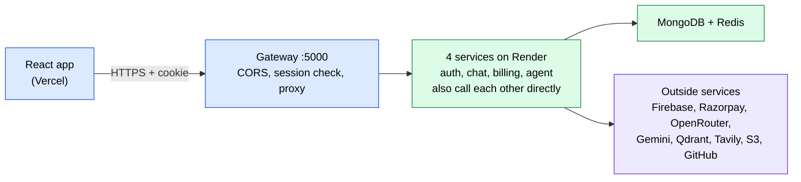
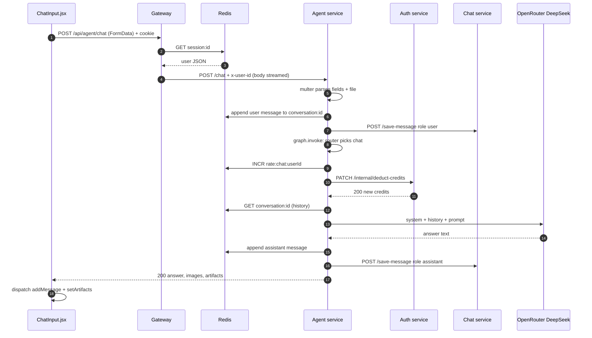
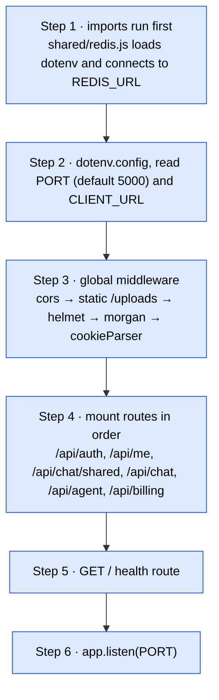
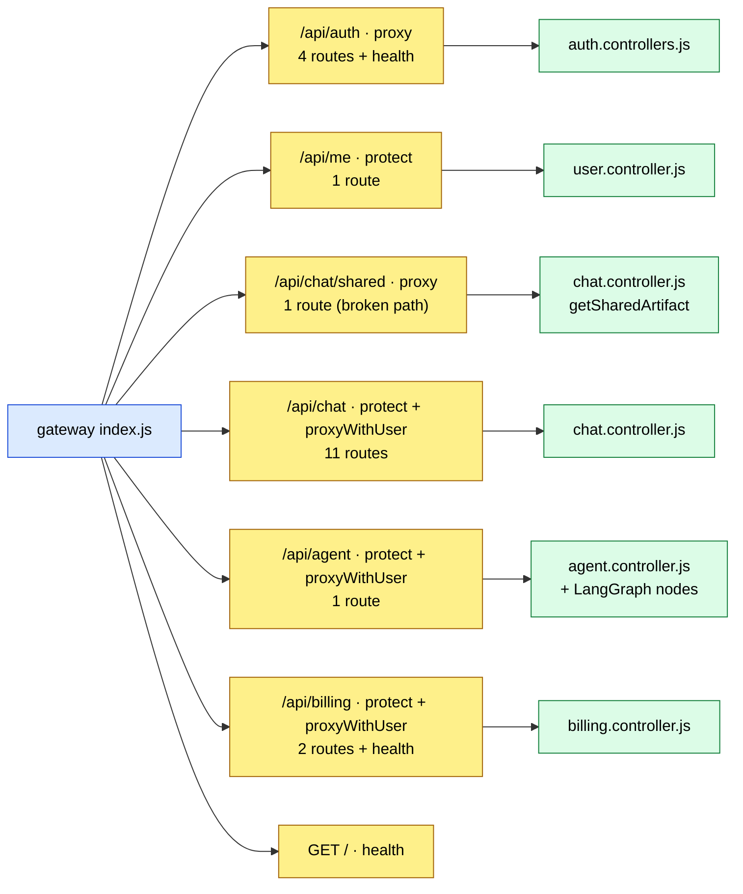

# 02 · Architecture

AI-LUMA is a chat app where one text box can reach many AI "agents". It can chat, search the web, write code, make PDFs, slides and images, read an uploaded PDF, image or CSV, and act on GitHub. It is built as **microservices**: small separate servers that each own one job and talk over HTTP.

---

## Who uses it

| Type of caller | How they are identified | What they can do |
|---|---|---|
| **Visitor (not logged in)** | nothing | See the login modal. Open a public share link `/shared/:shareId` (broken through the gateway today: [F5](08-known-issues-and-improvements.md#f5)). |
| **Logged-in user** | the `session` cookie → a Redis session → `x-user-id` header | Chat with agents, manage conversations, share artifacts, buy credits. |
| **Internal caller** (billing, agent) | **nothing**; they call the auth and chat services directly by URL | Add or remove credits, save messages. |

There are **no roles** (no admin). There is also no password login: only Google or GitHub through Firebase.

---

## Big picture



**Service-to-service calls** (these skip the gateway and use hard-coded public URLs):

| From | To | Call | Why |
|---|---|---|---|
| agent | auth | `PATCH /internal/deduct-credits` | Charge before each AI action |
| agent | chat | `POST /save-message` (×2 per prompt) | Store the user message and the AI answer |
| agent | chat | `GET /get-messages/:id` (via the `CHAT_SERVICE` env) | Memory fallback (almost never runs: [F13](08-known-issues-and-improvements.md#f13)) |
| billing | auth | `PATCH /internal/update-plan` | Add credits after payment |

---

## Folder tree

```
AI-LUMA/
├── backend/
│   ├── docker-compose.yml        only a Redis container, for local dev
│   ├── package.json              root deps (ioredis, dotenv) that the Dockerfiles install
│   ├── shared/
│   │   └── redis/redis.js        ONE ioredis client used by gateway, auth and agent
│   ├── gateway/                  the single entry point for the browser
│   │   ├── index.js              middleware + proxy mounts + /api/me + health
│   │   ├── middlewares/auth.middleware.js   protect(): cookie → Redis session → req.user
│   │   ├── utils/proxyWithHeaders.js        proxy that adds x-user-id / email / avatar / github token
│   │   └── controllers/user.controller.js   getCurrentUser(): returns req.user
│   └── services/
│       ├── auth/                 Firebase login, sessions, credits, plan
│       │   ├── config/ (db.js, firebase.js)
│       │   ├── models/user.model.js
│       │   ├── routes/auth.routes.js
│       │   └── controllers/auth.controllers.js
│       ├── chat/                 conversations, messages, shared artifacts (CRUD)
│       │   ├── models/ (conversation, message, sharedArtifact)
│       │   ├── routes/chat.routes.js
│       │   └── controllers/chat.controller.js
│       ├── billing/              Razorpay orders + payment check
│       │   ├── config/ (plans.js, credits.js unused, razorpay.js, db.js)
│       │   ├── models/payment.model.js
│       │   ├── routes/billing.routes.js
│       │   └── controllers/billing.controller.js
│       └── agent/                the AI engine
│           ├── index.js          express.json + router + global error handler
│           ├── routes/agent.route.js        POST /chat with multer.single("file")
│           ├── controllers/agent.controller.js   save → graph.invoke → save → reply
│           ├── config/ (multer.js, agentRateLimit.js, db.js)
│           ├── graph/ (state.js, supervisor.graph.js, router.node.js, planner.node.js)
│           ├── agents/ 10 agents: chat, search, coding, pdf, ppt, imageGen, vision, pdfRag, data, github
│           ├── utils/ (model, memory, getConv, deductCredits, s3, uploadToS3, getDownloadUrl,
│           │           embedding, vectorStore, tavily)
│           └── comment_script.js one-off script that auto-commented the code (root cause of F1-F3)
├── frontend/
│   ├── index.html                loads Razorpay checkout.js + /src/main.jsx
│   ├── firebase.js               Firebase web app + Google/GitHub providers
│   └── src/
│       ├── main.jsx, App.jsx     ErrorBoundary → Redux Provider → Router (2 routes)
│       ├── pages/ (Home.jsx, SharedArtifact.jsx)
│       ├── components/           Sidebar, ChatArea, ChatInput, MessageList, MessageBubble,
│       │                         ArtifactPanel, BillingDrawer, Navbar, AiBanner, Logo, ...
│       ├── features/             thin API wrappers (agent, billing, conversation, message)
│       ├── redux/                store + user / conversation / message slices
│       ├── hooks/useCurrentUser.jsx   GET /api/me on start-up
│       └── utils/ (axios.js with retry, wakeup.js, detectLanguage.js)
├── render.yaml                   Render Blueprint for the 5 backend services
├── run.ps1, .vscode/tasks.json   start everything locally in separate windows
├── WakeUp.html                   a page that pings all 5 Render services
└── Masterclass.md                older interview notes (out of date: Q13)
```

---

## One request traced end to end: "send a chat message"



Before this, if the chat is new, ChatInput first calls `POST /api/chat/create-conversation`, then `POST /api/chat/update-conversation` (the title = the first 40 characters of the prompt).

---

## Gateway start-up, step by step

From [gateway index.js](../backend/gateway/index.js):



Each **service** starts the same way: `express.json()` → router at `/` → `app.listen(PORT)`, and `connectDB()` is called **inside** the listen callback. A failed DB connection is only logged ([F31](08-known-issues-and-improvements.md#f31)). The agent service also adds a 4-argument **error handler** after the router.

> **Order matters:** `/api/chat/shared` is mounted **before** `/api/chat`. Otherwise the protected `/api/chat` mount would catch shared links and demand a login. The order is right, but the path stripping still breaks it ([F5](08-known-issues-and-improvements.md#f5)).

---

## Kinds of middleware in this project

(Middleware = a function that runs before the controller. It can read or add to the request, or stop it early with a reply.) Full details: [04-middleware.md](04-middleware.md).

| Kind | Examples | Where |
|---|---|---|
| Global, third-party | `cors`, `helmet`, `morgan`, `cookieParser`, `express.static` | gateway; `helmet` + `morgan` also in billing |
| Body parsing | `express.json()` | every service (never in the gateway) |
| Custom auth | `protect` | gateway, on `/api/me`, `/api/chat`, `/api/agent`, `/api/billing` |
| Proxy (acts like a final handler) | `proxy(...)`, `proxyWithUser(...)` | gateway |
| Upload | `multer.single("file")` | agent `POST /chat` |
| Error handler | `(err, req, res, next)` | agent service only |
| "Middleware-like" checks inside code | `checkAgentLimit`, `deductCredits` | called at the top of each agent node |

---

## Router index



| Router | Mounted at | Routes | Route doc | Controller doc |
|---|---|---|---|---|
| Gateway itself | `/`, `/api/me`, and all mounts | 2 own + 6 proxy mounts | [gateway.routes.md](routes/gateway.routes.md) | [gateway.controllers.md](controllers/gateway.controllers.md) |
| authRouter | `/api/auth` | 4 + health | [auth.routes.md](routes/auth.routes.md) | [auth.controllers.md](controllers/auth.controllers.md) |
| chatRouter | `/api/chat` (+ `/api/chat/shared`) | 11 | [chat.routes.md](routes/chat.routes.md) | [chat.controllers.md](controllers/chat.controllers.md) |
| billingRouter | `/api/billing` | 2 + health | [billing.routes.md](routes/billing.routes.md) | [billing.controllers.md](controllers/billing.controllers.md) |
| agentRouter | `/api/agent` | 1 | [agent.routes.md](routes/agent.routes.md) | [agent.controllers.md](controllers/agent.controllers.md) |

---

## Auth in one picture

```mermaid
flowchart LR
    A["Firebase popup<br/>Google or GitHub"] --> B["ID token"]
    B --> C["POST /api/auth/login<br/>verifyIdToken"]
    C --> D["Mongo user<br/>find or create"]
    D --> E["Redis session:uuid<br/>user JSON, 7 days"]
    E --> F["httpOnly cookie session=uuid"]
    F --> G["Every request: protect<br/>reads Redis → req.user"]
    G --> H["x-user-id header<br/>to services"]

    classDef req fill:#dbeafe,stroke:#1d4ed8,color:#000
    classDef mw fill:#fef08a,stroke:#a16207,color:#000
    classDef fn fill:#dcfce7,stroke:#15803d,color:#000
    class A,B req
    class C,D,E,F fn
    class G,H mw
```



- **Authentication** (who are you) = Firebase checks the Google / GitHub login once. After that, the Redis session is the proof.
- **Authorization** (what may you touch) = supposed to be "filter by `x-user-id`", but most chat and agent handlers skip it ([S4](08-known-issues-and-improvements.md#s4), [S5](08-known-issues-and-improvements.md#s5)).
- **Trust boundary** = the gateway. The services believe any `x-user-id` they receive, and they are publicly reachable ([S2](08-known-issues-and-improvements.md#s2)).
- The `Masterclass.md` file says "JWT". That's **wrong**: the cookie is an opaque UUID ([Q13](08-known-issues-and-improvements.md#q13)).

---

## Where state lives

| State | Where | Lifetime | Written by |
|---|---|---|---|
| User account, plan, credits (the truth) | MongoDB `users` | forever | auth |
| Session (copy of user, plan, credits) | Redis `session:<id>` | 7 days | auth (login, deduct, update-plan) |
| Newest session per user | Redis `user-session:<userId>` | 7 days | auth |
| Conversations, messages, artifacts | MongoDB (chat) | forever | chat (called by the frontend and the agent) |
| Short LLM memory | Redis `conversation:<id>`, last 20 messages | 24 h | agent |
| Rate-limit counters | Redis `rate:<agent>:<userId>` | 60 s | agent |
| Payments | MongoDB `payments` | forever | billing |
| Generated files | S3 bucket | forever (no cleanup) | agent |
| PDF chunks for RAG | Qdrant collection `pdf-<timestamp>` | *meant* to be temporary; actually leaks ([F4](08-known-issues-and-improvements.md#f4)) | agent |
| Uploaded files | agent `./temp` folder | until deleted (sometimes never: [F14](08-known-issues-and-improvements.md#f14)) | multer |
| UI state (user, list, messages, artifacts) | Redux store | until reload | frontend |
| GitHub token | browser `localStorage` | until cleared ([S9](08-known-issues-and-improvements.md#s9)) | Home.jsx |
| Firebase login state | Firebase SDK (IndexedDB) | Firebase default | Firebase |

---

## Business-flow diagrams (where to find them)

| Flow | Diagram |
|---|---|
| Login, session, logout | [auth.routes.md: end-to-end](routes/auth.routes.md#end-to-end-the-login-journey) |
| Charging credits | [auth.routes.md: credits](routes/auth.routes.md#end-to-end-how-credits-get-charged) |
| Sending a prompt, agent routing, Auto-Pilot | [agent.routes.md](routes/agent.routes.md), [05-agent-engine.md](05-agent-engine.md) |
| Payment | [billing.routes.md](routes/billing.routes.md) |
| New chat, sharing, deleting | [chat.routes.md](routes/chat.routes.md) |
| Frontend start-up | [06-frontend.md](06-frontend.md) |
