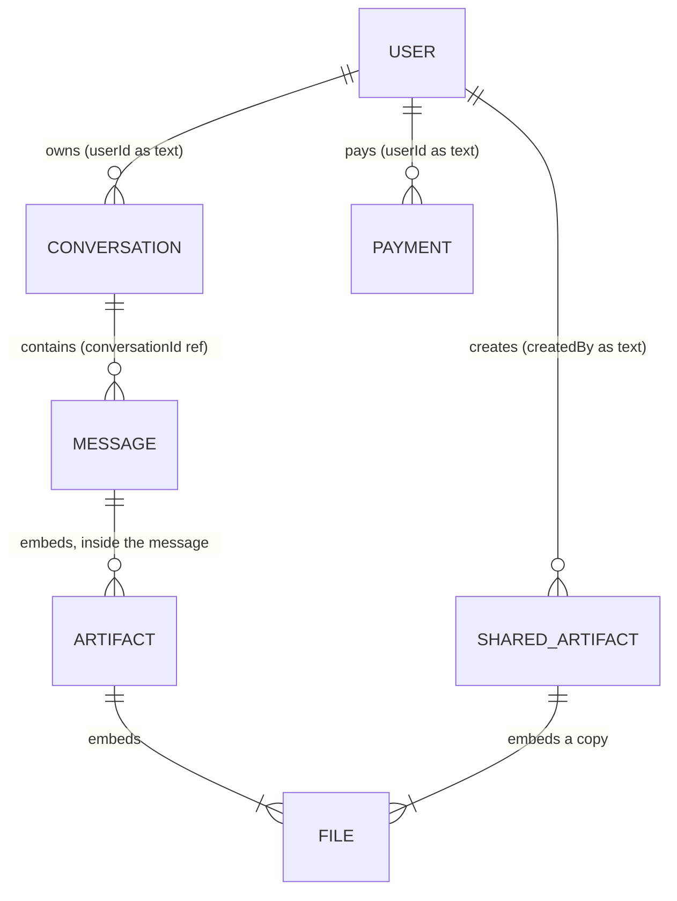
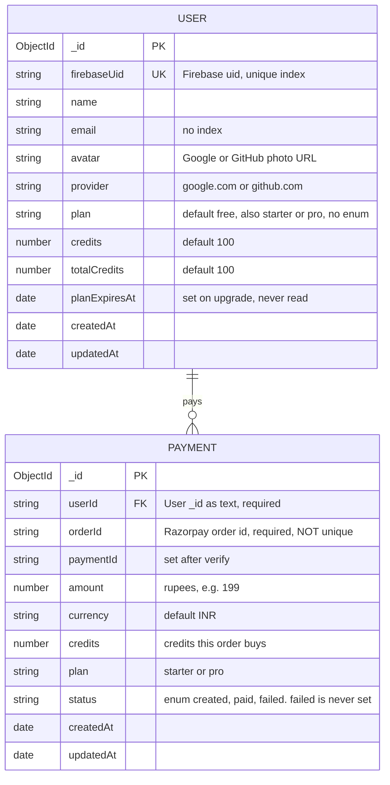
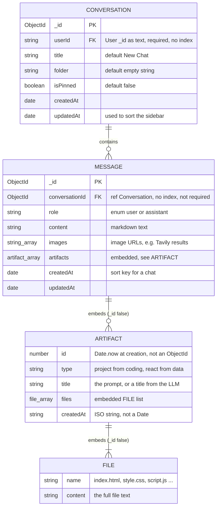
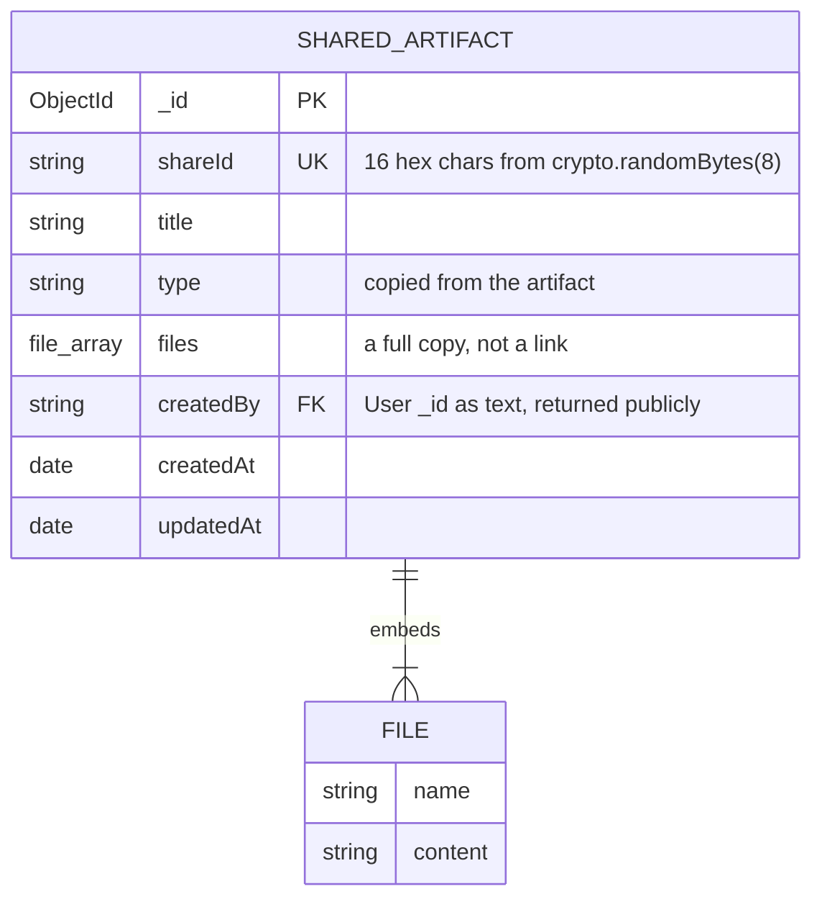

# 03 · Database models

There are **5 Mongoose models** in 3 services. Each service connects with its own `MONGO_URI` (or `MONGODB_URL`). The repo doesn't say whether they point at one database or several. The code works either way, because **no service reads another service's collections**. They talk over HTTP instead.

| Model | Collection | Service | File |
|---|---|---|---|
| `User` | `users` | auth | [user.model.js](../backend/services/auth/models/user.model.js) |
| `Conversation` | `conversations` | chat | [conversation.model.js](../backend/services/chat/models/conversation.model.js) |
| `Message` | `messages` | chat | [message.model.js](../backend/services/chat/models/message.model.js) |
| `SharedArtifact` | `sharedartifacts` | chat | [sharedArtifact.model.js](../backend/services/chat/models/sharedArtifact.model.js) |
| `Payment` | `payments` | billing | [payment.model.js](../backend/services/billing/models/payment.model.js) |

The agent service calls `mongoose.connect` but has **no models** ([Q4](08-known-issues-and-improvements.md#q4)).

**Symbols in the ER diagrams:** `||` exactly one · `o|` zero or one · `o{` zero or many · `|{` one or many. A line from `A ||--o{ B` means "one A has zero or many B".

---

## Overview (entities and links only)

**The key point:** only **one** link is a real Mongoose reference: `Message.conversationId` is an `ObjectId` with `ref: "Conversation"`. Every link to a user is a **plain string** (`userId: String`, `createdBy: String`) that holds the User `_id` as text. The user lives in another service, so the database can't enforce these links, and `populate` isn't possible.

---

## Area 1: users and payments (auth + billing)

**User notes**
- Created on the **first login** ([auth.controllers.js:42-65](../backend/services/auth/controllers/auth.controllers.js#L42-L65)). There's no signup route.
- `credits` is the spendable balance. `totalCredits` only grows (100 + every purchase). The UI draws `credits / totalCredits` as a progress bar.
- `plan` is a free string with no `enum`, set from the payment's plan ID.
- No password and no role fields. (`Masterclass.md` claims both; it's wrong: [Q13](08-known-issues-and-improvements.md#q13).)

**Payment notes**
- One document per Razorpay **order**. It's created as `created` in `createOrder`, then set to `paid` in `verifyPayment`.
- `amount` is in rupees here, but Razorpay received `amount × 100` (paise).
- `orderId` has no unique index, and `verifyPayment` doesn't check the status first. Together that allows replay ([S3](08-known-issues-and-improvements.md#s3), [Q5](08-known-issues-and-improvements.md#q5)).

---

## Area 2: conversations and messages (chat)

**Notes**
- `artifactSchema` and `fileSchema` use `{ _id: false }`, so the embedded items get no `_id` of their own.
- `Message.role` is the only `enum` in chat. Anything else fails validation → 500.
- Messages are written by **two** callers: the agent service (both user and assistant turns) and, in theory, any logged-in browser (`/api/chat/save-message` is reachable). Nobody checks ownership ([S4](08-known-issues-and-improvements.md#s4)).
- Deleting a conversation deletes its messages by hand with `Message.deleteMany`. This is a "manual cascade" (MongoDB has no `ON DELETE CASCADE`).
- `updatedAt` on a conversation only changes when the conversation document itself changes (rename, pin, folder), **not** when a new message is added. So "recent" order in the sidebar means "recently renamed / pinned", not "recently chatted".

---

## Area 3: shared artifacts (chat)

**Notes**
- Sharing makes a **snapshot**. Later edits never change a shared copy, and deleting the chat doesn't delete the share.
- `shareId` has 64 random bits, which is hard to guess. It is the only secret protecting the link.
- `getSharedArtifact` returns the whole document, including `createdBy` ([S7](08-known-issues-and-improvements.md#s7)).
- The same `fileSchema` is copied into both chat model files (duplicate code).

---

## Not in MongoDB: the other stores

| Store | Key / name | Value | TTL |
|---|---|---|---|
| Redis | `session:<uuid>` | `{ userId, email, avatar, name, plan, credits, totalCredits }` | 7 days |
| Redis | `user-session:<userId>` | newest session UUID | 7 days |
| Redis | `conversation:<conversationId>` | JSON array of the last 20 `{ role, content }` | 24 h |
| Redis | `rate:<agent>:<userId>` | integer counter | 60 s |
| Qdrant | collection `pdf-<Date.now()>` | chunk vectors + text (1000 chars, overlap 200) | meant to be deleted, but leaks ([F4](08-known-issues-and-improvements.md#f4)) |
| S3 | `pdf-<ts>.pdf`, `ppt-<ts>.pptx`, `image-<ts>.png` | generated files | none |

---

## Embed vs reference, and why

| Relationship | Choice | Why it fits | Cost |
|---|---|---|---|
| Message → artifacts → files | **Embedded** | Always read together with the message. Written once, never edited. | A big generated project makes the message document big (16 MB limit). Every `get-messages` call sends all file contents. |
| SharedArtifact → files | **Embedded copy** | The share must survive later changes, and one read gets everything. | The file content is stored twice. |
| Conversation → messages | **Referenced** (`conversationId`) | Chats grow without limit, and one document per message keeps each small. Easy to sort by `createdAt`. | Two queries (the conversation list, then the messages). Deletes need a manual cascade. |
| Anything → User | **String ID across services** | The user lives in the auth service's model, and other services only need the ID. | No integrity, no `populate`. A typo'd or foreign ID is still accepted. |
| Payment → User | **String ID** | Same reason. Billing never needs user details. | The same. |
| Session → User | **Denormalised copy** in Redis | No DB hit per request. Credits are shown instantly. | It must be rewritten on every change and can go stale ([F27](08-known-issues-and-improvements.md#f27)). |

---

## Indexes (what exists and what's missing)

| Collection | Existing | Should add |
|---|---|---|
| users | `_id`, `firebaseUid` (unique) | `email` (if you look users up by email) |
| conversations | `_id` | `{ userId: 1, isPinned: -1, updatedAt: -1 }` (matches the sidebar query and sort) |
| messages | `_id` | `{ conversationId: 1, createdAt: 1 }` |
| sharedartifacts | `_id`, `shareId` (unique) | — |
| payments | `_id` | `orderId` **unique** (stops duplicate orders and helps the atomic claim for [S3](08-known-issues-and-improvements.md#s3)) |
