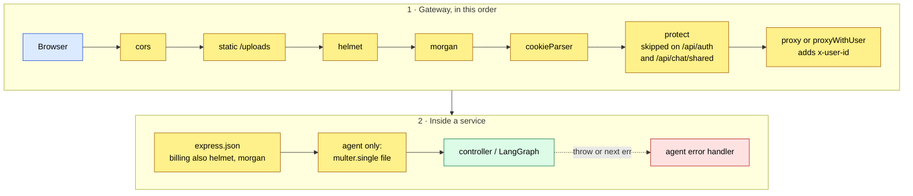
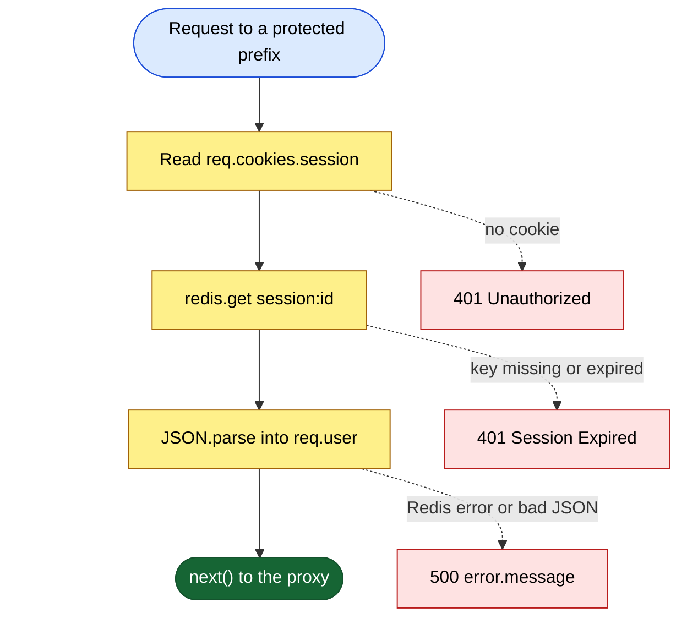
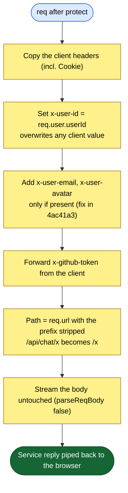
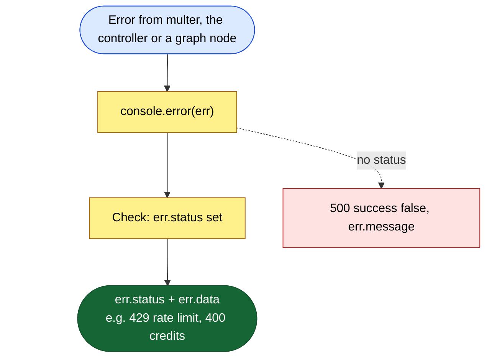
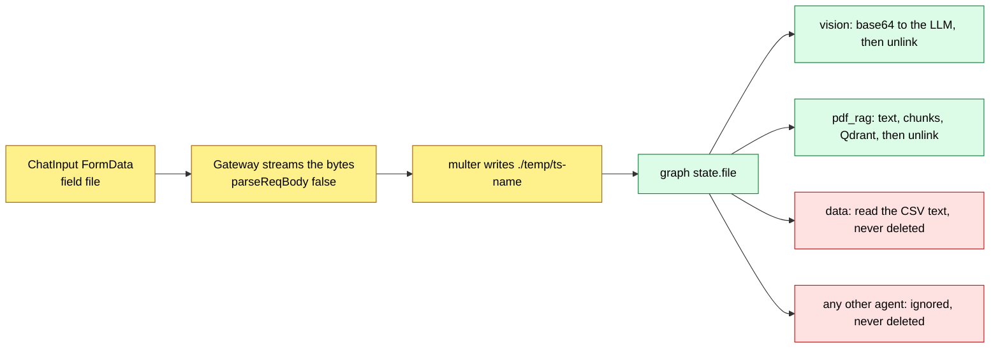
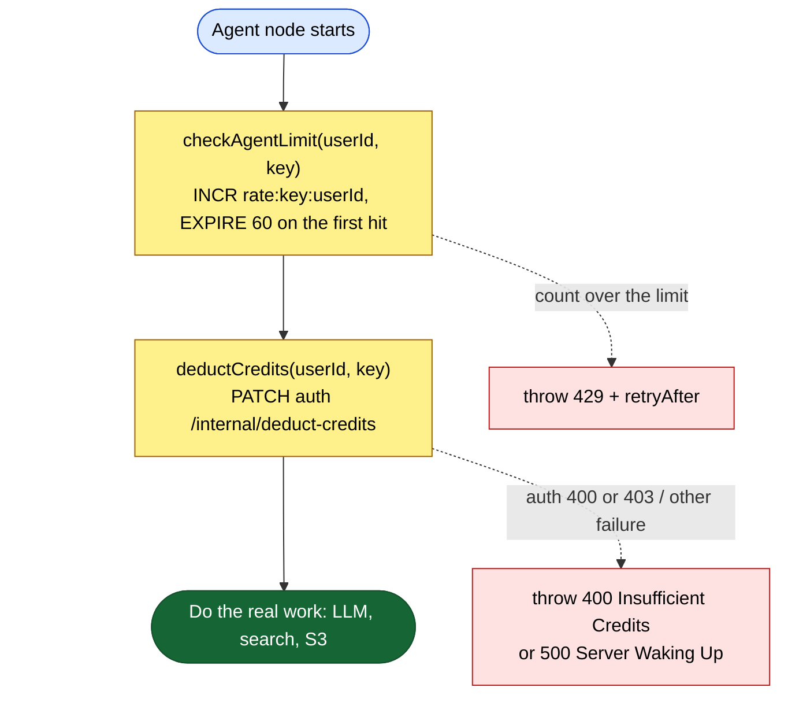

# 04 · Middleware

**Middleware** = a function `(req, res, next)` that runs **before** the controller. It can:
- **read** the request (headers, cookies, body),
- **add** to it (e.g. `req.user`, `req.file`), then call `next()` to pass it on,
- or **stop** it early by sending a reply itself (e.g. 401), and never call `next()`.

Express runs middleware **in the order it was registered**. An **error handler** is special: it has 4 arguments `(err, req, res, next)` and only runs when something calls `next(err)` or throws.

---

## The whole pipeline



## Summary table

| Name | Type | File | Used on |
|---|---|---|---|
| `cors({ origin, credentials: true })` | global, third-party | [gateway index.js:27-30](../backend/gateway/index.js#L27-L30) | every gateway request |
| `express.static("uploads")` | global, third-party | [gateway index.js:33-36](../backend/gateway/index.js#L33-L36) | `/uploads/*` (the folder is unused) |
| `helmet()` | global, third-party | [gateway index.js:38](../backend/gateway/index.js#L38), [billing index.js:28](../backend/services/billing/index.js#L28) | every request |
| `morgan("dev")` | global, third-party | [gateway index.js:39](../backend/gateway/index.js#L39), [billing index.js:31](../backend/services/billing/index.js#L31) | every request |
| `cookieParser()` | global, third-party | [gateway index.js:41](../backend/gateway/index.js#L41) | every gateway request (**not** in auth: [S6](08-known-issues-and-improvements.md#s6)) |
| `protect` | route, **custom** | [auth.middleware.js](../backend/gateway/middlewares/auth.middleware.js) | `/api/me`, `/api/chat`, `/api/agent`, `/api/billing` |
| `proxy(url, { parseReqBody:false })` | route, third-party (acts as the final handler) | [gateway index.js:60](../backend/gateway/index.js#L60), [66](../backend/gateway/index.js#L66) | `/api/auth`, `/api/chat/shared` |
| `proxyWithUser(url)` | route, **custom wrapper** | [proxyWithHeaders.js](../backend/gateway/utils/proxyWithHeaders.js) | `/api/chat`, `/api/agent`, `/api/billing` |
| `express.json()` | global in each service | auth / chat / billing / agent `index.js` | all service routes |
| `multer.single("file")` | route, upload | [multer.js](../backend/services/agent/config/multer.js), [agent.route.js:14](../backend/services/agent/routes/agent.route.js#L14) | `POST /chat` (agent) |
| error handler | global, **custom** | [agent index.js:25-49](../backend/services/agent/index.js#L25-L49) | agent service only |
| `checkAgentLimit`, `deductCredits` | **guards inside code**, not Express middleware | [agentRateLimit.js](../backend/services/agent/config/agentRateLimit.js), [deductCredits.js](../backend/services/agent/utils/deductCredits.js) | top of each paid agent node |

---

## Global middleware in plain words

**`cors`** (Cross-Origin Resource Sharing). Browsers block JavaScript on site A from reading replies from site B unless B says "A is allowed". This middleware answers the browser's **preflight** question (an `OPTIONS` request) and adds `Access-Control-Allow-Origin: <CLIENT_URL>` and `Access-Control-Allow-Credentials: true`. Without `credentials: true`, the browser would not send or accept the session cookie. It **stops early** on a preflight (it replies 204 itself). For a normal request it only adds headers.

**`express.static("uploads")`**. It serves files from an `uploads` folder if one exists. Nothing writes there (uploads go to the agent's `./temp`, and generated files go to S3), so it's leftover code. It sits *before* helmet, so any files it served would miss helmet's headers.

**`helmet`**. It adds about 12 safety headers: `X-Content-Type-Options: nosniff`, `Strict-Transport-Security`, a default `Content-Security-Policy`, `X-Frame-Options`, and others. On a JSON API most of these matter little, but they're free.

**`morgan("dev")`**. It prints `GET /api/chat/get-conversations 200 34 ms` for each request, which is useful in the Render logs. It logs the path only, not bodies.

**`cookieParser`**. It turns the raw `Cookie: session=abc` header into `req.cookies = { session: "abc" }`. `protect` needs this.

**`express.json()`**. It reads a JSON body into `req.body`. It is **not** in the gateway, on purpose. Commit `49e88fa` removed it because it used up the request stream before the proxy could forward it, which caused 502 errors.

---

## Custom middleware 1: `protect` (gateway)

```js
export const protect = async (req, res, next) => {
  try {
    const sessionId = req?.cookies?.session;
    if (!sessionId) return res.status(401).json({ message: "Unauthorized" });
    const session = await redis.get(`session:${sessionId}`);
    if (!session) return res.status(401).json({ message: "Session Expired" });
    req.user = JSON.parse(session);
    next();
  } catch (error) {
    return res.status(500).json({ message: error.message });
  }
};
```
(Comments removed. See [auth.middleware.js](../backend/gateway/middlewares/auth.middleware.js).)

| Reads | Adds to request | Stops early with |
|---|---|---|
| `req.cookies.session`, then Redis `session:<id>` | `req.user = { userId, email, avatar, name, plan, credits, totalCredits }` | `401 Unauthorized` (no cookie) · `401 Session Expired` (no Redis key) · `500` (Redis down, bad JSON) |



**Why it's written this way:**
- **Opaque session, not JWT.** The cookie is just a random UUID. Redis holds the truth, so a session can be killed by deleting one key, and credits can be kept up to date inside it.
- **Auth happens once, at the edge.** Downstream services never see cookies. They get a plain `x-user-id`, which keeps their code tiny.
- **Two different 401 messages.** They help the frontend (and debugging) tell "never logged in" from "session expired".

**Weak spots:**
- No **sliding expiry**. The session dies exactly 7 days after login, even for an active user.
- Every request costs a Redis round-trip. That's fine, but Redis becomes a single point of failure: when it's down, everything returns 500.
- It doesn't check that the session's user still exists or isn't banned (there's no ban concept).
- It runs on `/api/me` with `app.use`, so **any** method and any sub-path (`/api/me/anything`) returns the user.

---

## Custom middleware 2: `proxyWithUser` (gateway)

```js
export const proxyWithUser = (serviceUrl) => proxy(serviceUrl, {
  parseReqBody: false,
  proxyReqOptDecorator: (proxyReqOpts, srcReq) => {
    if (srcReq.user) {
      proxyReqOpts.headers["x-user-id"] = srcReq.user.userId;
      if (srcReq.user.email)  proxyReqOpts.headers["x-user-email"]  = srcReq.user.email;
      if (srcReq.user.avatar) proxyReqOpts.headers["x-user-avatar"] = srcReq.user.avatar;
    }
    if (srcReq.headers["x-github-token"]) proxyReqOpts.headers["x-github-token"] = srcReq.headers["x-github-token"];
    return proxyReqOpts;
  }
});
```

| Reads | Adds (to the outgoing request) | Stops early with |
|---|---|---|
| `req.user` (from `protect`), the client's `x-github-token` | headers `x-user-id`, `x-user-email`, `x-user-avatar`, `x-github-token` | never replies itself. It forwards the service's reply (status, body, `Set-Cookie`). If the service can't be reached, express-http-proxy returns its own error. |



**Why it's written this way:**
- A **higher-order function** (a function that returns a configured middleware) avoids repeating the header code for 3 services.
- `parseReqBody: false` keeps the multipart file upload byte-for-byte correct (commit `94e17d9` fixed "multipart boundary corruption").
- The email and avatar are only added when they exist, because sending an `undefined` header value made Node throw and crashed the gateway (commit `4ac41a3`).

**Weak spots:**
- `x-user-id` is **overwritten** on protected routes, which is good. But on the **unprotected** proxies (`/api/auth`, `/api/chat/shared`), any header the client sends goes straight through. And the services themselves are publicly reachable ([S2](08-known-issues-and-improvements.md#s2)).
- `x-user-email` / `x-user-avatar` are *not* overwritten when the session lacks them, so a client-supplied value would pass through. Nothing reads them today.
- It forwards the user's GitHub token to chat and billing too, which don't need it ([S9](08-known-issues-and-improvements.md#s9)).
- The default path resolver strips the prefix. That's correct for these 3 mounts but breaks `/api/chat/shared` ([F5](08-known-issues-and-improvements.md#f5)).
- No timeout is set. A slow agent call can hang until the platform's own timeout, and then the frontend retries it ([S13](08-known-issues-and-improvements.md#s13)).

---

## Custom middleware 3: the agent's global error handler

```js
app.use((err, req, res, next) => {
  console.error(err);
  if (err.status) return res.status(err.status).json(err.data || { success:false, message: err.message || "Internal Server Error" });
  return res.status(500).json({ success:false, message: err.message || "Internal Server Error" });
});
```
([agent index.js:25-49](../backend/services/agent/index.js#L25-L49))

| Reads | Sends |
|---|---|
| `err.status`, `err.data`, `err.message` | `err.status` + `err.data` (e.g. 429 with `retryAfter`, 400 "Insufficient Credits") or `500` + `{ success:false, message }` |



**Why it's written this way:** errors that carry `status` + `data` (built by `checkAgentLimit` and `deductCredits`) reach the browser as structured JSON (`title`, `message`, `retryAfter`). [ChatInput.jsx](../frontend/src/components/ChatInput.jsx#L213-L217) shows them in the `AIBanner`. Commits `399bf5a` / `62b5ab8` made it **always** return JSON, so the frontend never gets an empty body.

**Weak spots:**
- Multer errors have no `status`, so "wrong file type" and "file too large" become **500**, not 400/413 ([F9](08-known-issues-and-improvements.md#f9)).
- It sends `err.message` for unknown errors, which can leak internals ([S11](08-known-issues-and-improvements.md#s11)).
- Only the agent service has one. The other services catch errors inside each controller, and the gateway has none, so a proxy failure gets Express's default HTML error page.

---

## Upload middleware: `multer.single("file")` and where the file goes next

| Setting | Value ([multer.js](../backend/services/agent/config/multer.js)) |
|---|---|
| Storage | `diskStorage` into `./temp` (created at start-up if missing) |
| File name | `` `${Date.now()}-${file.originalname}` `` (busboy strips any path from the original name) |
| Allowed | `application/pdf`, `image/*`, `text/csv`, or a name ending in `.csv` |
| Size limit | 20 MB |
| Result | `req.file = { path, mimetype, originalname, size, ... }`; the text fields go into `req.body` |



Weak spots: [F14](08-known-issues-and-improvements.md#f14) (leftover files), [F9](08-known-issues-and-improvements.md#f9) (xlsx and 500s). There's also no virus or size check on the *content*. A PDF that is really something else still goes to `pdf-parse`.

---

## Guards inside code: `checkAgentLimit` and `deductCredits`

These aren't Express middleware, but they **act like** a middleware chain at the top of each agent node:



**Limits per 60-second window:** chat 20, coding 5, pdf 5, ppt 5, image 3, search 5 (any other key uses chat's 20).

**Why it's written this way:** the price depends on **which** agent the router picks, and that's only known *inside* the graph. So the checks can't live in an Express middleware before the controller.

**Weak spots:**
- Five agents wrap these calls in their own `try/catch`, which swallows the 429/400 ([F7](08-known-issues-and-improvements.md#f7)).
- The charge happens *before* the work, with no refund on failure.
- `INCR` + `EXPIRE` isn't atomic ([F28](08-known-issues-and-improvements.md#f28)).
- It's a **fixed window**: 20 at 0:59 plus 20 at 1:01 means 40 in 2 seconds. A sliding window or token bucket is smoother.
- Any other failure is labelled "Server Waking Up", which makes the frontend retry the whole prompt ([S13](08-known-issues-and-improvements.md#s13)).

---

## Why the order matters (real examples from this code)

1. **`cookieParser` before `protect`.** Otherwise `req.cookies` is undefined and every request gets 401. The auth service shows what happens when it's missing: logout can't read the cookie ([S6](08-known-issues-and-improvements.md#s6)).
2. **`/api/chat/shared` before `/api/chat`.** Express matches the first mount that fits. If `/api/chat` came first, `protect` would demand a login for public links.
3. **No `express.json()` before the proxy.** Parsing uses up the body stream, and the proxy would then forward an empty body (the 502s fixed in `49e88fa`).
4. **`multer` before the controller.** The controller needs `req.body.prompt` and `req.file`, and for a multipart request only multer fills them (`express.json` ignores multipart).
5. **The error handler last.** A 4-argument error handler only catches errors from middleware and routes registered **before** it, so it has to come after the router.
6. **`cors` first.** The preflight `OPTIONS` must be answered before anything else (like `protect`) can reject it for having no cookie.
7. **`static` before `helmet`** (as written). Files served from `/uploads` would skip helmet's headers. Harmless today (the folder is unused), but the wrong order in principle.

---

## Weak spots, all together

| Gap | Effect | Fix |
|---|---|---|
| No rate limiter at the gateway ([S8](08-known-issues-and-improvements.md#s8)) | Login and CRUD can be flooded | `express-rate-limit` + `rate-limit-redis` (already installed) |
| No validation middleware ([Q7](08-known-issues-and-improvements.md#q7)) | Bad bodies reach Mongo and cause 500s | zod / celebrate schemas per route |
| No internal-auth middleware on services ([S1](08-known-issues-and-improvements.md#s1), [S2](08-known-issues-and-improvements.md#s2)) | Anyone can call `/internal/*` or fake `x-user-id` | `requireInternal` (shared secret / HMAC) and `requireUser` (verify a signed header) |
| No ownership middleware ([S4](08-known-issues-and-improvements.md#s4)) | IDOR on chats | `loadOwnedConversation` middleware used by every `:id` route |
| No request timeout on the proxy | Hanging requests and retries | `proxyTimeout` / `timeout` option, and stream long agent jobs |
| No gateway error handler | HTML error pages for API clients | `app.use((err, req, res, next) => res.status(502).json(...))` |
