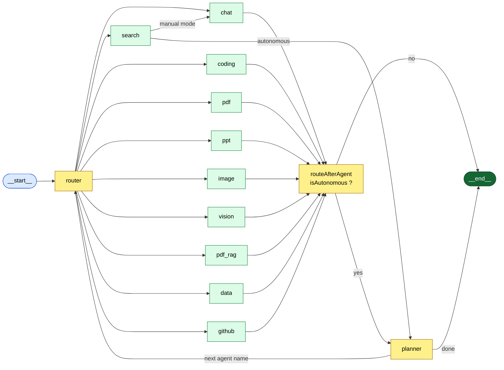
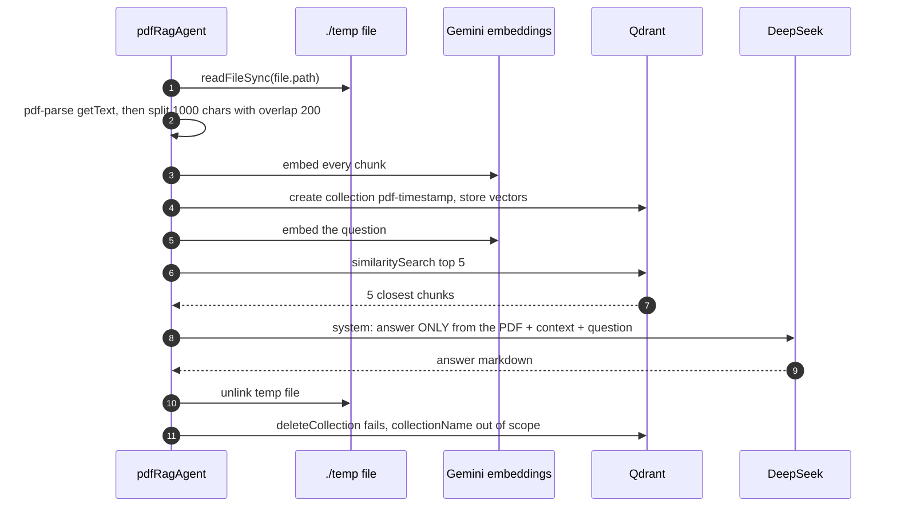
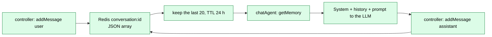
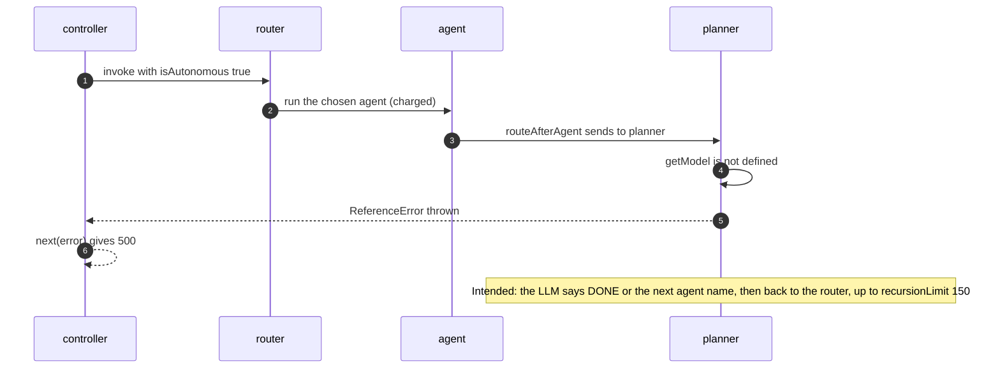

# 05 · The AI agent engine (LangGraph)

> **No real-time layer.** The project has **no WebSockets, SSE, message queues or cron jobs**. Every AI answer comes back as one normal HTTP reply to `POST /api/agent/chat`. So this slot in the docs covers the part that does the "moving work": the **LangGraph agent engine** in [backend/services/agent/graph/](../backend/services/agent/graph/). For the HTTP route and the exact behaviour of each function, see [agent.routes.md](routes/agent.routes.md) and [agent.controllers.md](controllers/agent.controllers.md).

**Words used here:**
- **LLM** = large language model (here DeepSeek, reached through OpenRouter).
- **Agent** = one function that does a single kind of job (chat, make a PDF, and so on).
- **LangGraph** = a library where you draw your program as a **graph**. **Nodes** are functions. **Edges** say which node runs next. **State** is one shared object every node reads and returns.
- **Conditional edge** = "look at the state, then pick the next node".

---

## The state every node shares

Defined in [state.js](../backend/services/agent/graph/state.js) with `Annotation.Root`. Each field is a plain `Annotation()`, meaning "last value wins" (no merge logic). Every node returns `{ ...state, <changes> }`.

| Field | Set by | Used by |
|---|---|---|
| `prompt`, `conversationId`, `userId`, `agent`, `file`, `githubToken`, `isAutonomous` | the controller (`graph.invoke`) | the router and all agents |
| `agent` | the router (and the planner) | conditional edges |
| `response` | every agent | the controller → the reply |
| `images` | the chat agent (from search results) | the reply |
| `artifacts` | the coding and data agents | the reply → the artifact panel |
| `searchResults` | the search agent | the chat agent |
| `taskPlan` | the planner | the controller (in Auto-Pilot) |
| `model`, `codeContext`, `pdfContext` | **nobody** (declared, never used) | — |
| `docs` | the pdfRag agent returns it, but it's **not declared** in the state | — |

---

## The graph



Built in [supervisor.graph.js](../backend/services/agent/graph/supervisor.graph.js). It's compiled once at start-up (`workflow.compile()`) and run per request with `graph.invoke(state, { recursionLimit: 150 })`. The **recursion limit** is the maximum number of node steps in one run. It was raised from LangGraph's default of 25 to 150 for Auto-Pilot (commit `276ead5`).

---

## How the router picks an agent

[router.node.js](../backend/services/agent/graph/router.node.js) checks these rules **in order**. The first match wins:

| # | Rule | Picks | Costs an LLM call? |
|---|---|---|---|
| 1 | The user chose an agent pill (`agent` is not `"auto"`) | that agent (chat, coding, pdf, ppt, image, search, data, github) | no |
| 2 | An image was uploaded (`mimetype` starts with `image/`) | `vision` | no |
| 3 | A PDF was uploaded | `pdf_rag` | no |
| 4 | A CSV (or `.xlsx`) was uploaded | `data` (xlsx never gets here: multer rejects it, [F9](08-known-issues-and-improvements.md#f9)) | no |
| 5 | Otherwise | ask the LLM "return ONLY one word", trim and lower-case the answer | **yes** |
| — | The LLM word isn't a known node | the `default` branch → `chat` | — |

> ⚠️ **Interview point:** rules 1–4 are **fast paths**. They skip an LLM call when the intent is obvious, which saves money and time. Rule 5 is **semantic routing** (the LLM classifies the intent). But the prompt's final "return one of" list leaves out `ppt` and `image`, and the output isn't checked against the allowed names ([F29](08-known-issues-and-improvements.md#f29)). If the user picks, say, "Chat" and attaches a PDF, rule 1 wins and the PDF is **ignored** (and never deleted: [F14](08-known-issues-and-improvements.md#f14)).

---

## The 10 agents at a glance

| Node | File | Triggered by | Charge key → cost | Limit / min | Outside services | Output |
|---|---|---|---|---|---|---|
| `chat` | [chat.agent.js](../backend/services/agent/agents/chat.agent.js) | default; after search | chat → 1 | 20 | OpenRouter | `response` markdown, `images` from search |
| `search` | [search.agent.js](../backend/services/agent/agents/search.agent.js) | pill / router | search → 5 (+1 in chat = **6**) | 5 | Tavily | `searchResults` (the answer is written by chat) |
| `coding` | [coding.agent.js](../backend/services/agent/agents/coding.agent.js) | pill / router | coding → 10 | 5 | OpenRouter | `artifacts: [{type:"project", files}]` or a markdown review |
| `pdf` | [pdf.agent.js](../backend/services/agent/agents/pdf.agent.js) | pill / router | pdf → 10 | 5 | OpenRouter, S3 | markdown with a download link |
| `ppt` | [ppt.agent.js](../backend/services/agent/agents/ppt.agent.js) | pill / router | ppt → 10 | 5 | OpenRouter, S3 | markdown with a download link |
| `image` | [imageGen.agent.js](../backend/services/agent/agents/imageGen.agent.js) | pill / router | image → 10 | 3 | OpenRouter, Pollinations, S3 | markdown with an embedded image |
| `vision` | [vision.agent.js](../backend/services/agent/agents/vision.agent.js) | image upload in Auto | image → 10 | 3 | OpenRouter (text-only model: [F16](08-known-issues-and-improvements.md#f16)) | markdown |
| `pdf_rag` | [pdfRag.agent.js](../backend/services/agent/agents/pdfRag.agent.js) | PDF upload in Auto | **none** ([F4](08-known-issues-and-improvements.md#f4)) | none | Gemini embeddings, Qdrant, OpenRouter | markdown |
| `data` | [data.agent.js](../backend/services/agent/agents/data.agent.js) | CSV upload / pill | coding → 10 | 5 (coding's bucket) | OpenRouter | `artifacts` (Chart.js HTML / CSS / JS) |
| `github` | [github.agent.js](../backend/services/agent/agents/github.agent.js) | pill (shown only if a GitHub token exists) | coding → 10 | 5 (coding's bucket) | OpenRouter, GitHub API | markdown. **Broken:** missing imports ([F2](08-known-issues-and-improvements.md#f2)) |

**One model for all:** `getModel(name)` ignores `name` and returns the same `ChatOpenRouter("deepseek/deepseek-chat", temperature 0, maxTokens 2500)` ([model.js](../backend/services/agent/utils/model.js)). Temperature 0 means "always pick the most likely word", which gives stable, repeatable output.

---

## How the agents turn LLM text into files ("structured output by parsing")

The LLM only returns **text**. Each agent asks for a strict text format, then parses it:

| Agent | Format asked for | How it's parsed | If the parse fails |
|---|---|---|---|
| coding | `FILE: index.html` then the content, repeated | regex `/FILE:\s*([^\n]+)\n([\s\S]*?)(?=\nFILE:\s*[^\n]+\n\|$)/g`, then strip the ``` fences | no `FILE:` → the text is shown as a markdown review |
| data | raw JSON `{ artifacts: [...] }` | cut from the first `{` to the last `}`, then `JSON.parse` | "❌ Failed to generate visualization format" |
| ppt | `TITLE:` / `SUBTITLE:` / `SLIDE:` blocks with `Type:` and `- ` bullets, stats as `Label \| Value` | split on `^SLIDE:`, then read the lines | defaults ("Presentation", "Slide", bullets) |
| github | JSON `{ action: reply \| list_repos \| read_file \| commit, ... }` | strip the ```json fences, then `JSON.parse` | "Failed to parse GitHub agent command." |
| pdf | plain text; the first line is the title if it's under 120 characters | strip `**`, `#`, ``` | falls back to the prompt as the title |

> ⚠️ **Interview point:** this is the fragile part of any LLM app. A better approach is **tool calling / JSON-schema structured output** (the model is forced to return valid JSON matching a schema). LangChain supports this with `llm.withStructuredOutput(zodSchema)`.

---

## PDF RAG in detail (the most "AI" feature)

**RAG** = retrieval-augmented generation: find the relevant pieces of a document, then ask the LLM to answer **only** from them.



- **Why chunks overlap:** so a sentence cut at a chunk edge still appears whole in one chunk.
- **Why the top 5:** it keeps the prompt small (5 × 1000 characters ≈ 1.2k tokens).
- **Weak spots:**
  - It re-embeds the whole PDF for **every** question ([Q9](08-known-issues-and-improvements.md#q9)).
  - The collection leaks ([F4](08-known-issues-and-improvements.md#f4)).
  - It's free, with no credit or rate check.
  - No page numbers or citations come back.

---

## Memory (how the chat agent "remembers")

[memory.js](../backend/services/agent/utils/memory.js):



- Only the **chat** agent reads history. Coding imports `getMemory` but never calls it, so "fix the code you just wrote" won't work.
- The Mongo fallback (`getConversationHistory`) only runs if the Redis key is missing. But the controller always writes the key first, so the fallback practically never runs ([F13](08-known-issues-and-improvements.md#f13)).
- 20 messages is a crude **context window** limit. A token-based limit or a running summary would be smarter.

---

## Auto-Pilot (autonomous mode): the loop

When the Auto-Pilot pill is on, `isAutonomous = true`. After any agent, `routeAfterAgent` sends the state to the **planner** instead of ending. The planner asks the LLM: "is the overall goal done? reply DONE, or the next agent name". It then routes back to the router, and the router uses `state.agent` (rule 1) to run that agent.



> ⚠️ **Interview point:** the planner **can't run**: `getModel` isn't imported ([F3](08-known-issues-and-improvements.md#f3)). The first agent has already charged credits when the 500 comes back. Even if it were fixed:
> - Each loop step is charged again.
> - `taskPlan` only records "response length", not what was done.
> - The planner never passes the plan to the next agent. The next agent still gets the *original* prompt.
> - The only guards against an endless, expensive loop are the recursion limit (150) and running out of credits or hitting rate limits.
>
> A real planner would write sub-goals into the state, and each agent would work on the current sub-goal.

---

## Cost and limits in one table

| Agent (charge key) | Credits | Rate limit (per 60 s) | Real cost drivers |
|---|---|---|---|
| chat | 1 | 20 | 1 LLM call (+ history) |
| search (then chat) | 5 + 1 = 6 | 5 (+ 1 chat slot) | 1 Tavily call + 1 LLM call |
| coding | 10 | 5 | 1 LLM call (big output) |
| pdf | 10 | 5 | 1 LLM call + pdfkit + S3 |
| ppt | 10 | 5 | 1 LLM call + pptxgenjs + S3 |
| image | 10 | 3 | 1 LLM call + Pollinations + S3 |
| vision (image key) | 10 | 3 | 1 LLM call with a base64 image |
| data (coding key) | 10 | 5 shared with coding | 1 LLM call with up to 500 CSV lines |
| github (coding key) | 10 | 5 shared with coding | 1 LLM call + 1–3 GitHub API calls |
| pdf_rag | **0** | **none** | N+1 embeddings + Qdrant + 1 LLM call |
| router (Auto, no file) | 0 | none | +1 LLM call (the classification) |

A new user gets **100 credits** ([user.model.js](../backend/services/auth/models/user.model.js)). That's 100 chat messages, 16 searches, or 10 PDFs.

---

## Weak spots of the engine (summary)

| Problem | Link |
|---|---|
| The GitHub agent and the planner can't run (missing imports) | [F2](08-known-issues-and-improvements.md#f2), [F3](08-known-issues-and-improvements.md#f3) |
| Rate-limit and credit errors are swallowed by 5 agents, and credits are charged before the work | [F7](08-known-issues-and-improvements.md#f7) |
| One text-only model for everything, including vision; 2500-token cap | [F16](08-known-issues-and-improvements.md#f16), [Q8](08-known-issues-and-improvements.md#q8) |
| Parsing free text instead of structured output | [F29](08-known-issues-and-improvements.md#f29) |
| No streaming: the user waits for the whole answer, and slow calls get retried | [Q10](08-known-issues-and-improvements.md#q10), [S13](08-known-issues-and-improvements.md#s13) |
| The GitHub agent can **commit** code chosen by the LLM with no confirmation step | worth saying in an interview: add a "preview diff → confirm" step (human in the loop) |
| Prompt injection: CSV contents, PDF text and search results go straight into prompts | treat tool output as data. For GitHub, never let tool output trigger a write. |
