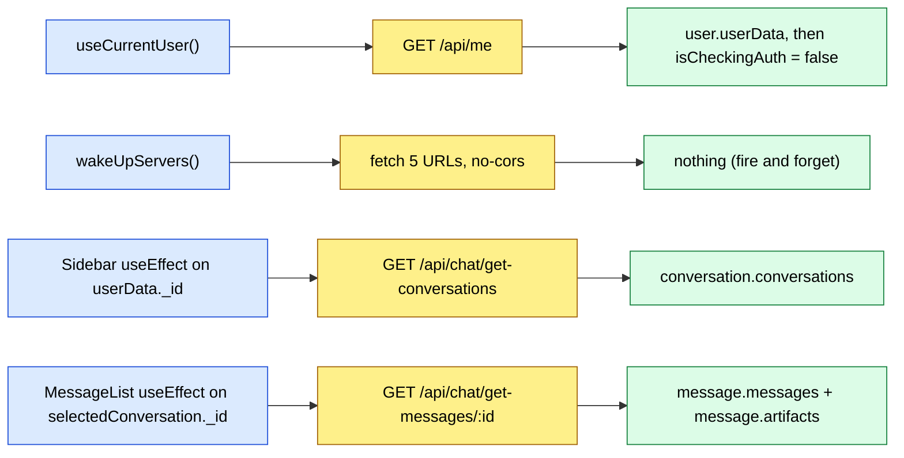
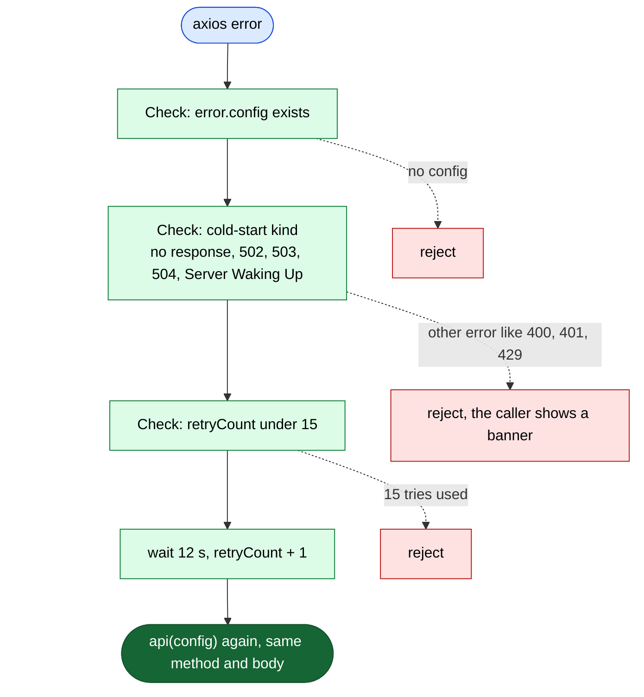
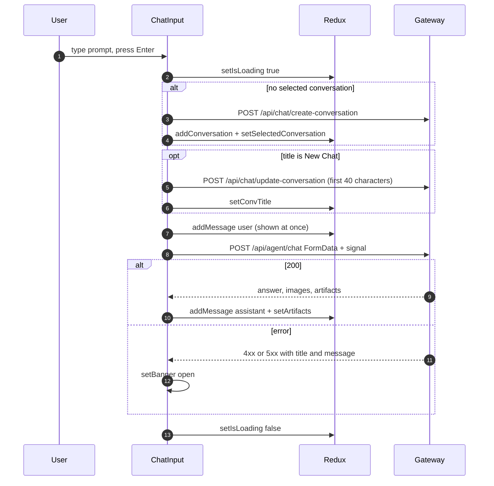

# 06 · Frontend

React 19 single-page app built with Vite. Code: [frontend/src](../frontend/src). It talks **only** to the gateway (`VITE_SERVER_URL`), plus Firebase (login popup) and Razorpay (payment popup).

> ⚠️ **The production build is broken on `main`.** `vite build` fails with `UNRESOLVED_IMPORT ../features/chat.api` in [ArtifactPanel.jsx:14](../frontend/src/components/ArtifactPanel.jsx#L14). The real file is `conversation.api.js` ([F1](08-known-issues-and-improvements.md#f1)). Everything below describes the code as written.

---

## Start-up

Render tree ([main.jsx](../frontend/src/main.jsx), [App.jsx](../frontend/src/App.jsx)):

```
<ErrorBoundary>            catches render crashes, shows the error + component stack
  <Provider store>         Redux store: user, conversation, message
    <App>                  runs useCurrentUser() + wakeUpServers() once
      <BrowserRouter>
        /                  → <Home>            (Sidebar + ChatArea + ArtifactPanel + login modal)
        /shared/:shareId   → <SharedArtifact>  (public, read-only viewer)
```

What happens on load: **hook → API call → where the result goes**.



- `useCurrentUser` ([hook](../frontend/src/hooks/useCurrentUser.jsx)) always sets `isCheckingAuth = false` in `finally`. That stops the login modal from flashing on refresh (commit `ecc6f91`).
- `wakeUpServers` ([wakeup.js](../frontend/src/utils/wakeup.js)) is meant to wake the sleeping Render services, but it pings wrong host names ([F23](08-known-issues-and-improvements.md#f23)).
- The Sidebar effect runs on mount **and** whenever `userData?._id` changes. After a fresh login, `_id` appears, so it refetches. After a reload, `/api/me` has no `_id`, but the mount fetch already worked thanks to the cookie ([F18](08-known-issues-and-improvements.md#f18)).

---

## Route guards

There are **no route guards** (no `<ProtectedRoute>`, no redirects).
- On `/`, [Home.jsx](../frontend/src/pages/Home.jsx#L102-L135) draws a full-screen **login modal** on top of the app when `!isCheckingAuth && !userData`. The app behind it still mounts and still calls the API, which just returns 401 without a cookie.
- `/shared/:shareId` is public. It uses the **plain** `axios` (not the `api` instance), so it sends no cookie and gets no retry.
- The real guard is the backend: the gateway's `protect` middleware.

| Guard | Where | What it does |
|---|---|---|
| Login modal | Home.jsx | Blocks interaction until `userData` exists |
| GitHub pill hidden | [ChatInput.jsx:246-248](../frontend/src/components/ChatInput.jsx#L246-L248) | Hides the GitHub agent unless `localStorage.github_token` exists |
| `protect` | gateway | Rejects API calls without a valid session (401) |

---

## State shape (Redux Toolkit)

```js
{
  user: {
    userData: null | {        // shape depends on where it came from (F18)
      // from POST /api/auth/login → the full Mongo user:
      _id, firebaseUid, name, email, avatar, provider, plan, credits, totalCredits, planExpiresAt, createdAt, updatedAt
      // from GET /api/me → the Redis session:
      userId, name, email, avatar, plan, credits, totalCredits
    },
    isCheckingAuth: true       // false after the first /api/me finishes
  },
  conversation: {
    conversations: [ { _id, userId, title, folder, isPinned, createdAt, updatedAt } ],
    selectedConversation: null | <one of the above>
  },
  message: {
    messages: [ { role: "user" | "assistant", content, images?, artifacts?, _id?, createdAt? } ],
    isLoading: false,          // true while waiting for the agent
    artifacts: [ { id, type, title, files: [ { name, content } ], createdAt } ]   // the panel shows artifacts[0]
  }
}
```

| Slice | File | Actions |
|---|---|---|
| user | [user.slice.js](../frontend/src/redux/user.slice.js) | `setUserData`, `setIsCheckingAuth` (it also imports `act` from react, unused) |
| conversation | [conversation.slice.js](../frontend/src/redux/conversation.slice.js) | `setConversations`, `addConversation` (unshift), `setSelectedConversation`, `setConvTitle`, `removeConversation`, `clearAllConversations`, `togglePinConversation` (re-sorts pinned first, then `updatedAt`), `moveConvToFolder` |
| message | [message.slice.js](../frontend/src/redux/message.slice.js) | `setMessages`, `addMessage`, `setIsLoading`, `setArtifacts`, `updateMessage` (unused), `removeLastMessage` |

**Updates are "pessimistic":** the UI waits for the API to succeed, *then* dispatches (e.g. `handlePin` → `togglePinApi` → `togglePinConversation`). The one exception is the user's message: ChatInput adds it to the list **before** the agent answers.

Logout only does `setUserData(null)`. It doesn't clear the conversations or messages, so the old list stays in memory until the next fetch.

---

## Screen → API map

| Screen / file | User action | API call | Backend route doc |
|---|---|---|---|
| [useCurrentUser.jsx](../frontend/src/hooks/useCurrentUser.jsx) | page load | `GET /api/me` | [gateway.routes.md](routes/gateway.routes.md) |
| [Home.jsx](../frontend/src/pages/Home.jsx) | Continue with Google / GitHub | Firebase `signInWithPopup` → `POST /api/auth/login` | [auth.routes.md](routes/auth.routes.md) |
| [Sidebar.jsx](../frontend/src/components/Sidebar.jsx) | sign out | `GET /api/auth/logout` | auth |
| Sidebar | load the list | `GET /api/chat/get-conversations` | [chat.routes.md](routes/chat.routes.md) |
| Sidebar | click a chat | `GET /api/chat/get-messages/:id` (MessageList fetches it **again**: [F17](08-known-issues-and-improvements.md#f17)) | chat |
| Sidebar | rename (Enter or blur) | `POST /api/chat/update-conversation` | chat |
| Sidebar | delete one / clear all | `DELETE /api/chat/delete-conversation/:id` · `DELETE /api/chat/delete-all-conversations` | chat |
| Sidebar | pin / move to folder | `POST /api/chat/toggle-pin` · `POST /api/chat/move-to-folder` | chat |
| Sidebar | "New Chat" | **no API call**. It only clears the selection. The conversation is created on the first send. | — |
| [ChatInput.jsx](../frontend/src/components/ChatInput.jsx) | first send in a new chat | `POST /api/chat/create-conversation` → `POST /api/chat/update-conversation` (title = the first 40 characters) | chat |
| ChatInput | send | `POST /api/agent/chat` (multipart: `conversationId`, `prompt`, `agent`, `isAutonomous`, `file?`) | [agent.routes.md](routes/agent.routes.md) |
| [MessageList.jsx](../frontend/src/components/MessageList.jsx) | a chat is selected (not "New Chat") | `GET /api/chat/get-messages/:id` | chat |
| [ArtifactPanel.jsx](../frontend/src/components/ArtifactPanel.jsx) | Share | `POST /api/chat/share-artifact`, then copies `origin/shared/<shareId>` | chat |
| [SharedArtifact.jsx](../frontend/src/pages/SharedArtifact.jsx) | open a share link | `GET /api/chat/shared/:shareId` (plain axios) → 404 through the gateway today ([F5](08-known-issues-and-improvements.md#f5)) | chat |
| [BillingDrawer.jsx](../frontend/src/components/BillingDrawer.jsx) | Upgrade | `POST /api/billing/create-order` → Razorpay popup → `POST /api/billing/verify-payment` | [billing.routes.md](routes/billing.routes.md) |
| [wakeup.js](../frontend/src/utils/wakeup.js) | page load | 5 `fetch` pings | — |

**Backend routes no screen calls:** `POST /api/chat/save-message` (the agent service calls it), `/api/auth/internal/*` (billing and agent call them), and the health routes.

---

## The HTTP client: [utils/axios.js](../frontend/src/utils/axios.js)

- `baseURL = VITE_SERVER_URL` and `withCredentials: true`, so the browser sends the gateway's session cookie cross-site.
- **Request interceptor:** adds `x-github-token` from `localStorage` to **every** call ([S9](08-known-issues-and-improvements.md#s9)).
- **Response interceptor:** on no response, 502, 503, 504, or a 500 whose `title` is "Server Waking Up", it waits 12 s and retries, up to 15 times (about 3 minutes). It retries POSTs too ([S13](08-known-issues-and-improvements.md#s13)).



---

## Key components

| Component | What it does | Notes |
|---|---|---|
| [Sidebar.jsx](../frontend/src/components/Sidebar.jsx) | Logo, New Chat, pinned / folders / recent list, rename, pin, folder, delete, billing button, user card, logout. Has desktop, collapsed-rail and mobile-drawer modes. | `SidebarContent` and `CollapsedRail` are components defined *inside* the component ([F21](08-known-issues-and-improvements.md#f21)). Folder grouping is computed twice (once unused). "Pro Member" is hard-coded text. |
| [ChatArea.jsx](../frontend/src/components/ChatArea.jsx) | Navbar + MessageList + AIBanner + ChatInput. Owns the `banner` state. | "Lifting state up": ChatInput calls `setBanner` on errors. |
| [ChatInput.jsx](../frontend/src/components/ChatInput.jsx) | Agent pills, Auto-Pilot toggle, file picker (`.pdf, image/*, .csv, .xlsx`), mic (Web Speech, `en-IN`), send / stop. | Stop = `AbortController` in the browser only ([S14](08-known-issues-and-improvements.md#s14)). It listens for a window `editPrompt` event from MessageList. |
| [MessageList.jsx](../frontend/src/components/MessageList.jsx) | Empty-state welcome, the message list, a "Thinking / Analyzing…" animation, a scroll-to-bottom button (IntersectionObserver). | The suggestion cards array is empty ([F22](08-known-issues-and-improvements.md#f22)). Regenerate only removes a message ([F20](08-known-issues-and-improvements.md#f20)). The `key` is the array index. |
| [MessageBubble.jsx](../frontend/src/components/MessageBubble.jsx) | Markdown (GFM tables), Prism code blocks with copy, image lightbox, copy message, read aloud (speechSynthesis), edit. | `console.log(children)` runs on every code block render. |
| [ArtifactPanel.jsx](../frontend/src/components/ArtifactPanel.jsx) | Shows `artifacts[0]`: file tabs, Monaco editor (read-only), live preview, copy, share. Right rail on desktop, drawer on mobile. | Preview = `<iframe sandbox="allow-scripts" srcDoc>` with CSS and JS inlined. Scripts run in an opaque origin, so they can't touch the app's cookies or storage. Good design. |
| [BillingDrawer.jsx](../frontend/src/components/BillingDrawer.jsx) | Current plan, a credits bar (`credits / totalCredits`), Starter ₹199 / 500 credits, Pro ₹499 / 1000 credits. | Prices are hard-coded in the UI **and** in `plans.js`. The verify result is only logged ([F19](08-known-issues-and-improvements.md#f19)). |
| [SharedArtifact.jsx](../frontend/src/pages/SharedArtifact.jsx) | Public viewer with the same code/preview UI. | |
| [AiBanner.jsx](../frontend/src/components/AiBanner.jsx) | An error toast that closes itself after 5 s. | `onClose` is a new function every render, so the 5 s timer restarts on each re-render while it's open. |
| [ErrorBoundary.jsx](../frontend/src/components/ErrorBoundary.jsx) | A class component with `getDerivedStateFromError` + `componentDidCatch`. | Shows the stack to users (fine for dev, noisy in production). |
| [ModelSelector.jsx](../frontend/src/components/ModelSelector.jsx) | A placeholder that renders "ModelSelector". | Dead code, never imported. |

---

## The send-message flow in the UI



---

## Security notes for the frontend

- **Session cookie:** `httpOnly`, so JavaScript can't read it (safer against XSS than `localStorage` tokens).
- **GitHub token:** it *is* in `localStorage`, readable by any script on the page ([S9](08-known-issues-and-improvements.md#s9)).
- **Markdown rendering:** `react-markdown` doesn't render raw HTML by default, so AI output can't inject `<script>`. Links open with `rel="noreferrer"`.
- **Generated code preview:** a sandboxed iframe without `allow-same-origin`.
- **Public config:** `VITE_*` values and the Firebase web config are public by design (see [01-tech-stack.md](01-tech-stack.md#environment-variables-names-only-never-values)).
