# 07 · Interview questions

Every answer uses **this** project's real names, numbers and files. Where the code has a weakness, the answer says so and gives the fix. Interviewers reward honesty about trade-offs much more than a "perfect" story.

**Contents:** [0. Explain with a diagram](#0-explain-with-a-diagram) · [A. Pitch](#a-project-pitch) · [B. Architecture](#b-architecture-and-framework) · [C. Middleware](#c-middleware) · [D. Auth and security](#d-auth-and-security) · [E. Database](#e-database) · [F. Business logic](#f-business-logic-credits-limits-agents) · [G. Payments](#g-payments-and-integrations) · [H. Real-time](#h-real-time) · [I. Uploads, AI, files](#i-uploads-ai-rag-files) · [J. Frontend](#j-frontend) · [K. Deployment](#k-deployment-and-env) · [L. Scaling and testing](#l-scaling-performance-testing) · [M. Bugs and improvements](#m-bugs-you-found-and-what-youd-improve) · [N. Quick-fire](#n-quick-fire-one-liners)

---

## 0. Explain with a diagram

### 0.1 Explain your architecture

**Say this:** "AI-LUMA is a multi-agent AI chat app built as five Node/Express services. The React app on Vercel only talks to an **API gateway**. The gateway checks the session cookie against Redis and proxies to four services: **auth** (Firebase login, sessions, credits), **chat** (conversations and messages in MongoDB), **billing** (Razorpay) and **agent** (a LangGraph graph that routes each prompt to one of ten agents). The agent calls auth to charge credits and chat to save messages. Outside it uses OpenRouter's DeepSeek model, Gemini embeddings with Qdrant for PDF Q&A, Tavily for search and S3 for generated files."

**Draw this:**
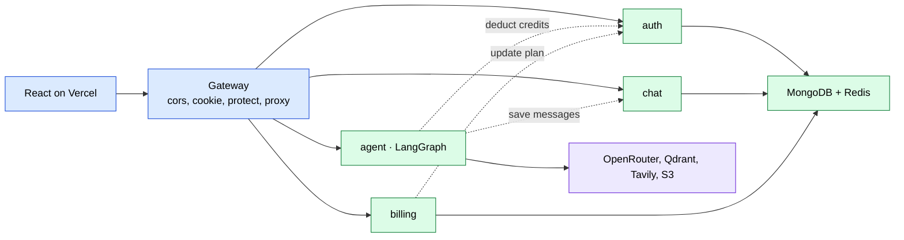

**Points to mention:**
- The gateway is the only thing the browser knows. The services get the user as an `x-user-id` header.
- Service-to-service calls use plain HTTP with axios, to **hard-coded public URLs** ([F6](08-known-issues-and-improvements.md#f6)).
- The weak spot: the services trust `x-user-id` but are publicly reachable ([S2](08-known-issues-and-improvements.md#s2)), and "internal" auth routes are exposed ([S1](08-known-issues-and-improvements.md#s1)). **Fix:** private network + a signed internal header.

### 0.2 What happens when a request hits the server

**Say this:** "Take `GET /api/chat/get-conversations`. At the gateway, `cors` adds the allow headers, `helmet` adds security headers, `morgan` logs, and `cookieParser` fills `req.cookies`. Then `protect` reads the `session` cookie, loads `session:<id>` from Redis and sets `req.user`, or replies 401. `proxyWithUser` strips `/api/chat`, adds `x-user-id` and streams the request to the chat service. There, `express.json` runs, the router matches `/get-conversations`, and the controller queries Mongo by `userId` and returns JSON, which the gateway pipes back."

**Draw this:**
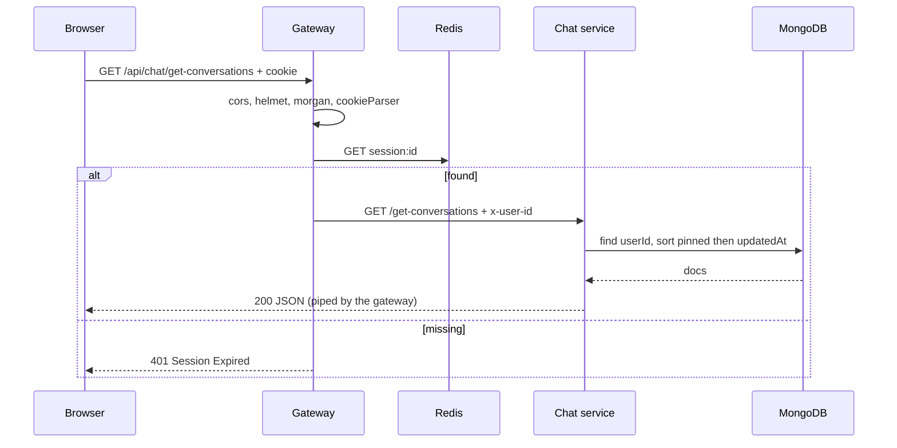

**Points to mention:**
- The body is **not** parsed at the gateway (`parseReqBody: false`), so uploads stream through.
- The prefix is stripped because Express mount paths remove it from `req.url`. That breaks `/api/chat/shared` ([F5](08-known-issues-and-improvements.md#f5)), and even opens every chat route with no login ([S15](08-known-issues-and-improvements.md#s15)).
- One Redis read per request is the price of revocable sessions.

### 0.3 How the backend code is organised (layers)

**Say this:** "Each service follows routes → controllers → models, with config and utils on the side. Routes only map a URL to a function. Controllers do the work and send one reply. Models are Mongoose schemas. The agent service adds a `graph/` layer (state, router node, planner) and an `agents/` layer (one file per agent). Cross-cutting code like the Redis client lives in `backend/shared`."

**Draw this:**
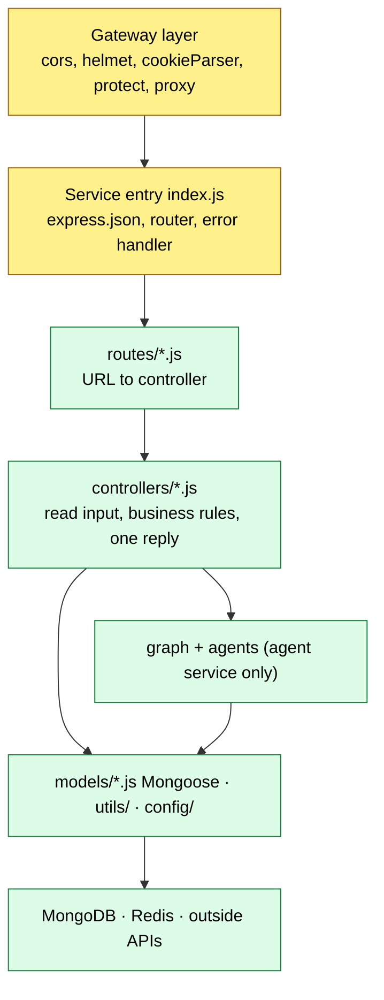

**Points to mention:**
- There's no service or repository layer: controllers call Mongoose directly. That's fine at this size, but harder to unit-test.
- Validation is missing at every layer ([Q7](08-known-issues-and-improvements.md#q7)).
- The graph/agents split is the cleanest part: each agent is a pure `state → state` function.

### 0.4 The main business flow end to end (a prompt becomes an answer)

**Say this:** "The user types a prompt. If it's a new chat, the frontend creates a conversation and sets its title. Then it posts FormData to `/api/agent/chat`. The agent service saves the user message to Redis memory and to the chat service, then runs the LangGraph. The router picks an agent: the user's choice, else the file type, else an LLM classification. The agent checks its per-minute rate limit, asks auth to deduct credits, then does its work: an LLM call, plus maybe a search, S3 or Qdrant. The controller saves the AI answer the same two ways and returns it, and Redux renders it. Generated code shows up in the artifact panel."

**Draw this:**
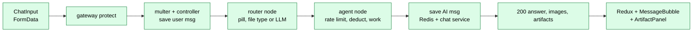

**Points to mention:**
- It's charged **before** the work and not refunded on failure ([F7](08-known-issues-and-improvements.md#f7)). The user message is saved before the checks ([F34](08-known-issues-and-improvements.md#f34)).
- It's one long synchronous request. Streaming (SSE) would be better ([Q10](08-known-issues-and-improvements.md#q10)).
- There's no ownership check on `conversationId` ([S5](08-known-issues-and-improvements.md#s5)).

### 0.5 The auth architecture

**Say this:** "Login is delegated to Firebase: a Google or GitHub popup returns an ID token. The auth service verifies it with the Firebase Admin SDK, finds or creates the user, and creates an **opaque session**: a random UUID stored in Redis for 7 days, with the user's name, plan and credits. The UUID goes into an `httpOnly`, `secure`, `SameSite=None` cookie. On every protected request, the gateway's `protect` looks the UUID up in Redis and forwards `x-user-id`. It's not JWT. I chose server sessions because they can be revoked and the cached credits can be updated in place."

**Draw this:**
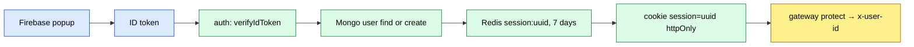

**Points to mention:**
- Logout is broken on the server: there's no `cookie-parser` in auth, so the Redis key is never deleted ([S6](08-known-issues-and-improvements.md#s6)).
- The cookie is cross-site (Vercel → Render), so it's a third-party cookie ([Q16](08-known-issues-and-improvements.md#q16)).
- Authorization (ownership) is missing on most chat routes ([S4](08-known-issues-and-improvements.md#s4)).

### 0.6 The real-time architecture

**Say this:** "There isn't one today. There are no sockets, SSE or queues. Every agent answer is one HTTP response, and the UI shows a 'Thinking…' animation until it arrives. For long jobs like PPT generation I'd add **Server-Sent Events** to stream tokens and progress, or push the job to a **BullMQ** queue on the existing Redis and notify the client when it's done."

**Draw this:**
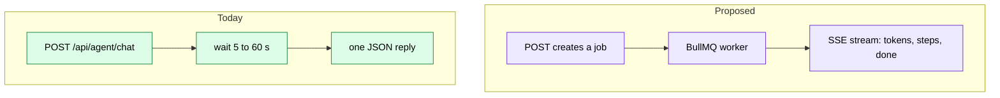

**Points to mention:**
- Long requests + proxies + the frontend retry loop = double charges ([S13](08-known-issues-and-improvements.md#s13)).
- SSE is one-way and works through normal HTTP proxies. WebSockets would be overkill for token streaming.
- A queue also makes "Stop" real: cancel the job ([S14](08-known-issues-and-improvements.md#s14)).

### 0.7 The most interesting feature: LangGraph agent routing

**Say this:** "The agent service is a LangGraph `StateGraph`. A **router** node picks one of 10 agents in order: the agent the user chose, then the uploaded file type (image → vision, PDF → RAG, CSV → data), and only then an LLM that returns one word. Conditional edges send the state to that agent. After an agent, the graph ends, or in Auto-Pilot mode goes to a **planner** node that decides DONE or 'next agent', looping back to the router. There's a `recursionLimit` of 150 to stop runaway loops. Search is special: it feeds its results to the chat agent, which writes the answer."

**Draw this:**
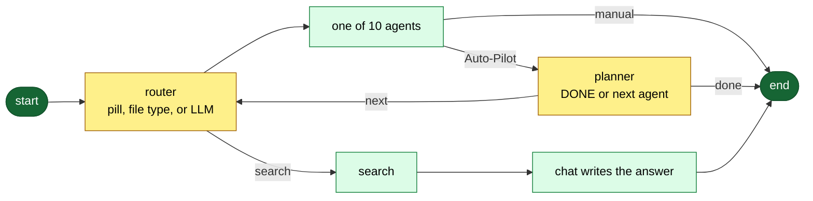

**Points to mention:**
- The fast paths avoid an LLM call, which saves cost and time.
- The planner can't run: `getModel` isn't imported ([F3](08-known-issues-and-improvements.md#f3)). The GitHub agent has no imports at all ([F2](08-known-issues-and-improvements.md#f2)). Both came from an auto-commenting script ([Q1](08-known-issues-and-improvements.md#q1)).
- The router's output isn't validated ([F29](08-known-issues-and-improvements.md#f29)). I'd use structured output.

### 0.8 The payment architecture

**Say this:** "Billing creates a Razorpay **order** on the server with the amount in paise (₹199 → 19900), and stores a `Payment` with status `created`. The browser opens Razorpay Checkout with that order ID. After payment, Razorpay gives the browser `order_id`, `payment_id` and `signature`, and the frontend posts them to `/verify-payment`. The server recomputes `HMAC-SHA256(key_secret, order_id|payment_id)`. If it matches, it marks the payment paid and calls auth's `/internal/update-plan` to add credits and set the plan for 30 days."

**Draw this:**
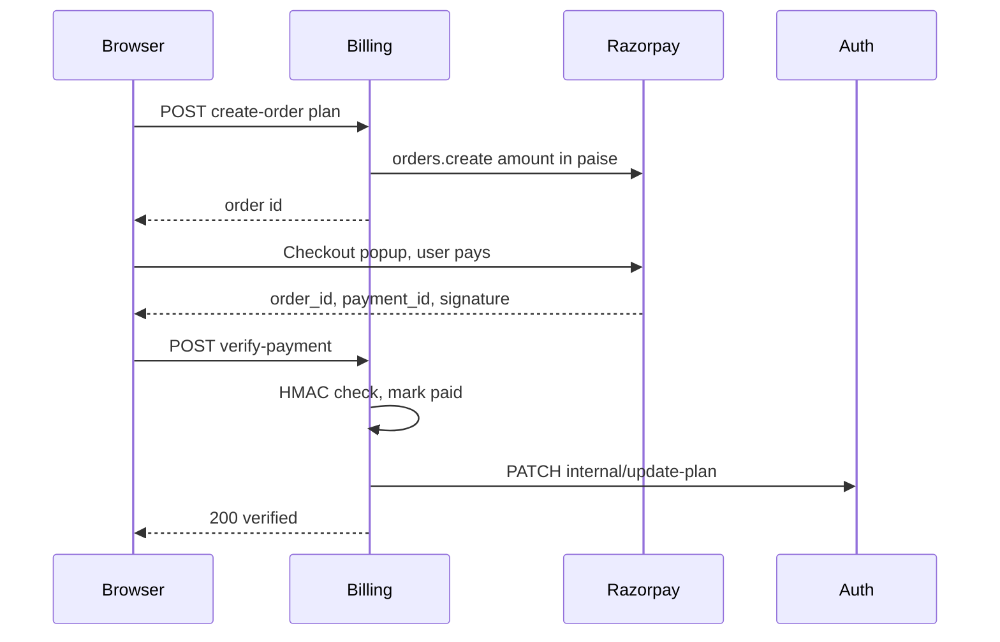

**Points to mention:**
- The signature check is correct in idea. But the payment status isn't checked, so the same signed payload can be **replayed** for more credits ([S3](08-known-issues-and-improvements.md#s3)). Fix it with an atomic `created → paid` update.
- No webhook: if the tab closes, the user paid but gets no credits ([S12](08-known-issues-and-improvements.md#s12)).
- The prices are trusted from the server-side `PLANS` (good: the client only sends the plan name).

### 0.9 The deployment architecture

**Say this:** "The frontend is a Vite build on Vercel. The five backend services are separate Render free web services defined in `render.yaml`. Each runs `npm install` for `shared` and itself, then `npm start`. MongoDB and Redis are external URLs. Free Render services sleep, so I added a wake-up page, a 'Server Waking Up' error title, and an axios retry loop (15 × 12 s)."

**Draw this:**
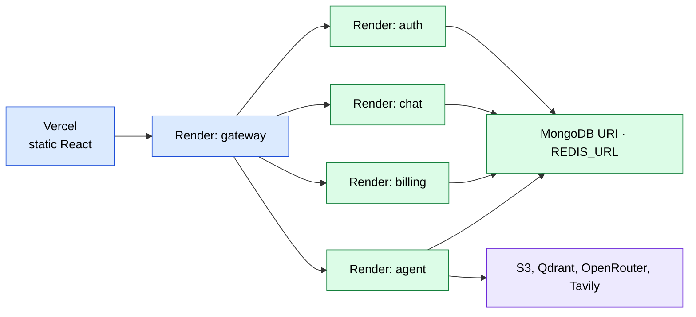

**Points to mention:**
- The code ignores the Render env service URLs and hard-codes production URLs, so local dev hits prod ([F6](08-known-issues-and-improvements.md#f6)).
- `main` doesn't build right now ([F1](08-known-issues-and-improvements.md#f1)), and there's no CI ([Q11](08-known-issues-and-improvements.md#q11)).
- The Dockerfiles exist but aren't used by Render ([Q12](08-known-issues-and-improvements.md#q12)).

### 0.10 The frontend architecture

**Say this:** "It's React 19 with Vite. `main.jsx` wraps the app in an ErrorBoundary and the Redux Provider. `App` runs `useCurrentUser` (GET `/api/me`) and has two routes: Home and the public share viewer. Home is three panes: Sidebar (conversations), ChatArea (Navbar, MessageList, ChatInput) and ArtifactPanel (Monaco plus a live iframe preview). State is three Redux slices: user, conversation and message. All HTTP goes through one axios instance with `withCredentials` and a retry interceptor."

**Draw this:**
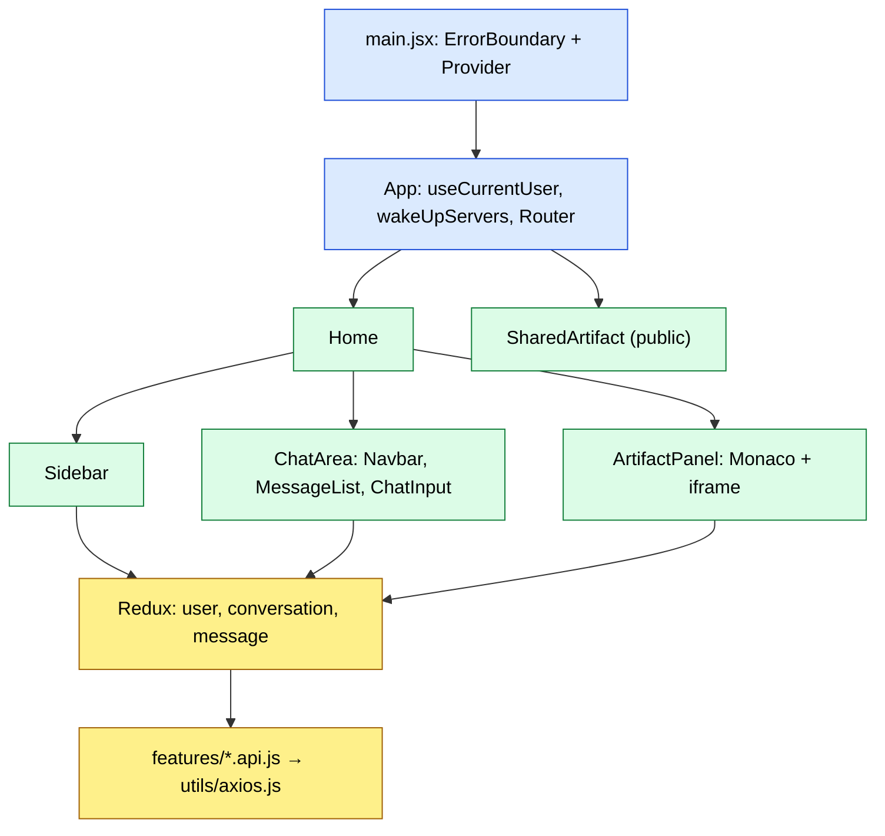

**Points to mention:**
- There are no route guards; the login modal sits on top of Home.
- There's a mix of a `window` CustomEvent (`editPrompt`) and Redux for cross-component messages.
- The known UI bugs: components defined inside components ([F21](08-known-issues-and-improvements.md#f21)), stale credits ([F19](08-known-issues-and-improvements.md#f19)), and the build-breaking import ([F1](08-known-issues-and-improvements.md#f1)).

### 0.11 The data model

**Say this:** "There are five Mongoose models across three services. Auth has `User` (firebaseUid unique, plan, credits, totalCredits). Chat has `Conversation` (userId, title, folder, isPinned), `Message` (conversationId ref, role, content, images, embedded artifacts with embedded files), and `SharedArtifact` (a unique shareId plus a copy of the files). Billing has `Payment` (orderId, amount, credits, status). User IDs cross services as plain strings. Redis holds the sessions, rate counters and the last 20 messages."

**Draw this:**
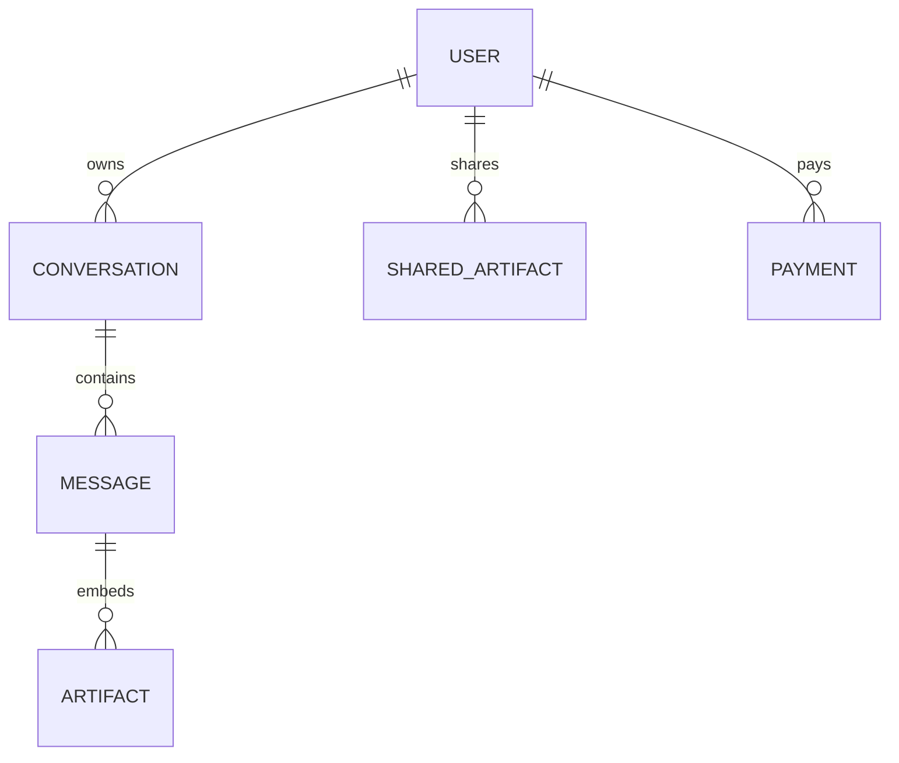

**Points to mention:**
- Embedded vs referenced: artifacts are embedded (read with the message), messages are referenced (they grow without limit).
- No indexes on `userId`, `conversationId` or `orderId` ([Q5](08-known-issues-and-improvements.md#q5)).
- No cross-service integrity. Deletes cascade by hand.

### 0.12 How file uploads travel through the system

**Say this:** "The user attaches a PDF, image or CSV. ChatInput sends FormData. The gateway doesn't parse the body, so the multipart stream goes to the agent service untouched. Multer checks the type and the 20 MB limit and writes it to `./temp`. `req.file` goes into the graph state. In Auto mode, the router sends images to vision, PDFs to RAG and CSVs to the data agent. Vision and RAG delete the temp file afterwards."

**Draw this:**
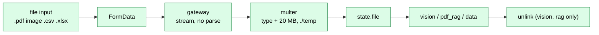

**Points to mention:**
- The `parseReqBody: false` story (commit `94e17d9`) is a good "bug I fixed" answer.
- `.xlsx` is accepted by the UI but rejected by multer, giving a 500 ([F9](08-known-issues-and-improvements.md#f9)). Temp files leak in several paths ([F14](08-known-issues-and-improvements.md#f14)).
- Better: presigned direct-to-S3 uploads, so big files skip the gateway.

### 0.13 How you would scale it

**Say this:** "Today every service is one free instance, the agent does all work inside the HTTP request, and PDFs are re-embedded for every question. To scale: private networking plus internal auth first. Then the stateless services go behind a load balancer with several instances each. That's easy because sessions are already in Redis. Agent work moves to a queue with workers and SSE streaming. Embeddings get cached per file. Add Mongo indexes and pagination, a CDN for S3 files, and per-user rate limits at the gateway."

**Draw this:**
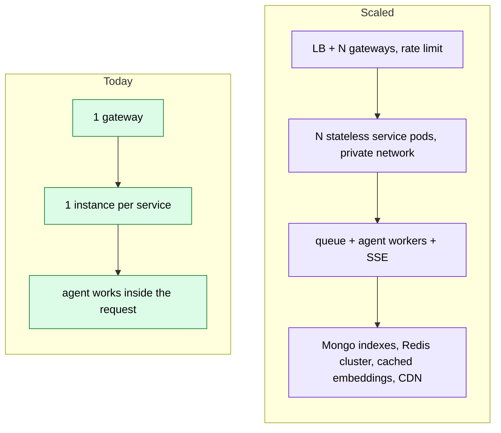

**Points to mention:**
- The services are already stateless (the state is in Redis and Mongo), so horizontal scaling is cheap.
- The bottleneck is LLM latency and cost, not CPU. So queue, cache and choose cheaper models per agent ([Q8](08-known-issues-and-improvements.md#q8)).
- Fix the atomicity (credits, payments) *before* adding instances, because races get worse with more instances.

### 0.14 How errors are handled across layers

**Say this:** "Each service controller has its own try/catch that returns `error.message` with 500, or a specific 400/401/404. The agent service is different: agents throw errors carrying `status` and `data` (429 rate limit, 400 insufficient credits, 500 'Server Waking Up'), and a global Express error handler turns them into JSON. The frontend axios interceptor retries cold-start errors, and ChatInput shows others in a banner using `title` and `message`."

**Draw this:**
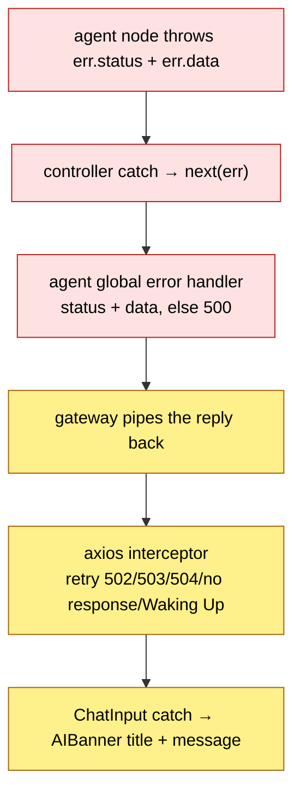

**Points to mention:**
- Five agents swallow their own errors and return 200 "Failed…" ([F7](08-known-issues-and-improvements.md#f7)).
- Login turns every error into 401 ([F11](08-known-issues-and-improvements.md#f11)). Multer errors become 500 ([F9](08-known-issues-and-improvements.md#f9)).
- The gateway has no error handler, and messages leak internals ([S11](08-known-issues-and-improvements.md#s11)).

---

## A. Project pitch

**A1. Give me the 60-second pitch.**
"AI-LUMA is an AI workspace where one chat box reaches ten specialised agents. It can chat, search the web, write complete web projects with a live preview, make PDFs and PowerPoints, generate images, answer questions about an uploaded PDF, turn a CSV into a chart, and work with your GitHub repos. It's built as five Node/Express microservices behind a gateway: auth with Firebase and Redis sessions, chat on MongoDB, billing on Razorpay, and an agent service that uses LangGraph to route each prompt. It's pay-per-use with credits: chat costs 1, search 5, and code, PDF, PPT and image 10. There's also a per-minute rate limit in Redis. The frontend is React 19 with Redux, Monaco for code and a sandboxed iframe preview. It's deployed on Vercel and Render's free tier."

**A2. What problem does it solve?**
One place for many AI tasks, instead of separate tools for chat, slides, PDFs, images and code. You pay per action with credits, rather than a flat subscription.

**A3. What was your role and what are you proudest of?**
The whole stack. The proudest part is the LangGraph router with its fast paths (user choice → file type → LLM), and the artifact panel that previews generated code safely in a sandboxed iframe.

**A4. What would you do differently?**
Private networking and internal auth from day one, atomic credit and payment updates, streaming instead of one long request, CI with lint and build, and no tool that rewrites source files without review (see [Q1](08-known-issues-and-improvements.md#q1)).

## B. Architecture and framework

**B1. Why microservices for a project this size?**
Separate deploys and failure isolation (the AI service can crash without killing login), and a place to scale the heavy agent service on its own. The honest cost: 4 network hops per prompt, no shared transactions, 5 cold starts on free hosting, and duplicated config. A modular monolith would have been simpler at this scale.

**B2. What does the gateway do exactly?**
CORS for the frontend origin, security headers (helmet), request logs (morgan), cookie parsing, the session check (`protect`), and reverse-proxying with `express-http-proxy` to 4 services while adding `x-user-id`. It also answers `/api/me` itself. It has no rate limit or error handler.

**B3. How do services talk to each other?**
Synchronous REST with axios: agent → auth `/internal/deduct-credits`, agent → chat `/save-message`, billing → auth `/internal/update-plan`. There's no queue, no retries, and no auth between services.

**B4. Why does the gateway not use `express.json()`?**
It would read the body stream, and the proxy would then forward an empty body. That caused 502s (commit `49e88fa`). With `parseReqBody: false`, the proxy streams the raw body, which also keeps multipart uploads intact.

**B5. How is the path forwarded?**
express-http-proxy uses `req.url`, which Express has already stripped of the mount prefix. So `/api/billing/create-order` becomes `/create-order` at billing, and each service mounts its router at `/`.

**B6. What's in `backend/shared`?**
A single ioredis client that loads dotenv and connects to `REDIS_URL`. The gateway, auth and agent import it by a relative path (`../../../shared/redis/redis.js`). Render installs it with `npm install --prefix ../../shared`.

**B7. Why Express 5?**
Rejected promises in async handlers go to the error middleware automatically, the path syntax is stricter, and it's the current major version. All services use 5.2.1.

**B8. What's the request flow for `/api/me`?**
The gateway `protect` loads the Redis session, and `getCurrentUser` returns `{ success: true, user: req.user }`. There's no DB hit and no service hop.

**B9. What are the single points of failure?**
Redis (every protected request reads it), the gateway, and the auth service (every paid agent call needs it). Also OpenRouter: one model for all agents.

**B10. How would you make service calls safe?**
Private network, a shared secret or an HMAC-signed internal header checked by a `requireInternal` middleware, timeouts plus retries with idempotency keys, and a message queue for "credit after payment".

## C. Middleware

**C1. What is middleware?**
A function `(req, res, next)` that runs before the controller. It can read or modify the request, or end it early. Express runs them in registration order.

**C2. Walk through `protect`.**
Read `req.cookies.session`, and reply 401 "Unauthorized" if it's missing. Then `redis.get("session:"+id)`, and reply 401 "Session Expired" if that's null. Otherwise `req.user = JSON.parse(value)` and `next()`. Any exception gives 500.

**C3. What does `proxyWithUser` add?**
`x-user-id` from the session (it overwrites the client's value), plus `x-user-email` and `x-user-avatar` only if they exist (commit `4ac41a3` fixed a crash on undefined headers), and it forwards `x-github-token`.

**C4. Why is order important? Give real examples.**
`cookieParser` must come before `protect`. `/api/chat/shared` must be mounted before `/api/chat`. There must be no body parser before the proxy. `multer` must come before the controller. The error handler must come last. And `cors` first, so preflight OPTIONS requests are answered.

**C5. How does the agent service handle errors?**
A 4-argument handler: if `err.status` is set, it replies with that status and `err.data`, otherwise 500 `{ success: false, message }`. `checkAgentLimit` and `deductCredits` throw errors shaped for it.

**C6. Is the rate limiter middleware?**
No. `checkAgentLimit(userId, agent)` is called inside each agent node, because the agent (and so the limit) is only known after the router runs.

**C7. What's missing from the middleware stack?**
A gateway rate limit (the packages are installed but unused), validation, internal auth, an ownership check, a proxy timeout, and a gateway error handler. See [04-middleware.md](04-middleware.md#weak-spots-all-together).

**C8. What does helmet actually protect here?**
Mostly headers like `nosniff`, HSTS and frame-options on a JSON API. It isn't a big deal for an API, but it's free defence in depth.

## D. Auth and security

**D1. Session or JWT, and why?**
An opaque session ID in Redis. Pros: it can be revoked at logout, and the credits and plan cached in it can be updated when they change. Cons: one Redis read per request, and state to manage.

**D2. Why Firebase instead of your own login?**
No password storage, resets or brute-force protection to build. You get Google and GitHub in a few lines, and the GitHub OAuth token for the GitHub agent.

**D3. How is the Firebase token verified?**
`getAuth(app).verifyIdToken(token)` with a service account from 3 env variables. The SDK checks the signature against Google's public keys, the expiry, the audience and the issuer.

**D4. Cookie flags and why?**
`httpOnly` (JavaScript can't read it, which helps against XSS), `secure` (HTTPS only), `sameSite: "none"` (needed because the frontend and API are on different sites), and a `maxAge` of 7 days.

**D5. Does logout work?**
Only on the browser side. The auth service has no `cookie-parser`, so `req.cookies` is undefined and `redis.del` never runs. The session stays valid for 7 days ([S6](08-known-issues-and-improvements.md#s6)).

**D6. What's the most serious security bug?**
`/api/auth/internal/update-plan` and `/deduct-credits` are proxied publicly with no auth, so anyone can give themselves credits ([S1](08-known-issues-and-improvements.md#s1)). The second is `/api/chat/shared/*`, which opens every chat route with no login ([S15](08-known-issues-and-improvements.md#s15)).

**D7. What is IDOR, and where is it here?**
Insecure Direct Object Reference: you access another user's data just by knowing or guessing its ID. Here: `get-messages/:id`, `save-message`, `update-conversation`, `toggle-pin`, `move-to-folder`, and the message delete in `delete-conversation` ([S4](08-known-issues-and-improvements.md#s4)). The same goes for `conversationId` in the agent ([S5](08-known-issues-and-improvements.md#s5)).

**D8. How do services know who the user is, and why is that risky?**
The `x-user-id` header set by the gateway. It's risky because the services are publicly reachable and don't verify the header ([S2](08-known-issues-and-improvements.md#s2)).

**D9. Where is the GitHub token stored?**
In `localStorage`, and it's sent on every request as `x-github-token` ([S9](08-known-issues-and-improvements.md#s9)). It's better kept server-side and encrypted.

**D10. How is generated HTML previewed safely?**
`<iframe sandbox="allow-scripts" srcDoc=...>` without `allow-same-origin`. Scripts run in an opaque origin, so they can't read the app's cookies, storage or DOM.

**D11. Is AI output an XSS risk in the chat?**
`react-markdown` doesn't render raw HTML by default, so no. Links get `rel="noreferrer"`. Images from AI output are loaded (a tracking-pixel risk, which is minor).

**D12. What about prompt injection?**
PDF text, CSV contents and search results go straight into prompts. For the GitHub agent, an injected instruction could lead to a **commit**. Fix: never let tool output trigger writes, and ask the user to confirm.

**D13. Are there hard-coded secrets?**
No API secrets in the code. The Firebase web config is hard-coded, but it's a set of public identifiers. The hard-coded **service URLs** are a config smell, not a secret ([Q2](08-known-issues-and-improvements.md#q2)).

## E. Database

**E1. Why MongoDB?**
Chat messages with nested artifacts (`artifacts[].files[]`) of changing shape fit documents well, and there's free hosting and Mongoose schemas.

**E2. List the models.**
User (auth), Conversation, Message and SharedArtifact (chat), Payment (billing). See [03-database-models.md](03-database-models.md).

**E3. Embedded or referenced, and why?**
Artifacts and files are embedded in the message (read together, never edited). Messages reference the conversation (unbounded growth). User IDs are plain strings across services (the user lives in another service).

**E4. How is "delete conversation" done without cascade?**
`findOneAndDelete({ _id, userId })`, then `Message.deleteMany({ conversationId })`. That's a manual cascade. The bug: the second step runs even if the first matched nothing.

**E5. What indexes exist and which are missing?**
Existing: `firebaseUid` and `shareId` (unique). Missing: `Conversation.userId` (+ sort fields), `Message {conversationId, createdAt}`, unique `Payment.orderId`.

**E6. How does the sidebar sort?**
`{ isPinned: -1, updatedAt: -1 }`. But `updatedAt` doesn't change on a new message, so "recent" isn't really recent ([F33](08-known-issues-and-improvements.md#f33)).

**E7. Where are credits stored, and how do you keep them consistent?**
The truth is `User.credits` in Mongo. There's a copy in the Redis session, rewritten after each change. The race: read-check-save isn't atomic ([S10](08-known-issues-and-improvements.md#s10)). Use `findOneAndUpdate` with `$gte` and `$inc`.

**E8. Do you use transactions?**
No. Payment and credits are in different services, so a DB transaction wouldn't help anyway. You'd need an idempotent handler plus an outbox or retry.

**E9. What's `totalCredits`?**
All credits ever granted (100 + every purchase). The UI shows `credits/totalCredits` as a bar.

**E10. How would you paginate messages?**
A cursor: `find({ conversationId, createdAt: { $lt: cursor } }).sort({ createdAt: -1 }).limit(50)`, with a compound index.

## F. Business logic: credits, limits, agents

**F1. How are credits charged?**
Each agent calls `deductCredits(userId, key)`, which asks auth to subtract `COST[key]`: chat 1, search 5, and coding / pdf / ppt / image 10 (unknown keys cost 1). Data and GitHub are charged as coding, and vision as image.

**F2. What does a search really cost?**
6: search charges 5, then the graph always goes to chat, which charges 1 more ([F8](08-known-issues-and-improvements.md#f8)).

**F3. Is anything free?**
PDF-RAG (Q&A over an uploaded PDF) never charges or rate-limits ([F4](08-known-issues-and-improvements.md#f4)). The router's LLM call in Auto mode also isn't charged.

**F4. How does the rate limiter work?**
A fixed 60 s window per user and agent: `INCR rate:<agent>:<userId>`, `EXPIRE 60` on the first hit. Over the limit, it throws 429 with `retryAfter` ("45s" or "1m 5s"). Limits: chat 20, coding 5, pdf 5, ppt 5, image 3, search 5.

**F5. Fixed window vs sliding window vs token bucket?**
A fixed window allows bursts at the boundary (2 × the limit in about 2 s). A sliding log or window is exact but costs more memory. A token bucket allows controlled bursts. For LLM cost control, a token bucket per user is the usual choice.

**F6. What happens when a user runs out of credits?**
Auth returns 400 "Not enough credits." The util converts it to `{ status: 400, title: "Insufficient Credits" }`, and the frontend shows a banner. That's true for chat, coding, search and vision. For pdf, ppt, image, data and github, the agent swallows it and returns 200 "Failed to generate…" ([F7](08-known-issues-and-improvements.md#f7)).

**F7. Are users refunded when the LLM fails?**
No. The charge happens before the work. Better: reserve credits, then commit on success, or charge after success.

**F8. How does the router decide?**
Rule 1: the user's pill (if it's not "auto"). Rule 2: an image goes to vision. Rule 3: a PDF goes to pdf_rag. Rule 4: a CSV goes to data. Rule 5: an LLM returns one word, with default chat.

**F9. How does the coding agent create files?**
It asks the LLM for `FILE: name` blocks, splits them with a regex, and strips the code fences. The result is an artifact `{ type: "project", files }` that the panel shows with a live preview of index.html + style.css + script.js.

**F10. How does the PPT agent work?**
It asks for `TITLE:`, `SUBTITLE:` and 8 `SLIDE:` blocks typed `bullets`, `stats` or `conclusion`, parses them, draws them with pptxgenjs on a 16:9 layout (a cover, up to 6 bullet cards per slide, up to 4 stat cards, and a conclusion), uploads to S3, and returns a 24 h link.

**F11. How does conversation memory work?**
Redis `conversation:<id>` holds the last 20 `{role, content}` for 24 h. Only the chat agent sends this history to the LLM ([F13](08-known-issues-and-improvements.md#f13) covers its limits).

**F12. What's Auto-Pilot?**
After each agent, a planner asks the LLM "DONE or the next agent?" and loops back to the router, up to a recursion limit of 150. It's currently broken: `getModel` isn't imported ([F3](08-known-issues-and-improvements.md#f3)).

**F13. How do new users get credits?**
The schema default is `credits: 100` and `totalCredits: 100`, set when the user is first created at login.

## G. Payments and integrations

**G1. Walk me through Razorpay.**
Order on the server (amount × 100 paise, receipt `receipt_<ts>`) → a `Payment` row with status `created` → Checkout in the browser with `order_id` → the handler gets `{order_id, payment_id, signature}` → the server does the HMAC check → marks it paid → calls auth update-plan.

**G2. How is the signature verified?**
`crypto.createHmac("sha256", RAZORPAY_KEY_SECRET).update(order_id + "|" + payment_id).digest("hex") === signature`. Better: `crypto.timingSafeEqual`.

**G3. Why can't the client just say "I paid"?**
It can't forge the HMAC without the key secret. But it **can** replay a real one, because the status isn't checked ([S3](08-known-issues-and-improvements.md#s3)).

**G4. Why do you need a webhook?**
The browser handler may never run (a closed tab, a network drop). Razorpay's `payment.captured` webhook, verified with `X-Razorpay-Signature`, makes crediting reliable ([S12](08-known-issues-and-improvements.md#s12)).

**G5. What if auth is down during verify?**
The payment is already saved as `paid`. The axios call throws, and the user gets a 500. There's no retry, so the credits are lost. Fix with an outbox or retry, and an idempotent update-plan.

**G6. Plans and prices?**
Free (₹0, 100 credits: not buyable), Starter ₹199 → 500 credits, Pro ₹499 → 1000 credits. There's a 30-day expiry that nothing enforces ([F12](08-known-issues-and-improvements.md#f12)).

**G7. Can the client choose the price?**
No. Only the plan name is sent, and the server looks up `PLANS[plan]`. But `PLANS["constructor"]` slips through the check ([F36](08-known-issues-and-improvements.md#f36)).

**G8. Which outside APIs does the agent use?**
OpenRouter (DeepSeek), Google embeddings, Qdrant, Tavily, S3, Pollinations and the GitHub REST API.

## H. Real-time

**H1. Does the app use WebSockets?**
No. There are no sockets, SSE, queues or cron. Each answer is one HTTP reply.

**H2. How does the user see progress?**
A rotating "Thinking / Analyzing / Reasoning / Generating" label (every 1.8 s) while `isLoading` is true. It isn't real progress.

**H3. How would you add streaming?**
`llm.stream()` in the agent, then SSE (`text/event-stream`) through the gateway (the proxy has to not buffer). The frontend reads it with `fetch` + `ReadableStream` (`EventSource` can't POST).

**H4. What problems does the lack of streaming cause?**
Long waits, proxy and platform timeouts, the frontend retry loop re-running expensive prompts ([S13](08-known-issues-and-improvements.md#s13)), and a "Stop" that can't really stop ([S14](08-known-issues-and-improvements.md#s14)).

## I. Uploads, AI, RAG, files

**I1. How are uploads handled?**
Multer disk storage in `./temp`, only pdf / image / csv, 20 MB, one file named `file`.

**I2. What is RAG, and how is it done here?**
Retrieve relevant chunks, then generate from them. Here: pdf-parse → a RecursiveCharacterTextSplitter (1000 / 200) → Gemini `gemini-embedding-001` → a new Qdrant collection → top 5 by similarity → the LLM answers "only from the PDF".

**I3. Why chunk overlap?**
So ideas cut at a boundary still appear whole in one chunk.

**I4. What's wrong with the RAG implementation?**
It re-embeds the whole PDF for every question, the collection is never deleted (a scoping bug), it's free, and there are no citations ([F4](08-known-issues-and-improvements.md#f4), [Q9](08-known-issues-and-improvements.md#q9)).

**I5. What model do you use and why?**
`deepseek/deepseek-chat` via OpenRouter, temperature 0, max 2500 tokens. The git history shows Groq and Gemini were tried and dropped. It's one model for every agent ([Q8](08-known-issues-and-improvements.md#q8)).

**I6. Why temperature 0?**
Stable output for parsing (`FILE:` blocks, JSON, slide formats) and routing. The trade-off is less creative text.

**I7. How do you get structured output from the LLM?**
By prompting for a format and parsing: a regex for `FILE:`, first-`{`-to-last-`}` for JSON, and line parsing for slides. It's fragile. `withStructuredOutput(schema)` or tool calling is better.

**I8. How is the image generated?**
The LLM writes a detailed prompt → `GET image.pollinations.ai/prompt/<prompt>` → the bytes go to S3 → a presigned URL goes into markdown.

**I9. What's a presigned URL?**
A time-limited signed link to a private S3 object. Here it lasts 24 h (the text wrongly says 10 minutes for PDF and image: [F15](08-known-issues-and-improvements.md#f15)).

**I10. How does vision work?**
It base64-encodes the image as an `image_url` data URI in a `HumanMessage`. But the model is text-only, so it likely fails ([F16](08-known-issues-and-improvements.md#f16)).

**I11. How does the data agent make charts?**
It reads the CSV text (up to 500 lines) and asks the LLM for JSON with 3 files (Chart.js via CDN, `<canvas id="myChart">`) → an artifact → a live preview in the iframe.

**I12. What does the GitHub agent do?**
The LLM picks `reply`, `list_repos` (10 most recently updated), `read_file`, or `commit` (createOrUpdateFileContents, with the sha if the file exists). It's currently broken by missing imports. Commits made without confirmation are a risk.

## J. Frontend

**J1. How is state managed?**
Redux Toolkit with 3 slices: user `{userData, isCheckingAuth}`, conversation `{conversations, selectedConversation}`, message `{messages, isLoading, artifacts}`.

**J2. How do you avoid the login-modal flash on refresh?**
`isCheckingAuth` starts `true`. The modal only shows when `!isCheckingAuth && !userData`. `useCurrentUser` sets it `false` in `finally`.

**J3. How does the retry interceptor work?**
On no response, 502, 503, 504, or a 500 with the title "Server Waking Up", it waits 12 s and retries, up to 15 times. It's for Render cold starts. It's also a bug for POSTs ([S13](08-known-issues-and-improvements.md#s13)).

**J4. How does "Stop generating" work?**
An `AbortController` signal passed to axios. On abort, the catch ignores `CanceledError`. The server keeps working ([S14](08-known-issues-and-improvements.md#s14)).

**J5. How is the artifact previewed?**
index.html + style.css + script.js are inlined into a `srcDoc` template and shown in a sandboxed iframe. The code view is a read-only Monaco editor with the language picked by file extension (`detectLanguage`).

**J6. How do components talk across the tree?**
Redux for data, prop callbacks (`setBanner`), and one `window` CustomEvent (`editPrompt`) from MessageList to ChatInput.

**J7. What performance issues exist?**
Components defined inside components remount every render ([F21](08-known-issues-and-improvements.md#f21)). The message list uses index keys. Messages are fetched twice ([F17](08-known-issues-and-improvements.md#f17)). There's a `console.log` in every code-block render. Monaco is loaded eagerly.

**J8. What's broken in the frontend right now?**
The build (a wrong import path, [F1](08-known-issues-and-improvements.md#f1)), empty suggestion cards ([F22](08-known-issues-and-improvements.md#f22)), share links ([F5](08-known-issues-and-improvements.md#f5)), Regenerate / Edit ([F20](08-known-issues-and-improvements.md#f20)), and credits not refreshing ([F19](08-known-issues-and-improvements.md#f19)).

**J9. Voice features?**
Web Speech `SpeechRecognition` (en-IN, continuous, interim results) for input, and `speechSynthesis` for read-aloud. They're browser-only, and speech recognition doesn't work in Firefox.

**J10. How is the GitHub agent pill shown or hidden?**
Only if `localStorage.github_token` exists, which is set after a GitHub login.

## K. Deployment and env

**K1. Where is it deployed?**
Render free web services for all 5 backends (`render.yaml`), and Vercel for the frontend (from the commit history).

**K2. How does Render build the shared folder?**
`npm install --prefix ../../shared && npm install` in each service's `rootDir`.

**K3. How are cold starts handled?**
WakeUp.html pings, `wakeUpServers()` on app load (wrong URLs: [F23](08-known-issues-and-improvements.md#f23)), a "Server Waking Up" error title, and 15 × 12 s retries in axios.

**K4. What env variables does the agent need?**
OPENROUTER_API_KEY, GOOGLE_API_KEY, TAVILY_API_KEY, QDRANT_URL, QDRANT_API_KEY, the four AWS_* variables, REDIS_URL, MONGO_URI, and CHAT_SERVICE. `render.yaml` only lists 4 of them.

**K5. Are frontend env variables secret?**
No. `VITE_*` values are compiled into the bundle. The Firebase web key and the Razorpay key ID are public by design.

**K6. Why are the service URLs hard-coded?**
Commit `a5209f2` switched to public HTTPS URLs after internal-DNS problems. The result: env variables are ignored and local dev calls production ([F6](08-known-issues-and-improvements.md#f6)).

**K7. What's the CORS setup?**
Origins `CLIENT_URL` and `http://localhost:5173` with `credentials: true`. A wildcard isn't allowed with credentials.

**K8. Is Docker used?**
Each service has a Dockerfile (unpinned `node` image) and docker-compose runs Redis. Render doesn't use the Dockerfiles ([Q12](08-known-issues-and-improvements.md#q12)).

## L. Scaling, performance, testing

**L1. What's the bottleneck?**
LLM latency and cost, then the synchronous request model. Mongo queries are small but unindexed.

**L2. Can you run several instances of each service?**
Yes. They're stateless (the state is in Redis and Mongo). The exceptions: temp files on the agent's local disk (fine per request), and the non-atomic credit, payment and memory updates, which get worse with concurrency.

**L3. How would you cut LLM cost?**
Fast-path routing (already done), a cheaper model for routing and planning, caching repeated prompts, caching PDF embeddings per file hash, shorter history (a summary), and per-agent `maxTokens`.

**L4. How would you test this?**
Unit tests for the parsers (`parseResponse`, the coding regex, the data JSON slice), `checkAgentLimit` against a Redis mock, controller tests with supertest and mongodb-memory-server, a fake LLM (a fixed-response `invoke`), and one Playwright happy path. Plus CI running lint + build.

**L5. Are there any tests now?**
No. The test scripts are placeholders ([Q11](08-known-issues-and-improvements.md#q11)).

**L6. How would you monitor it?**
Structured logs with a request ID passed through the gateway, metrics per agent (latency, tokens, errors), alerts on 5xx and on credit or payment mismatches, and uptime checks on the health routes.

**L7. What's the biggest scaling risk in the data model?**
Big generated projects embedded in messages (every `get-messages` returns every file), and no pagination.

**L8. How would you protect against abuse?**
A gateway rate limit per IP and user, a CAPTCHA on login bursts, a per-user daily credit cap, a max prompt length, and file-type checks by magic bytes, not just MIME type.

**L9. How long does a prompt take?**
It depends on the agent: one LLM call for chat, plus a search for search, plus S3 for files. The code doesn't measure it, so I'd add timing logs.

**L10. What about the Redis memory approach at scale?**
Fine for speed, but switch to `RPUSH`/`LTRIM` (atomic), key by user and conversation, and summarise older turns.

## M. Bugs you found and what you'd improve

**M1. Tell me about a bug you debugged.**
Multipart uploads through the gateway were corrupted, because the proxy re-serialised the parsed body. Setting `parseReqBody: false` made the gateway a pure stream pipe (commit `94e17d9`). Related: removing `express.json()` from the gateway fixed 502s (commit `49e88fa`).

**M2. Tell me about a bug that's still there.**
A commenting script rewrote every file through an LLM and dropped imports. The GitHub agent and the Auto-Pilot planner throw ReferenceErrors, and the frontend imports a file that doesn't exist, so `vite build` fails. A lint + build step in CI would have caught all of it ([Q1](08-known-issues-and-improvements.md#q1)).

**M3. What's the worst security issue?**
Public `/internal/*` credit routes ([S1](08-known-issues-and-improvements.md#s1)) and the open `/api/chat/shared/*` pass-through ([S15](08-known-issues-and-improvements.md#s15)).

**M4. What's the worst money issue?**
Payment replay ([S3](08-known-issues-and-improvements.md#s3)), then the credit race ([S10](08-known-issues-and-improvements.md#s10)), then double charges from retries ([S13](08-known-issues-and-improvements.md#s13)).

**M5. A subtle JavaScript bug?**
In `pdfRag.agent.js`, `const collectionName` is declared inside `try` and used in `finally`. Block scope makes it a ReferenceError, the inner catch swallows it, and the Qdrant collections leak ([F4](08-known-issues-and-improvements.md#f4)).

**M6. A subtle HTTP bug?**
Mounting a proxy at `/api/chat/shared` strips the prefix, so share links 404 and every chat route is reachable without login ([F5](08-known-issues-and-improvements.md#f5), [S15](08-known-issues-and-improvements.md#s15)).

**M7. A wrong-status-code bug?**
Login returns 401 for DB outages ([F11](08-known-issues-and-improvements.md#f11)). Multer rejections return 500 ([F9](08-known-issues-and-improvements.md#f9)). Five agents return 200 on rate-limit or credit errors ([F7](08-known-issues-and-improvements.md#f7)).

**M8. A frontend bug?**
`MessageList` calls `get-messages/undefined` when no chat is selected, and gets a 500 ([F32](08-known-issues-and-improvements.md#f32)). `setArtifacts(messages.artifacts)` on an array ([F17](08-known-issues-and-improvements.md#f17)).

**M9. What would you fix first, with one day?**
Block `/internal/*` and lock `/api/chat/shared` to one route, make payment verification idempotent, use an atomic `$inc`, fix the three missing imports, and add CI.

**M10. What would you redesign with more time?**
Private networking with signed internal identity, a job queue with streaming, one pricing config, structured LLM output, per-agent models, and a proper persistent RAG store.

---

## N. Quick-fire one-liners

| Question | Answer |
|---|---|
| Gateway port | `PORT` or 5000 |
| Service ports | `PORT` env only (no default). The Dockerfiles `EXPOSE` 8000–8004 |
| Session lifetime | 7 days (Redis TTL and cookie `maxAge`) |
| Session key | `session:<uuid>`; `user-session:<userId>` → the newest session |
| Cookie flags | httpOnly, secure, SameSite=None |
| Memory key / cap / TTL | `conversation:<id>` / 20 messages / 24 h |
| Rate-limit key / window | `rate:<agent>:<userId>` / 60 s fixed |
| Limits per minute | chat 20, coding 5, pdf 5, ppt 5, image 3, search 5 |
| Credit costs | chat 1, search 5 (+1 = 6), coding / pdf / ppt / image 10, others 1 |
| Starting credits | 100 (`credits` and `totalCredits`) |
| Plans | free ₹0/100, starter ₹199/500, pro ₹499/1000, 30 days |
| Razorpay amount unit | paise (× 100) |
| Signature | HMAC-SHA256(secret, `order_id\|payment_id`) hex |
| LLM | `deepseek/deepseek-chat` via OpenRouter, temp 0, 2500 max tokens |
| Embeddings | `gemini-embedding-001` |
| Chunking | 1000 chars, 200 overlap, top-5 retrieval |
| Tavily | 5 results, images included |
| Upload limit | 20 MB, one file field `file`, pdf / image / csv |
| Presigned URL life | 24 h (86 400 s) |
| Recursion limit | 150 |
| Axios retries | 15 × 12 s ≈ 3 min |
| Banner auto-close | 5 s |
| Thinking label rotation | 1.8 s |
| Data agent CSV cap | 500 lines |
| PPT | 8 slides + a cover, LAYOUT_WIDE, ≤ 6 bullets, ≤ 4 stats, ≤ 4 conclusion points |
| Share ID | `crypto.randomBytes(8)` → 16 hex chars |
| Title of a new chat | the first 40 characters of the first prompt |
| Models count | 5 (User, Conversation, Message, SharedArtifact, Payment) |
| Services | 5 (gateway, auth, chat, billing, agent) |
| Agents | 10 + router + planner = 12 graph nodes |
| Chat routes | 11 |
| Message roles | `user`, `assistant` |
| Payment statuses | `created`, `paid`, `failed` (failed is never set) |
| Default conversation title | "New Chat" |
