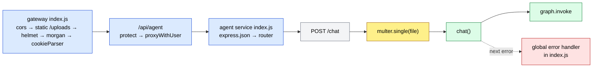
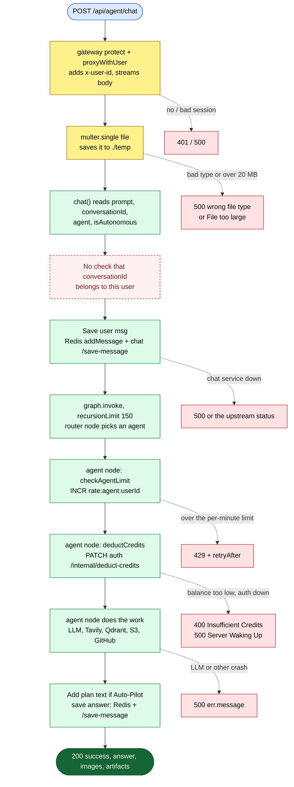
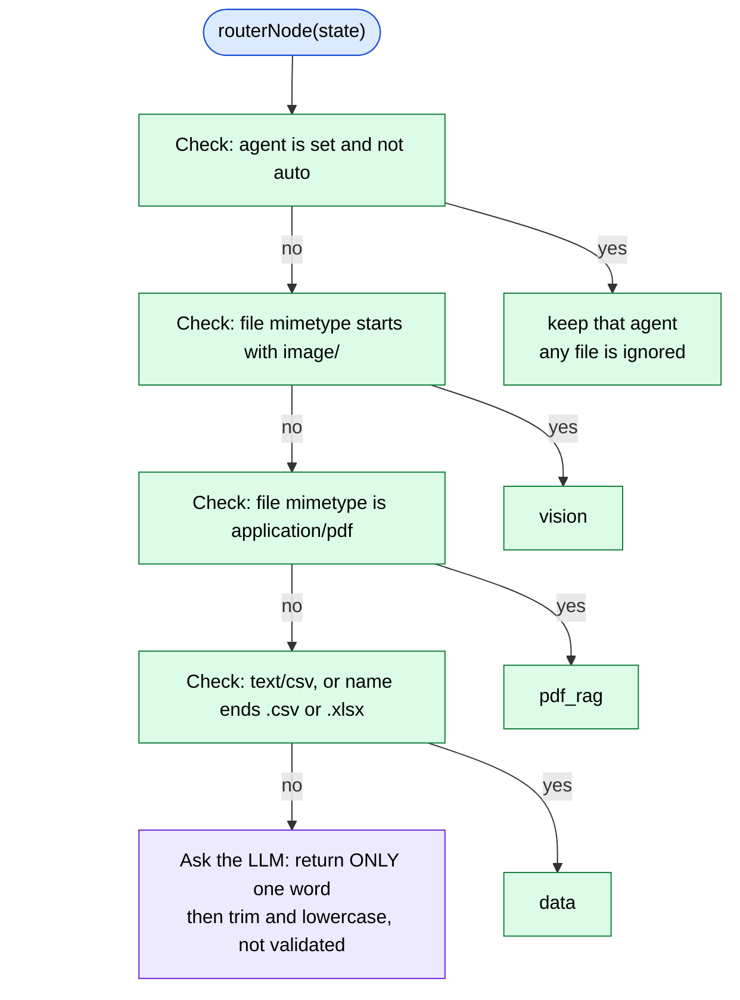
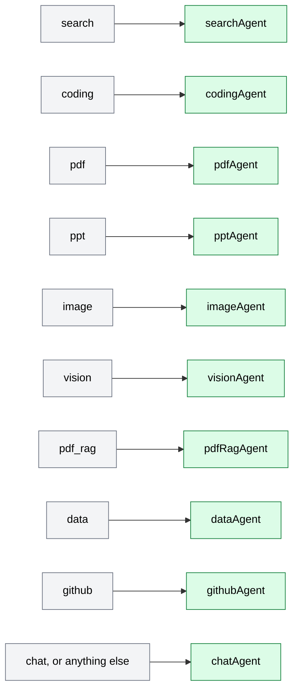
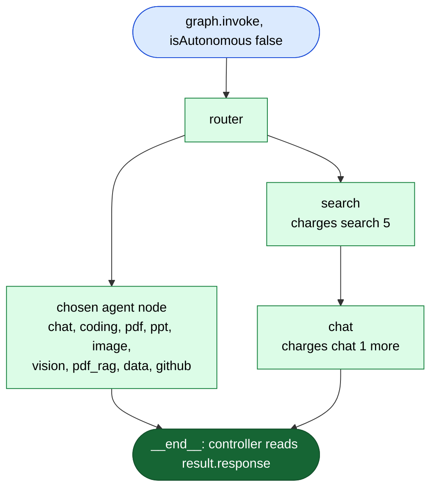
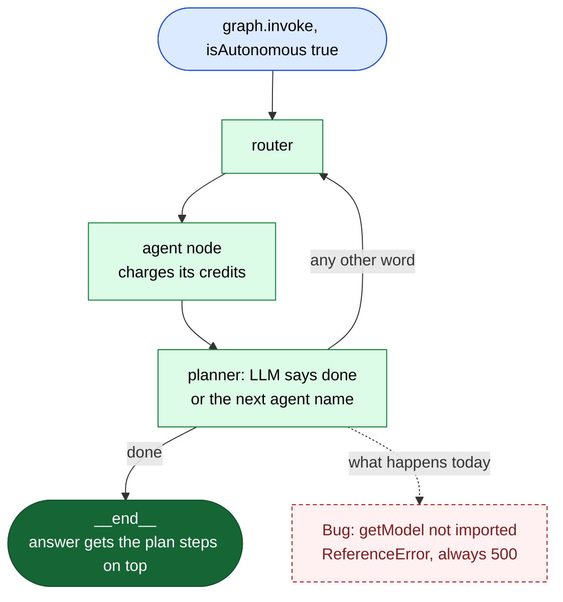
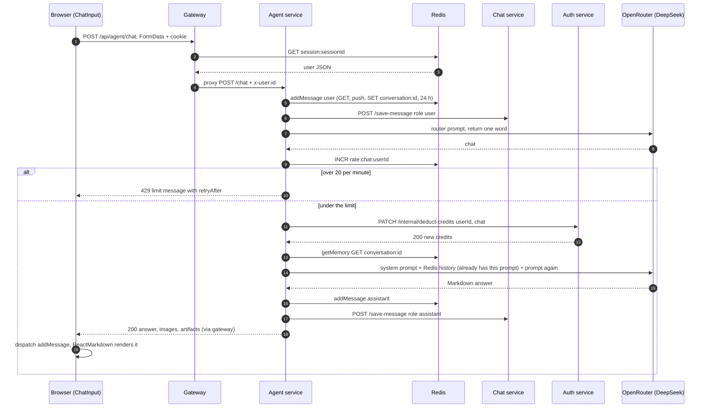
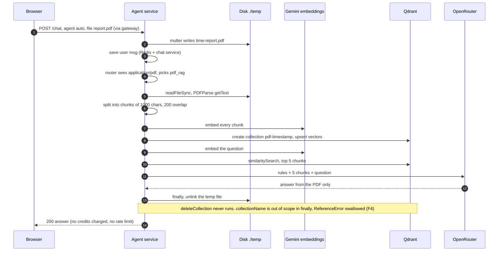
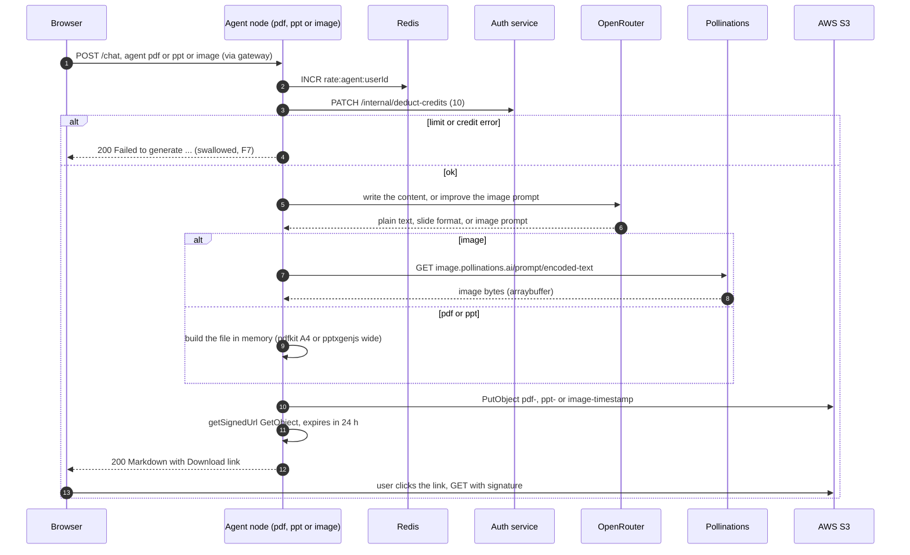

# Agent routes (the AI chat endpoint)

**Code:** [agent.route.js](../../backend/services/agent/routes/agent.route.js) · [agent.controller.js](../../backend/services/agent/controllers/agent.controller.js) · [agent service index.js](../../backend/services/agent/index.js) · [multer.js](../../backend/services/agent/config/multer.js) · [supervisor.graph.js](../../backend/services/agent/graph/supervisor.graph.js) · [gateway index.js](../../backend/gateway/index.js#L72) · controllers: [agent.controllers.md](../controllers/agent.controllers.md) · architecture overview: [05-agent-engine.md](../05-agent-engine.md)

The **agent service** is the "brain" of the app. It has only **one** route. The browser sends it a prompt (and maybe a file), and it runs a **LangGraph** graph to answer.

- **LangGraph** is a library for building AI workflows as a graph. A **node** is one step (a JavaScript function). An **edge** says which node runs next. The **state** is one shared object that every node reads and returns an updated copy of.
- An **LLM** (large language model) is the text AI. Here every node uses the same one: `deepseek/deepseek-chat` through **OpenRouter** ([model.js](../../backend/services/agent/utils/model.js)).
- Each "agent" (chat, search, coding, pdf, ppt, image, vision, pdf_rag, data, github) is one node. A **router** node picks which one runs.

The browser reaches it through the **gateway** at `/api/agent/chat`. The gateway checks the login first, then forwards the request.

> **Mount path:** the gateway mounts the proxy at `/api/agent` ([index.js:72](../../backend/gateway/index.js#L72)). Express removes the mount prefix from `req.url`, and `express-http-proxy` forwards `req.url`. So `/api/agent/chat` arrives at the agent service as `/chat`. The agent service mounts its router at `/` ([index.js:20](../../backend/services/agent/index.js#L20)).

> **Multipart:** the body is **multipart/form-data** (the browser format that can carry text fields *and* a file in one request), not JSON. The gateway uses `parseReqBody: false` ([proxyWithHeaders.js:19](../../backend/gateway/utils/proxyWithHeaders.js#L19)), so it streams the raw body through untouched. `multer` (a file-upload middleware) parses it inside the agent service.

---

## Router map

## Quick table

| # | Method | Full URL (through gateway) | Middleware | Controller | Login needed |
|---|---|---|---|---|---|
| 1 | POST | `/api/agent/chat` | gateway `protect` + `proxyWithUser`, then `multer.single("file")` in the agent service | `chat()` | **Yes** (at the gateway only; the agent service itself trusts `x-user-id`, see [S2](../08-known-issues-and-improvements.md#s2)) |

> **How to read the diagrams**
> 🟦 request / router · 🟨 middleware · 🟩 controller or graph step · 🟪 outside AI / cloud service · 🟥 error reply · 🟢 success reply · dashed pink = a known bug.
> The main (success) path goes straight down. Errors hang off to the **right** on dotted arrows. The gateway's global middleware (cors, helmet, morgan, cookieParser) is drawn **once**, in the router map above, and not repeated below.

---

## 1. POST /api/agent/chat: send a prompt to the AI agents

**Called from:** [ChatInput.jsx](../../frontend/src/components/ChatInput.jsx#L138-L221) `handleSend()`, through [agent.api.js](../../frontend/src/features/agent.api.js#L9-L24) `sendPrompt()` and the shared axios instance [axios.js](../../frontend/src/utils/axios.js) (cookie + `x-github-token` header, auto-retry) · **Body (multipart form fields, all strings):**

| Field | Example | Meaning |
|---|---|---|
| `conversationId` | `"66f1..."` | The Mongo `_id` of the chat. The frontend creates a conversation first if none is selected ([ChatInput.jsx:158-163](../../frontend/src/components/ChatInput.jsx#L158-L163)). |
| `prompt` | `"Explain Redis"` | What the user typed. |
| `agent` | `"auto"` (default), `"chat"`, `"coding"`, `"pdf"`, `"ppt"`, `"image"`, `"search"`, `"data"`, `"github"` | The button chosen in the UI ([ChatInput.jsx:59-70](../../frontend/src/components/ChatInput.jsx#L59-L70)). There is no button for `vision` or `pdf_rag`; those are only picked by the router from the file type. |
| `isAutonomous` | `"true"` / `"false"` | The Auto-Pilot toggle. `FormData` turns the boolean into a **string**. |
| `file` (optional) | a PDF, image, CSV (the picker also offers `.xlsx`) | Saved to disk by multer as `req.file`. |

**Headers added on the way:** the axios interceptor adds `x-github-token` from `localStorage` ([axios.js:14-23](../../frontend/src/utils/axios.js#L14-L23)). The gateway adds `x-user-id` (plus `x-user-email`, `x-user-avatar`) from the Redis session and passes `x-github-token` on ([proxyWithHeaders.js:24-43](../../backend/gateway/utils/proxyWithHeaders.js#L24-L43)).

**Reply:** `200` + `{ success: true, answer, images, artifacts }`. `answer` is Markdown text. `images` is a list of image URLs (only the chat node sets it, from web search). `artifacts` is a list of code projects for the side panel (from the coding and data nodes), or `[]`.

**In simple words:** The gateway checks the login cookie and forwards the request with the user's ID in a header. Multer saves any uploaded file into a `temp` folder. The controller saves the user's message twice: once in Redis (short-term memory for the AI) and once in the chat service (the permanent Mongo copy). Then it runs the LangGraph graph. The router node picks one agent. That agent checks a per-minute limit, charges credits through the auth service, and does its job (calls the LLM, searches the web, builds a PDF, and so on). The controller saves the answer in the same two places and sends it back.

**Where each error reply comes from:** every error is thrown, then `next(error)` ([agent.controller.js:87-90](../../backend/services/agent/controllers/agent.controller.js#L87-L90)) hands it to the global error handler ([index.js:25-49](../../backend/services/agent/index.js#L25-L49)). If the error has a `status`, the reply is that status + `err.data` (or `{ success: false, message }`). Otherwise it is `500` + `{ success: false, message }`.

> ⚠️ **Interview point:** the 429 and 400 replies above only happen for the **chat, search, coding and vision** nodes. The **pdf, ppt, image, data and github** nodes run the limit and credit checks *inside* their own `try/catch`, so the error is swallowed and the user gets `200` "Failed to generate…" instead. Credits are also taken *before* the work, with no refund if it fails. See [F7](../08-known-issues-and-improvements.md#f7).

> ⚠️ **Interview point:** any `conversationId` is accepted. The controller writes into it (Redis and Mongo), and the chat node reads its Redis history into the prompt. So a user who knows another chat's ID can read or pollute it. See [S5](../08-known-issues-and-improvements.md#s5).

> ⚠️ **Interview point:** multer's errors (wrong type, file too large) have no `status`, so they all become **500** instead of 400 / 413. The file picker offers `.xlsx` and the router has an `.xlsx` branch, but multer rejects `.xlsx`, so that branch is dead. See [F9](../08-known-issues-and-improvements.md#f9).

> ⚠️ **Interview point:** the whole AI job runs inside **one long HTTP request** (no streaming, no job queue). The frontend's axios interceptor retries on no-response, 502/503/504, and on a 500 whose title is "Server Waking Up", up to 15 times. Every retry runs the controller **from the start**: the user message is saved again and credits are charged again. The Stop button only cancels the browser request; the server keeps running and charging. See [S13](../08-known-issues-and-improvements.md#s13), [S14](../08-known-issues-and-improvements.md#s14), [Q10](../08-known-issues-and-improvements.md#q10).

> ⚠️ **Interview point:** the chat service URL `https://ailuma-chat-service.onrender.com/save-message` is **hard-coded** twice ([agent.controller.js:32](../../backend/services/agent/controllers/agent.controller.js#L32), [68-77](../../backend/services/agent/controllers/agent.controller.js#L68-L77)), is called directly (not through the gateway), and sends no `x-user-id`. See [F6](../08-known-issues-and-improvements.md#f6) and [S4](../08-known-issues-and-improvements.md#s4).

### 1a. How the router picks an agent

[router.node.js](../../backend/services/agent/graph/router.node.js) runs first on every request. It checks these rules **in order** and stops at the first match:

Then a conditional edge ([supervisor.graph.js:49-79](../../backend/services/agent/graph/supervisor.graph.js#L49-L79)) turns `state.agent` into the next node. Anything that is not in the list goes to `chat`:

> ⚠️ **Interview point:** the first rule wins over the file rules. If the user picks "Chat" and attaches an image, the image is **ignored** (and left on disk, [F14](../08-known-issues-and-improvements.md#f14)). The file only decides the agent (vision, pdf_rag or data) when the button is left on **Auto**.

> ⚠️ **Interview point:** the LLM rule is fragile. The prompt lists `ppt` and `image` as agents but leaves them out of the final "Return ONLY one word" list, and the reply is never checked against the allowed names (anything unknown, like `"chat."`, silently becomes chat). See [F29](../08-known-issues-and-improvements.md#f29). A better way: structured output (a JSON schema or a tool call) with an enum.

### 1b. Manual mode path (Auto-Pilot off)

With `isAutonomous = false`, every agent node ends the graph. The one exception is **search**, which always hands its results to **chat** to write the answer ([supervisor.graph.js:84-104](../../backend/services/agent/graph/supervisor.graph.js#L84-L104)).

> ⚠️ **Interview point:** so one web search really costs **6** credits (5 + 1) and uses one "search" rate slot *and* one "chat" rate slot. See [F8](../08-known-issues-and-improvements.md#f8).

### 1c. Auto-Pilot loop (planner)

With `isAutonomous = true`, every agent node goes to the **planner** instead of the end. The planner asks the LLM "is the goal done?". If it says `done`, the graph ends. Otherwise the planner puts the LLM's word into `state.agent` and goes back to the router, which (by rule 1) sends it straight to that agent. `recursionLimit: 150` ([agent.controller.js:48](../../backend/services/agent/controllers/agent.controller.js#L48)) is LangGraph's cap on how many steps one run may take; past it, LangGraph throws.

> ⚠️ **Interview point (dead feature):** [planner.node.js:12](../../backend/services/agent/graph/planner.node.js#L12) calls `getModel` but the file has no import line. So the first agent runs **and charges**, then the planner throws a `ReferenceError` and the user gets **500**. Auto-Pilot has never worked on this commit. **Fix:** `import { getModel } from "../utils/model.js"`, and add a lint step (`no-undef`) to CI. See [F3](../08-known-issues-and-improvements.md#f3).

> ⚠️ **Interview point (if F3 were fixed):** the planner's word is not checked either. `"done."` or `"Done!"` is not equal to `"done"`, so the loop would go on (router → chat → planner …). Each loop is 3 steps (router, agent, planner), so `recursionLimit: 150` allows about 50 loops, and every loop charges credits before LangGraph finally throws (→ 500). Also `taskPlan.join("\\n")` joins with a literal backslash-n, and the controller checks the *string* `isAutonomous` ([F30](../08-known-issues-and-improvements.md#f30)).

### 1d. Each agent node at a glance

"Charge key" is the word sent to auth's `deduct-credits`; the price comes from auth's table ([auth.controllers.js:374-388](../../backend/services/auth/controllers/auth.controllers.js#L374-L388)). "Rate limit" is per user per 60-second window ([agentRateLimit.js:4-11](../../backend/services/agent/config/agentRateLimit.js#L4-L11)); agents that share a key share one counter.

| Node | When it runs | Charge key → cost | Rate limit (per min) | Outside services | Output (state fields set) | Temp file cleanup | Known bugs |
|---|---|---|---|---|---|---|---|
| [chat](../../backend/services/agent/agents/chat.agent.js) | default, `chat`, or after `search` | `chat` → 1 | chat 20 | OpenRouter, Redis memory | `response` (Markdown), `images` (Tavily images or `[]`) | no | [F8](../08-known-issues-and-improvements.md#f8) |
| [search](../../backend/services/agent/agents/search.agent.js) | `search` | `search` → 5 | search 5 | Tavily | `searchResults` (then goes to chat) | no | [F8](../08-known-issues-and-improvements.md#f8) |
| [coding](../../backend/services/agent/agents/coding.agent.js) | `coding` | `coding` → 10 | coding 5 | OpenRouter | `response` + `artifacts` (`[]` or one `project`) | no | [Q8](../08-known-issues-and-improvements.md#q8) (2500-token cap) |
| [pdf](../../backend/services/agent/agents/pdf.agent.js) | `pdf` | `pdf` → 10 | pdf 5 | OpenRouter, S3 | `response` with a download link | no | [F7](../08-known-issues-and-improvements.md#f7), [F15](../08-known-issues-and-improvements.md#f15), [Q15](../08-known-issues-and-improvements.md#q15), [Q18](../08-known-issues-and-improvements.md#q18) |
| [ppt](../../backend/services/agent/agents/ppt.agent.js) | `ppt` | `ppt` → 10 | ppt 5 | OpenRouter, S3 | `response` with a download link | no | [F7](../08-known-issues-and-improvements.md#f7), [Q18](../08-known-issues-and-improvements.md#q18) |
| [image](../../backend/services/agent/agents/imageGen.agent.js) | `image` | `image` → 10 | image 3 | OpenRouter, Pollinations, S3 | `response` with the image + link | no | [F7](../08-known-issues-and-improvements.md#f7), [F15](../08-known-issues-and-improvements.md#f15), [Q17](../08-known-issues-and-improvements.md#q17) |
| [vision](../../backend/services/agent/agents/vision.agent.js) | Auto + image file | `image` → 10 | image 3 (shared with image) | OpenRouter | `response` | **yes** (`finally`) | [F16](../08-known-issues-and-improvements.md#f16) (likely) |
| [pdf_rag](../../backend/services/agent/agents/pdfRag.agent.js) | Auto + PDF file | **none** (free) | **none** | Gemini embeddings, Qdrant, OpenRouter | `response` | **yes** (file); the Qdrant collection is **not** deleted | [F4](../08-known-issues-and-improvements.md#f4), [Q9](../08-known-issues-and-improvements.md#q9) |
| [data](../../backend/services/agent/agents/data.agent.js) | Auto + CSV, or `data` | `coding` → 10 | coding 5 (shared) | OpenRouter | `response` + `artifacts` (one `react` artifact) | **no** | [F7](../08-known-issues-and-improvements.md#f7), [F14](../08-known-issues-and-improvements.md#f14) |
| [github](../../backend/services/agent/agents/github.agent.js) | `github` (button shown only with a GitHub token) | `coding` → 10 | coding 5 (shared) | OpenRouter, GitHub API (Octokit) | `response` | no | [F2](../08-known-issues-and-improvements.md#f2) (always fails), [S9](../08-known-issues-and-improvements.md#s9) |

> ⚠️ **Interview point (GitHub write access):** the GitHub node lets the **LLM decide** the action from the user's text: `reply`, `list_repos`, `read_file` or `commit`. For `commit` it calls `createOrUpdateFileContents` on the user's repo right away (with the file's `sha` if it exists, so it overwrites). There is **no confirmation step**, no diff shown and no allow-list of repos. A vague or injected prompt could overwrite a real file. **Fix:** make write actions a two-step flow (the agent proposes a diff, the user clicks "Commit"), and use a token with the smallest scope. The node is dead today anyway because its imports are missing ([F2](../08-known-issues-and-improvements.md#f2)).

> ⚠️ **Interview point:** all ten nodes use the **same** model object (`getModel` ignores its argument, [Q8](../08-known-issues-and-improvements.md#q8)). The vision node sends a picture to that text-only model ([F16](../08-known-issues-and-improvements.md#f16), likely).

---

## End-to-end: a normal chat message (Auto button, no file)

The answer is shown by [MessageBubble.jsx](../../frontend/src/components/MessageBubble.jsx#L102-L214) with `react-markdown`. Links open in a new tab and `images` show as small thumbnails. If `artifacts` is set, [ChatInput.jsx:203-205](../../frontend/src/components/ChatInput.jsx#L203-L205) puts it in Redux and [ArtifactPanel.jsx](../../frontend/src/components/ArtifactPanel.jsx#L40-L71) shows the first artifact: its files in a Monaco editor, plus a live preview in a sandboxed `iframe` if there is an `index.html`.

## End-to-end: a question about an uploaded PDF (PDF-RAG)

**RAG** (retrieval-augmented generation) means: first find the few pieces of a document that match the question, then give only those pieces to the LLM. An **embedding** is a list of numbers that captures the meaning of a text; similar texts get similar numbers. A **vector store** (here **Qdrant**) is a database that finds the stored embeddings closest to a query embedding.

> ⚠️ **Interview point:** the whole PDF is parsed and embedded again for **every** question, into a new collection that is never deleted. A follow-up question needs the file uploaded again. See [F4](../08-known-issues-and-improvements.md#f4), [Q9](../08-known-issues-and-improvements.md#q9).

## End-to-end: generating a PDF, a PPT or an image (S3 + presigned URL)

**S3** is Amazon's file storage. The bucket is private. A **presigned URL** is a normal link with a signature and an expiry time in it, so anyone holding the link can download that one file until it expires. The agent signs it **locally** with its AWS keys (no call to AWS is needed to sign).

> ⚠️ **Interview point:** the link is signed for **24 hours**, but the PDF and image replies say "Link expires in 10 minutes" (PPT correctly says 24 hours). The link is saved inside the message text, so opening an old chat shows dead links. **Fix:** store the S3 key and sign a fresh URL when the message is read. See [F15](../08-known-issues-and-improvements.md#f15), [Q18](../08-known-issues-and-improvements.md#q18).
