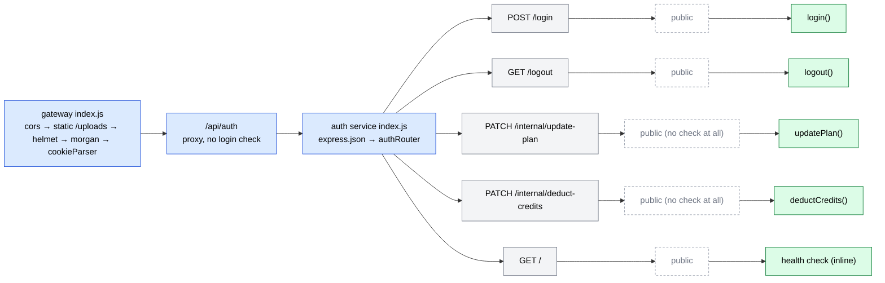
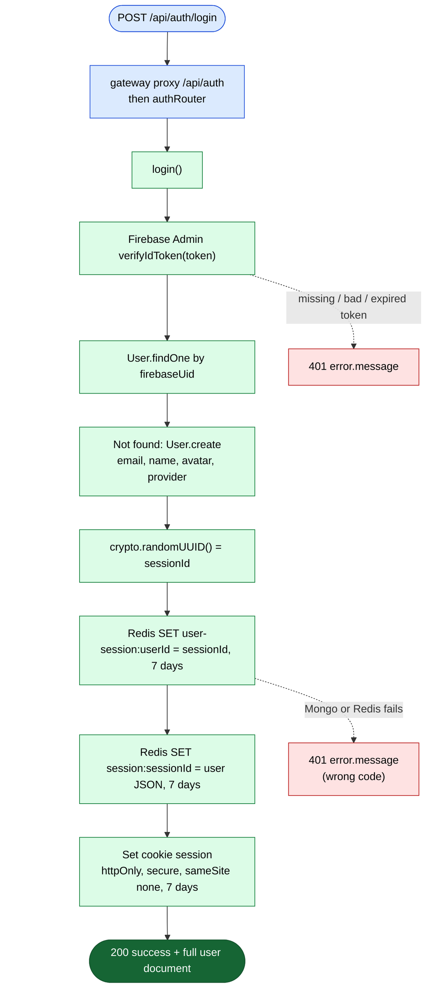
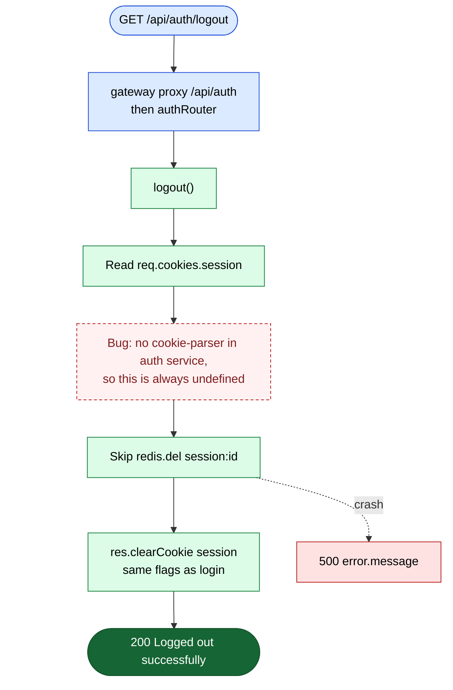
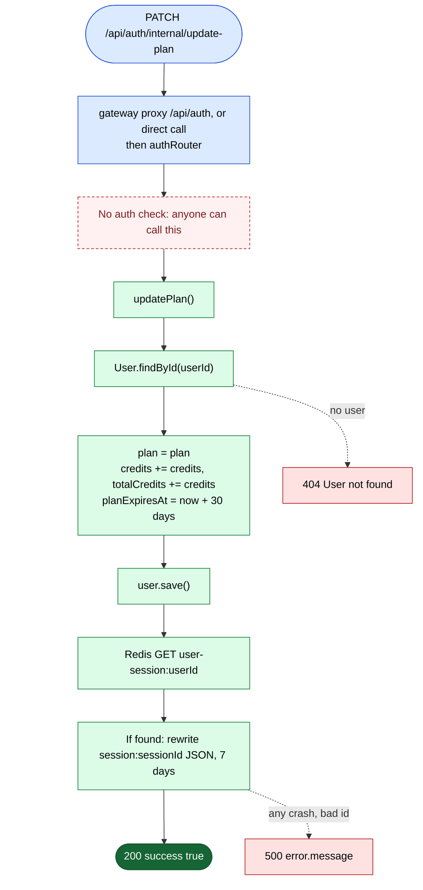
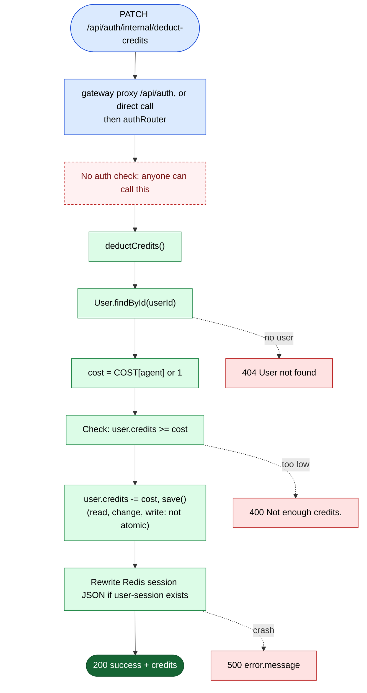
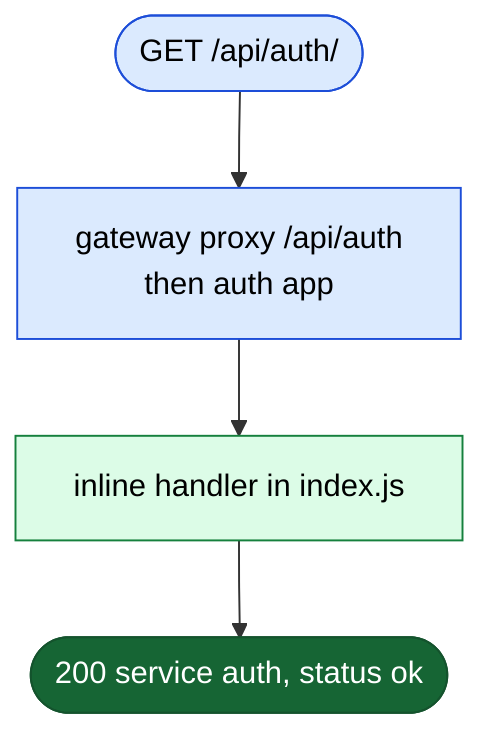
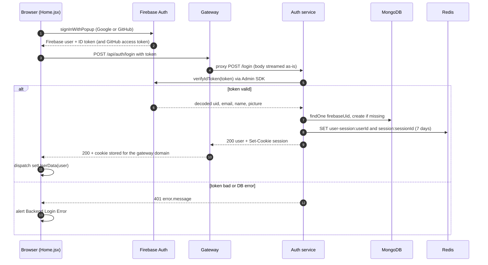
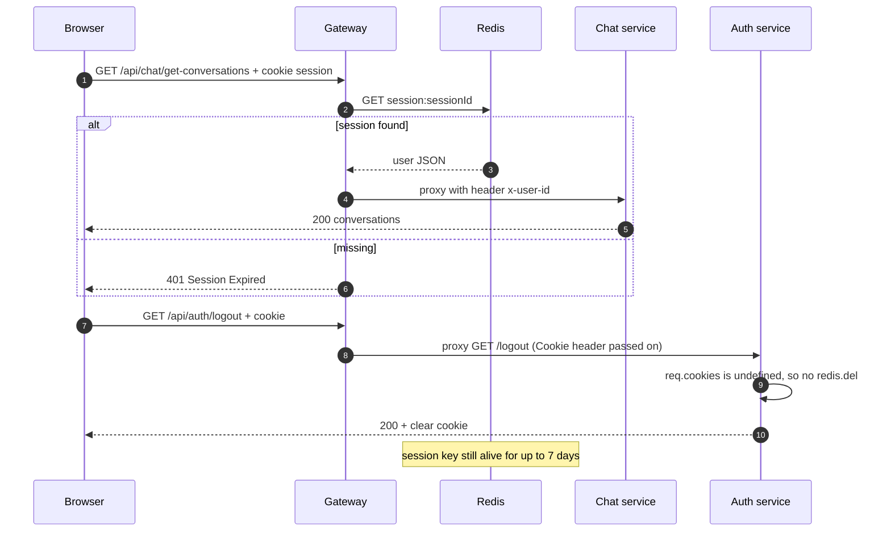
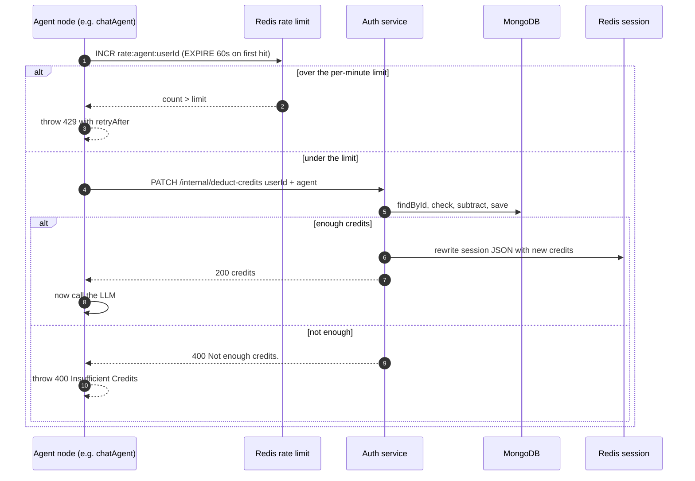

# Auth routes (login, logout, credits, plan)

**Code:** [auth.routes.js](../../backend/services/auth/routes/auth.routes.js) · [auth.controllers.js](../../backend/services/auth/controllers/auth.controllers.js) · [auth service index.js](../../backend/services/auth/index.js) · [gateway index.js](../../backend/gateway/index.js#L60)

The **auth service** is a small Express app. It checks a Google/GitHub login done through Firebase, creates the user in MongoDB the first time, and starts a **session** (a random ID saved in Redis and in a browser cookie). It also owns the user's **credits** (the "money" of the app) and **plan**.

The browser reaches it through the **gateway** at `/api/auth/...`. Two other services (billing and agent) call it **directly** on its public Render URL, skipping the gateway.

> **Mount path:** the gateway mounts the proxy at `/api/auth` ([index.js:60](../../backend/gateway/index.js#L60)). The proxy library (`express-http-proxy`) forwards `req.url`, and Express removes the mount prefix from `req.url`. So `/api/auth/login` arrives at the auth service as `/login`. The auth service mounts its router at `/` ([index.js:41](../../backend/services/auth/index.js#L41)).

---

## Router map

## Quick table

| # | Method | Full URL (through gateway) | Middleware | Controller | Login needed |
|---|---|---|---|---|---|
| 1 | POST | `/api/auth/login` | none | `login()` | No (this *is* the login) |
| 2 | GET | `/api/auth/logout` | none | `logout()` | No |
| 3 | PATCH | `/api/auth/internal/update-plan` | none | `updatePlan()` | **No**, and it should be internal-only |
| 4 | PATCH | `/api/auth/internal/deduct-credits` | none | `deductCredits()` | **No**, and it should be internal-only |
| 5 | GET | `/api/auth/` | none | inline health handler | No |

> **How to read the diagrams**
> 🟦 request / router · 🟨 middleware · 🟩 controller step · 🟥 error reply · 🟢 success reply.
> The main (success) path goes straight down. Errors hang off to the **right** on dotted arrows. The gateway's global middleware (cors, helmet, morgan, cookieParser) is drawn **once**, in the router map above, and not repeated below.

---

## 1. POST /api/auth/login: log in with a Firebase token

**Called from:** [Home.jsx](../../frontend/src/pages/Home.jsx#L36-L47) `login()`, after `signInWithPopup` (Google or GitHub) · **Body:** `{ token }` (the Firebase **ID token**, a signed proof from Google/Firebase of who the user is)

**In simple words:** The browser first logs in with Google or GitHub through Firebase and gets a signed token. It sends that token here. The server asks the Firebase Admin SDK "is this token real?". If yes, it finds or creates the user in MongoDB, makes a random session ID, stores the user's basic info in Redis for 7 days, and puts the session ID in an `httpOnly` cookie.

**What is saved in the Redis session** ([auth.controllers.js:83-107](../../backend/services/auth/controllers/auth.controllers.js#L83-L107)): `userId, email, avatar, name, plan, credits, totalCredits`. This JSON becomes `req.user` in the gateway on every later request.

> ⚠️ **Interview point:** this is **not JWT**. The cookie holds an opaque random ID, and the real data lives in Redis. That is why logout *could* instantly kill a session (a JWT can't be revoked easily). The trade-off: every protected request costs one Redis read. See [02-architecture.md](../02-architecture.md#auth-in-one-picture).

> ⚠️ **Interview point:** the whole function is in one `try/catch` that always returns **401**. If MongoDB or Redis is down, the user sees "401 Unauthorized" instead of a 500 server error. See [F11](../08-known-issues-and-improvements.md#f11).

> ⚠️ **Interview point:** `console.log(decoded)` ([line 31](../../backend/services/auth/controllers/auth.controllers.js#L31)) prints the decoded token (email, name, uid) into server logs on every login. That is personal data in logs. See [S11](../08-known-issues-and-improvements.md#s11).

> ⚠️ **Interview point:** the reply sends the **full Mongo user** (with `_id`, `firebaseUid`). But `/api/me` sends the smaller **session object** (with `userId`, no `_id`). So the frontend's `userData` has two different shapes. See [F18](../08-known-issues-and-improvements.md#f18).

---

## 2. GET /api/auth/logout: end the session

**Called from:** [Sidebar.jsx](../../frontend/src/components/Sidebar.jsx#L45-L54) `logout()` (the sign-out button) · **Body/Params/Query:** none; it reads the `session` cookie

**In simple words:** It should delete the session from Redis and clear the cookie. It does clear the cookie in the browser. But the auth service never installs `cookie-parser` (a middleware that reads the `Cookie` header into `req.cookies`). So `req.cookies` is always `undefined`, and the Redis session is **never deleted**.

> ⚠️ **Interview point:** the gateway *does* use `cookie-parser`, but the auth service doesn't ([auth index.js](../../backend/services/auth/index.js) only has `express.json()`). The package is even listed in auth's `package.json`, just never used. Result: a stolen session cookie keeps working for up to 7 days after the user logs out. **Fix:** add `app.use(cookieParser())` in the auth service, and also `DEL user-session:<userId>`. See [S6](../08-known-issues-and-improvements.md#s6).

> ⚠️ **Interview point:** logout is a **GET** that changes server state. GET should be safe (no side effects). A page could trigger it with ``. Use POST. See [Q7](../08-known-issues-and-improvements.md#q7).

---

## 3. PATCH /api/auth/internal/update-plan: give a plan and credits after payment

**Called from:** [billing.controller.js](../../backend/services/billing/controllers/billing.controller.js#L114-L122) `verifyPayment()`, **directly** at the hard-coded URL `https://ailuma-auth-service.onrender.com/internal/update-plan` (not through the gateway) · **Body:** `{ userId, plan, credits }`

**In simple words:** After a successful payment, billing tells auth "give this user this plan and add these credits". Auth loads the user, sets the plan, **adds** the credits to both `credits` and `totalCredits`, and sets the plan to end in 30 days. Then it rewrites the cached Redis session so the new balance shows up without logging in again.

> ⚠️ **Interview point (the most serious bug in the project):** the word "internal" is only in the URL. Nothing checks who is calling. The gateway proxies **everything** under `/api/auth` with no login check, so anyone on the internet can send `PATCH /api/auth/internal/update-plan` with `{ userId, plan: "pro", credits: 1000000 }` and get free credits. **Fix:** don't expose `/internal/*` through the gateway, and require a shared secret header or mTLS / a private network between services. See [S1](../08-known-issues-and-improvements.md#s1).

> ⚠️ **Interview point:** `user.credits += credits` with no check. If `credits` is missing, the balance becomes `NaN`. `planExpiresAt` is saved, but **no code ever reads it**, so plans never expire. See [F12](../08-known-issues-and-improvements.md#f12).

---

## 4. PATCH /api/auth/internal/deduct-credits: charge the user for an AI action

**Called from:** [agent utils/deductCredits.js](../../backend/services/agent/utils/deductCredits.js#L13-L25), which every paid agent calls before it does any work. It uses the direct URL `https://ailuma-auth-service.onrender.com/internal/deduct-credits` · **Body:** `{ userId, agent }`

**In simple words:** The agent service says "user X used agent Y". Auth looks up the price in a small table (chat 1, search 5, coding / pdf / ppt / image 10, anything else 1). If the balance is too low, it refuses with 400. Otherwise it subtracts the price, saves, updates the cached session, and returns the new balance.

**Price table** ([auth.controllers.js:374-388](../../backend/services/auth/controllers/auth.controllers.js#L374-L388)):

| agent value sent | Cost |
|---|---|
| `chat` | 1 |
| `search` | 5 |
| `coding`, `pdf`, `ppt`, `image` | 10 |
| anything else | 1 (fallback) |

The agent service sends `coding` for the data and GitHub agents, and `image` for the vision agent. So those cost 10.

> ⚠️ **Interview point (race condition):** it reads the balance, checks it in JavaScript, then saves. Two requests at the same moment can both read `credits = 10`, both pass the check, and both save `0`. The user gets two paid actions for one charge. **Fix:** one atomic query: `User.findOneAndUpdate({ _id, credits: { $gte: cost } }, { $inc: { credits: -cost } }, { new: true })`. If it returns `null`, the balance was too low. See [S10](../08-known-issues-and-improvements.md#s10).

> ⚠️ **Interview point:** the same price table exists again in [billing/config/credits.js](../../backend/services/billing/config/credits.js), which nothing imports. Two copies of pricing will drift apart. See [Q3](../08-known-issues-and-improvements.md#q3).

> ⚠️ **Interview point:** this route is also public ([S1](../08-known-issues-and-improvements.md#s1)). Here that means anyone can **drain** another user's credits if they know the user's Mongo `_id`, and a shared-artifact link leaks that `_id` ([S7](../08-known-issues-and-improvements.md#s7)).

---

## 5. GET /api/auth/: health check

**Called from:** nothing in the frontend. [wakeup.js](../../frontend/src/utils/wakeup.js) tries to ping auth, but at a different host name and a `/health` path that doesn't exist ([F23](../08-known-issues-and-improvements.md#f23)). [WakeUp.html](../../WakeUp.html) pings the real root URL · **Body/Params/Query:** none

**In simple words:** It returns `{ service: "auth", status: "ok" }` so a person or a monitor can see the service is awake. On Render's free plan, services go to sleep, and this is used to wake them.

---

## End-to-end: the login journey

## End-to-end: a logged-in request, then logout

## End-to-end: how credits get charged

