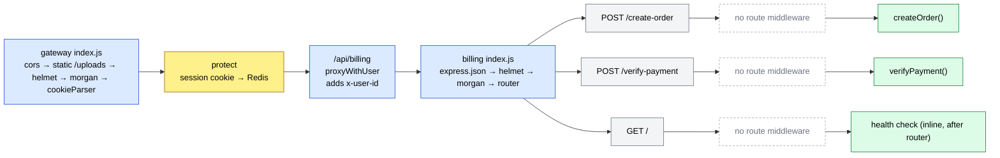
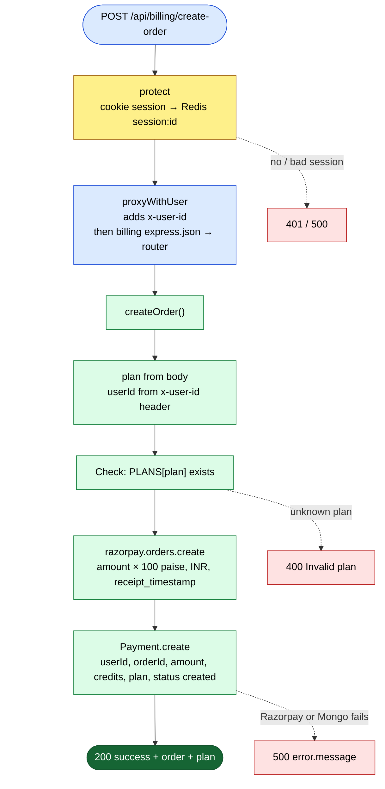
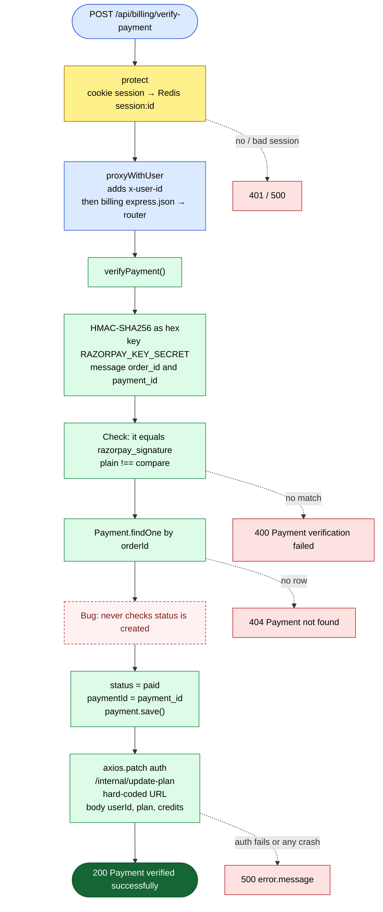
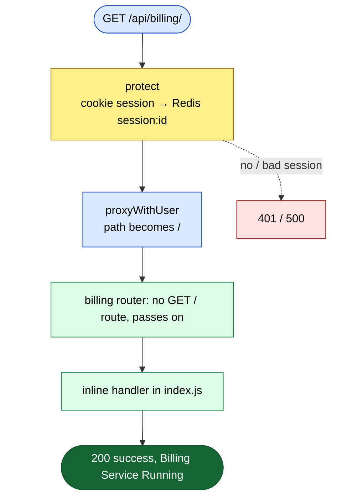
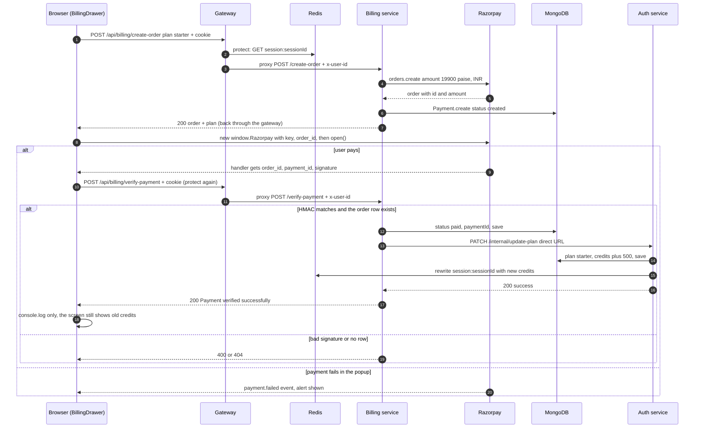
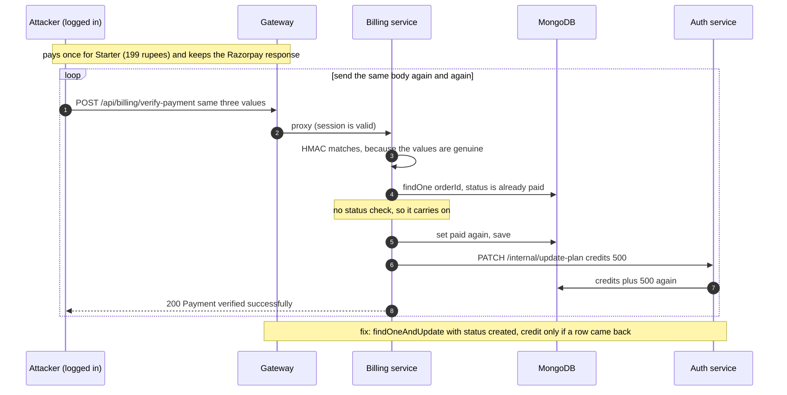

# Billing routes (buy a plan with Razorpay)

**Code:** [billing.routes.js](../../backend/services/billing/routes/billing.routes.js) · [billing.controller.js](../../backend/services/billing/controllers/billing.controller.js) · [billing service index.js](../../backend/services/billing/index.js) · [plans.js](../../backend/services/billing/config/plans.js) · [payment.model.js](../../backend/services/billing/models/payment.model.js) · [gateway index.js](../../backend/gateway/index.js#L73) · controllers: [billing.controllers.md](../controllers/billing.controllers.md)

The **billing service** is a small Express app that sells credit packs. It uses **Razorpay**, an Indian payment company. Razorpay shows the card / UPI popup and takes the money. Billing only does two things:

1. **Create an order**: tell Razorpay "this user wants to pay ₹199", and save a `Payment` row in MongoDB with status `created`.
2. **Verify a payment**: after the user pays, check that Razorpay really signed the result, mark the row `paid`, and ask the **auth service** to add the credits.

The browser reaches billing through the **gateway** at `/api/billing/...`. Unlike `/api/auth`, this mount **needs a login**: the gateway runs `protect` (the session check) first. Billing then calls auth **directly** on auth's hard-coded public Render URL, skipping the gateway.

> **Mount path:** the gateway mounts `protect` + `proxyWithUser` at `/api/billing` ([index.js:73](../../backend/gateway/index.js#L73)). The proxy library (`express-http-proxy`) forwards `req.url`, and Express removes the mount prefix from `req.url`. So `/api/billing/create-order` arrives at billing as `/create-order`. Billing mounts its router at `/` ([index.js:34-37](../../backend/services/billing/index.js#L34-L37)). The gateway does **not** parse the body (`parseReqBody: false`); it streams it through untouched, and billing's own `express.json()` ([index.js:24](../../backend/services/billing/index.js#L24)) turns it into `req.body`.

---

## Router map



## Quick table

| # | Method | Full URL (through gateway) | Middleware | Controller | Login needed |
|---|---|---|---|---|---|
| 1 | POST | `/api/billing/create-order` | `protect` (gateway) | `createOrder()` | Yes |
| 2 | POST | `/api/billing/verify-payment` | `protect` (gateway) | `verifyPayment()` | Yes, but it never checks that the order belongs to the caller |
| 3 | GET | `/api/billing/` | `protect` (gateway) | inline health handler | Yes through the gateway. Billing's own Render URL is public. |

> **How to read the diagrams**
> 🟦 request / router · 🟨 middleware · 🟩 controller step · 🟥 error reply · 🟢 success reply.
> The main (success) path goes straight down. Errors hang off to the **right** on dotted arrows. The gateway's global middleware (cors, helmet, morgan, cookieParser) is drawn **once**, in the router map above, and not repeated below. `protect` is drawn as **one** yellow node with one merged error arrow: `401 Unauthorized` (no cookie), `401 Session Expired` (no Redis key) or `500` (Redis error).

---

## 1. POST /api/billing/create-order: start a payment

**Called from:** [billing.api.js](../../frontend/src/features/billing.api.js#L9-L22) `createOrder(plan)`, called by [BillingDrawer.jsx](../../frontend/src/components/BillingDrawer.jsx#L21-L24) `handleUpgrade("starter")` or `handleUpgrade("pro")` (the two **Upgrade** buttons) · **Body:** `{ plan }` (`"free"`, `"starter"` or `"pro"`) · **Header used:** `x-user-id` (added by the gateway)

**In simple words:** The user clicks **Upgrade**. Billing looks up the plan's price in a fixed table. It asks Razorpay to create an **order** (a "bill" with an ID, waiting to be paid) for that price in **paise** (1 rupee = 100 paise). It saves a `Payment` row with status `created`, and returns the order to the browser. The browser needs the order ID to open the Razorpay popup.



**The plan table** ([plans.js](../../backend/services/billing/config/plans.js)):

| `plan` sent | Price (`amount`, rupees) | Sent to Razorpay (paise) | Credits added | `validity` |
|---|---|---|---|---|
| `free` | 0 | 0 (Razorpay refuses it, see [F25](../08-known-issues-and-improvements.md#f25)) | 100 | 30 (never read) |
| `starter` | 199 | 19 900 | 500 | 30 (never read) |
| `pro` | 499 | 49 900 | 1000 | 30 (never read) |

**Worked example (paise):** the user clicks Upgrade on **Starter**. `amount = 199 × 100 = 19 900` paise, which is ₹199.00. Razorpay's order comes back with `amount: 19900`, and the browser passes that same number to the popup. But the `Payment` row stores `amount: 199` (rupees, [line 44](../../backend/services/billing/controllers/billing.controller.js#L44)). So the same field name holds two different units in two places.

**Reply shape:** `{ success: true, order, plan }`. `order` is Razorpay's order object as-is (it includes `id`, `amount`, `currency`, `receipt`, `status`). `plan` is the whole entry from the table above.

> ⚠️ **Interview point:** the `userId` comes from the `x-user-id` header, which billing trusts blindly. Through the gateway it is safe, because the gateway overwrites it from the session. But billing's own Render URL is public, so anyone can call it directly and send any `x-user-id`. See [S2](../08-known-issues-and-improvements.md#s2).

> ⚠️ **Interview point:** the plan check is only `if (!PLANS[plan])`. `"free"` passes it, and Razorpay then rejects an order of 0 paise, so the user gets a **500** instead of a clear 400. See [F25](../08-known-issues-and-improvements.md#f25). The same happens for names like `"constructor"`: `PLANS` is a plain object, so `PLANS["constructor"]` is inherited and truthy, the amount becomes `NaN`, and Razorpay fails. `Object.hasOwn(PLANS, plan)` plus a price check would fix both.

> ⚠️ **Interview point:** the order is created at Razorpay **before** the Mongo save. If the save fails, there is an order at Razorpay with no row in the database. Also, the axios interceptor retries a POST that gets a 502/503/504 or no response, up to 15 times. Each retry makes another order and another `created` row. See [S13](../08-known-issues-and-improvements.md#s13).

> ⚠️ **Interview point:** `orderId` has no index and no unique rule in the model, so `verifyPayment` does a full collection scan to find it, and duplicates are possible. See [Q5](../08-known-issues-and-improvements.md#q5).

---

## 2. POST /api/billing/verify-payment: confirm the payment and add credits

**Called from:** the Razorpay popup's `handler` in [BillingDrawer.jsx](../../frontend/src/components/BillingDrawer.jsx#L36-L48), which posts Razorpay's `response` object unchanged · **Body:** `{ razorpay_order_id, razorpay_payment_id, razorpay_signature }`

**In simple words:** When the user finishes paying, Razorpay gives the browser three values. The third one, the **signature**, is Razorpay's proof: it is an **HMAC** of the other two. (An **HMAC** is a "keyed fingerprint": you mix a message with a secret key using a hash function like SHA-256. Only someone who knows the key can make the right fingerprint.) Billing and Razorpay both know `RAZORPAY_KEY_SECRET`, and the browser doesn't. So billing makes the same fingerprint itself. If it matches, the payment is genuine. Billing then marks the row `paid` and tells auth to add the plan's credits.



**The signature formula** ([billing.controller.js:80-86](../../backend/services/billing/controllers/billing.controller.js#L80-L86)):

```
expected = HMAC_SHA256( key = RAZORPAY_KEY_SECRET,
                        message = razorpay_order_id + "|" + razorpay_payment_id ).hex
valid    = (expected === razorpay_signature)
```

*Worked example (made-up key, not the real one):* key `demo_secret`, `razorpay_order_id = order_ABC123`, `razorpay_payment_id = pay_XYZ789`. The message is `order_ABC123|pay_XYZ789`. Its HMAC-SHA256 in hex is `1cc492f1ab2b70adb65c857a944c35b582b08530b140ad2c53a60de8fcbb2934`. If the browser sends exactly that as `razorpay_signature`, the check passes. Change one letter of the payment ID and the hex is completely different, so a user can't invent a "paid" result without the secret.

**What auth then does** (see [auth.routes.md](auth.routes.md#3-patch-apiauthinternalupdate-plan-give-a-plan-and-credits-after-payment)): `plan = "starter"`, `credits += 500`, `totalCredits += 500`, `planExpiresAt = now + 30 days`, and it rewrites the Redis session so `/api/me` shows the new balance.

> ⚠️ **Interview point (money bug):** `verifyPayment` never checks `payment.status === "created"`. The same valid `{ order_id, payment_id, signature }` can be sent again and again, and every time auth adds the credits again. One ₹199 payment → unlimited credits. **Fix:** an atomic "claim": `Payment.findOneAndUpdate({ orderId, status: "created" }, { status: "paid", paymentId })`. Only call auth if it returned a document. Add a unique index on `orderId`. See [S3](../08-known-issues-and-improvements.md#s3) and the replay diagram below.

> ⚠️ **Interview point:** it also never checks that `payment.userId` equals the caller's `x-user-id`. Any logged-in user who has someone's valid triple can trigger the credit (it goes to the order's owner, not to the caller). An **idempotent** endpoint (one where sending the same request twice has the same effect as sending it once) would make both of these harmless.

> ⚠️ **Interview point:** the row is saved as `paid` **before** the call to auth, and a failed auth call is never retried. If auth is asleep or down, the user has paid, the record says `paid`, but no credits were added, and the reply is a 500. There is also no Razorpay **webhook** (a server-to-server call that Razorpay makes to your backend when a payment is captured). So if the user closes the tab before the `handler` runs, nothing is ever credited. See [S12](../08-known-issues-and-improvements.md#s12).

> ⚠️ **Interview point:** the auth URL is hard-coded to production (`https://ailuma-auth-service.onrender.com`, [line 114](../../backend/services/billing/controllers/billing.controller.js#L114)). `render.yaml` gives billing an `AUTH_SERVICE_HOSTPORT` variable that the code never reads. See [F6](../08-known-issues-and-improvements.md#f6).

> ⚠️ **Interview point:** the signature is compared with `!==`, which stops at the first different character. In theory that leaks timing. The standard fix is `crypto.timingSafeEqual` on two equal-length buffers. It's a small point, but interviewers like it.

> ⚠️ **Interview point:** on success the frontend only does `console.log(data)`. The credits on screen don't change until the page is reloaded. See [F19](../08-known-issues-and-improvements.md#f19). And because of the axios auto-retry ([S13](../08-known-issues-and-improvements.md#s13)), a verify call that gets a 502/503/504 or no response is sent **again**, which, with [S3](../08-known-issues-and-improvements.md#s3), can add the credits twice by accident.

---

## 3. GET /api/billing/: health check

**Called from:** nothing in the frontend through the gateway. [WakeUp.html](../../WakeUp.html#L48) pings billing's own root URL directly. [wakeup.js](../../frontend/src/utils/wakeup.js#L13) pings a different host and a `/api/billing/health` path that doesn't exist ([F23](../08-known-issues-and-improvements.md#f23)) · **Body/Params/Query:** none

**In simple words:** It returns `{ success: true, message: "Billing Service Running" }` so a person or a monitor can see the service is awake. It is registered **after** the router ([index.js:41-46](../../backend/services/billing/index.js#L41-L46)), but it still works, because the router has no `GET /` route and passes the request on.



> ⚠️ **Interview point:** through the gateway, the health check needs a login, because `protect` guards all of `/api/billing`. That is why the wake-up page skips the gateway and pings billing's public URL, which also shows that billing is reachable directly ([S2](../08-known-issues-and-improvements.md#s2)).

---

## End-to-end: the full payment flow



## End-to-end: the replay attack (S3)



*Worked example:* one real Starter payment, then the same body sent 9 more times. Credits added = 500 × 10 = **5 000** for ₹199. The `Payment` row still looks normal (one row, `paid`), so nothing in the database shows the fraud. See [S3](../08-known-issues-and-improvements.md#s3).
