# Chat routes (conversations, messages, shared artifacts)

**Code:** [chat.routes.js](../../backend/services/chat/routes/chat.routes.js) · [chat.controller.js](../../backend/services/chat/controllers/chat.controller.js) · [chat service index.js](../../backend/services/chat/index.js) · [gateway index.js](../../backend/gateway/index.js#L65-L71) · [auth.middleware.js](../../backend/gateway/middlewares/auth.middleware.js) · [proxyWithHeaders.js](../../backend/gateway/utils/proxyWithHeaders.js)

The **chat service** is a small Express app that stores the chat history in MongoDB. It keeps three kinds of documents: **conversations** (one per chat in the sidebar), **messages** (the lines inside a chat) and **shared artifacts** (a public copy of generated code that anyone with the link can open). It does not use Redis, and it never calls another service.

The chat service does **no login check of its own**. It trusts a header called `x-user-id`, which the gateway adds after it has checked the session cookie. The service only installs `express.json()` ([index.js:19](../../backend/services/chat/index.js#L19)); there is no cors, helmet or morgan, and no `GET /` health route (so a wake-up ping to the root gets a 404, which still wakes the server).

It has three kinds of callers:
- the **browser**, through the gateway at `/api/chat/...` (logged in),
- the **agent service**, which calls `save-message` **directly** on the public Render URL, with no `x-user-id` ([agent.controller.js:32](../../backend/services/agent/controllers/agent.controller.js#L32), [:68](../../backend/services/agent/controllers/agent.controller.js#L68)),
- anyone on the internet, because that Render URL is public ([S2](../08-known-issues-and-improvements.md#s2)).

> **Mount path:** the gateway has **two** mounts for chat, and the order matters. First `app.use("/api/chat/shared", proxy(...))` with **no** login check ([index.js:66](../../backend/gateway/index.js#L66)), then `app.use("/api/chat", protect, proxyWithUser(...))` ([index.js:71](../../backend/gateway/index.js#L71)). The proxy library (`express-http-proxy`) forwards `req.url`, and Express removes the mount prefix from `req.url`. So `/api/chat/get-conversations` arrives at chat as `/get-conversations` (good). But `/api/chat/shared/abc` arrives as `/abc`, which matches no route, so public share links get a 404 ([F5](../08-known-issues-and-improvements.md#f5)). The same stripping means `/api/chat/shared/get-conversations` reaches a real chat route **with no login** ([S15](../08-known-issues-and-improvements.md#s15)). The chat service mounts its router at `/` ([index.js:26](../../backend/services/chat/index.js#L26)).

> **Which URL?** `getServiceUrl("CHAT_SERVICE")` returns the hard-coded `https://ailuma-chat-service.onrender.com` first and only then looks at the env variable, so the env value is never used ([index.js:44-53](../../backend/gateway/index.js#L44-L53), [F6](../08-known-issues-and-improvements.md#f6)).

---

## Router map

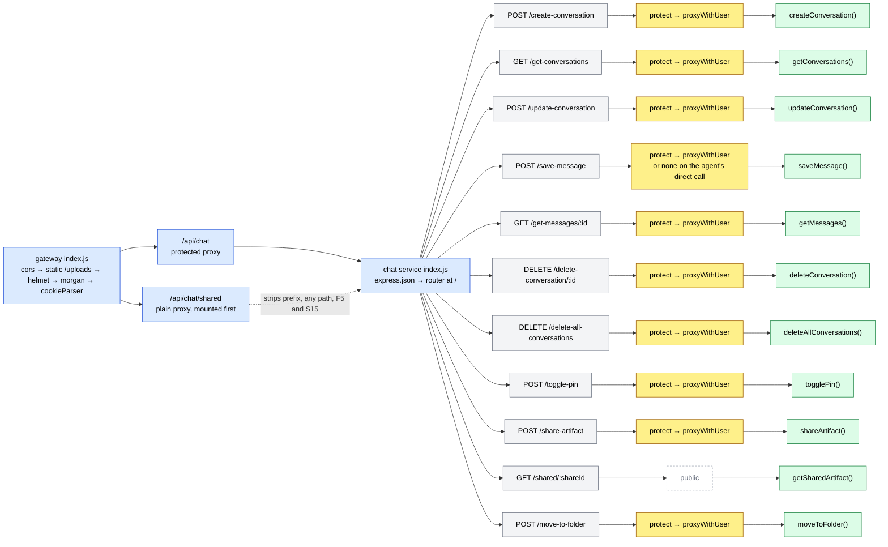

## Quick table

| # | Method | Full URL (through gateway) | Middleware | Controller | Login needed |
|---|---|---|---|---|---|
| 1 | POST | `/api/chat/create-conversation` | protect → proxyWithUser | `createConversation()` | Yes |
| 2 | GET | `/api/chat/get-conversations` | protect → proxyWithUser | `getConversations()` | Yes |
| 3 | POST | `/api/chat/update-conversation` | protect → proxyWithUser | `updateConversation()` | Yes, but **no owner check** |
| 4 | POST | `/api/chat/save-message` | protect → proxyWithUser (the agent skips the gateway) | `saveMessage()` | Yes via gateway; **No** on the direct URL the agent uses |
| 5 | GET | `/api/chat/get-messages/:id` | protect → proxyWithUser | `getMessages()` | Yes, but **no owner check** |
| 6 | DELETE | `/api/chat/delete-conversation/:id` | protect → proxyWithUser | `deleteConversation()` | Yes, owner check only for the conversation, **not** the messages |
| 7 | DELETE | `/api/chat/delete-all-conversations` | protect → proxyWithUser | `deleteAllConversations()` | Yes |
| 8 | POST | `/api/chat/toggle-pin` | protect → proxyWithUser | `togglePin()` | Yes, but **no owner check** |
| 9 | POST | `/api/chat/share-artifact` | protect → proxyWithUser | `shareArtifact()` | Yes |
| 10 | GET | `/api/chat/shared/:shareId` | none (public mount) | `getSharedArtifact()` | No, and **it can't be reached through the gateway** ([F5](../08-known-issues-and-improvements.md#f5)) |
| 11 | POST | `/api/chat/move-to-folder` | protect → proxyWithUser | `moveToFolder()` | Yes, but **no owner check** |

> **How to read the diagrams**
> 🟦 request / router · 🟨 middleware · 🟩 controller step · 🟥 error reply · 🟢 success reply.
> The main (success) path goes straight down. Errors hang off to the **right** on dotted arrows. The gateway's global middleware (cors, helmet, morgan, cookieParser) is drawn **once**, in the router map above, and not repeated below.
> `protect` reads the `session` cookie and loads `session:<id>` from Redis. It replies 401 "Unauthorized" (no cookie), 401 "Session Expired" (no Redis key) or 500 (Redis error). Each diagram shows those as one arrow: `401 / 500`. `proxyWithUser` then adds `x-user-id` (plus `x-user-email` / `x-user-avatar` when present) and passes on `x-github-token`.

---

## 1. POST /api/chat/create-conversation: start a new chat

**Called from:** [ChatInput.jsx](../../frontend/src/components/ChatInput.jsx#L158-L163) `handleSend()`, only when no chat is selected yet. The Sidebar "New chat" button ([Sidebar.jsx:70-75](../../frontend/src/components/Sidebar.jsx#L70-L75)) does **not** call it; it only clears the screen · **Body:** `{}` (ignored). The owner comes from the `x-user-id` header.

**In simple words:** When you send your first message in an empty screen, the browser first asks for a new, empty conversation. The server makes one with the default title "New Chat" and sends the whole document back. The browser then uses its `_id` for the rest of the flow.

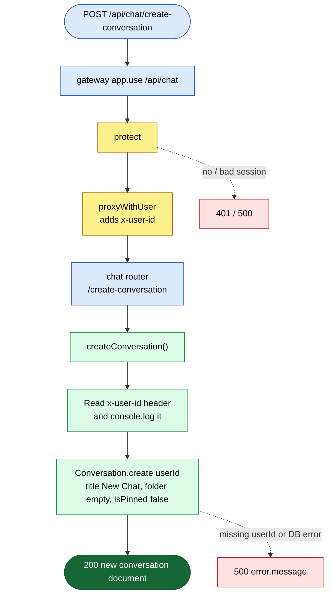

> ⚠️ **Interview point:** the user ID is just a header. Through the gateway it is safe, because `protect` runs first and `proxyWithUser` overwrites the header. But the chat service's own URL is public, so anyone can call it directly with any `x-user-id` and create chats for someone else ([S2](../08-known-issues-and-improvements.md#s2)). If the header is missing, `userId` is `required` in the model, so Mongoose throws a validation error and the reply is **500**, not 400.

> ⚠️ **Interview point:** the frontend's axios interceptor retries **any** request that gets no reply or a 502/503/504, up to 15 times ([S13](../08-known-issues-and-improvements.md#s13)). A slow cold start can therefore create **several** empty "New Chat" documents for one click. It also replies `200` instead of the usual `201 Created`.

---

## 2. GET /api/chat/get-conversations: list my chats for the sidebar

**Called from:** [Sidebar.jsx](../../frontend/src/components/Sidebar.jsx#L57-L67) `useEffect` on load (depends on `userData?._id`) · **Body/Params/Query:** none

**In simple words:** The sidebar asks "give me all my chats". The server finds every conversation whose `userId` equals the `x-user-id` header. It sorts pinned chats first, then the most recently updated. It returns the whole list in one go.

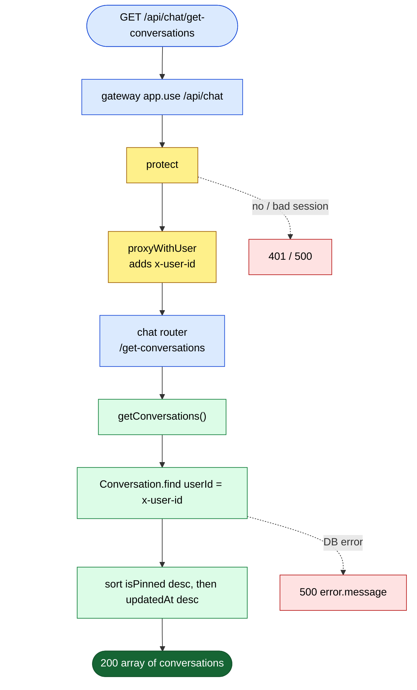

> ⚠️ **Interview point:** no pagination ([Q6](../08-known-issues-and-improvements.md#q6)) and no index on `userId` ([Q5](../08-known-issues-and-improvements.md#q5)). A heavy user gets every chat in one reply, and MongoDB scans the whole collection to find them. **Fix:** `index: true` on `userId` (better, a compound index `{ userId, isPinned, updatedAt }` that matches the sort), plus cursor pagination.

> ⚠️ **Interview point:** "most recently updated" does **not** mean "most recent message". Saving a message never touches the conversation document, so `updatedAt` only changes on rename, pin or folder move. An old chat you just replied to stays low in the list ([F33](../08-known-issues-and-improvements.md#f33)).

> ⚠️ **Interview point:** the sidebar effect runs on `userData?._id`, but `/api/me` returns the session object, which has `userId` and no `_id`. It works by luck ([F18](../08-known-issues-and-improvements.md#f18)).

---

## 3. POST /api/chat/update-conversation: rename a chat

**Called from:** [ChatInput.jsx](../../frontend/src/components/ChatInput.jsx#L167-L170) (auto-title: the first 40 characters of the first prompt) and [Sidebar.jsx](../../frontend/src/components/Sidebar.jsx#L97-L111) `commitRename()` (the pencil button) · **Body:** `{ conversationId, title }`

**In simple words:** The browser sends a chat ID and a new title. The server updates that conversation's title. It does not check that the chat belongs to you, and it replies with the document as it was **before** the change.

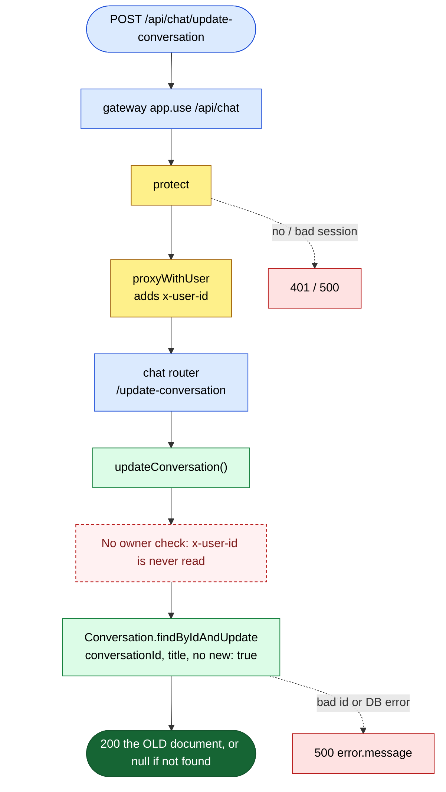

> ⚠️ **Interview point (IDOR):** IDOR = "insecure direct object reference": you can change someone else's data just by knowing its ID. Any logged-in user can rename **any** chat. **Fix:** `Conversation.findOneAndUpdate({ _id: conversationId, userId }, { title }, { new: true })`, and send 404 when it returns `null`. See [S4](../08-known-issues-and-improvements.md#s4).

> ⚠️ **Interview point:** Mongoose's `findByIdAndUpdate` returns the **old** document unless you pass `{ new: true }` (the code's own comment says so, [chat.controller.js:128](../../backend/services/chat/controllers/chat.controller.js#L128)). The frontend ignores the reply and updates Redux itself, so nobody notices. An unknown ID gives `200 null` instead of 404. There is no check on `title` either (empty or huge titles are accepted).

> ⚠️ **Interview point:** an update sent as a **POST** to a verb-style URL. REST style would be `PATCH /conversations/:id`. See [Q7](../08-known-issues-and-improvements.md#q7).

---

## 4. POST /api/chat/save-message: store one message

**Called from:** not the frontend. [agent.controller.js](../../backend/services/agent/controllers/agent.controller.js#L32-L36) saves the **user** prompt before the AI runs, and [again](../../backend/services/agent/controllers/agent.controller.js#L68-L77) saves the **assistant** answer after it. Both calls go straight to `https://ailuma-chat-service.onrender.com/save-message`, skipping the gateway, with no `x-user-id` · **Body:** `{ conversationId, role, content, images?, artifacts? }`

**In simple words:** The agent service says "add this line to conversation X". The chat service creates a message document with the role (`user` or `assistant`), the text, any image URLs and any code artifacts (empty list if none). It never checks that conversation X exists, or who owns it.

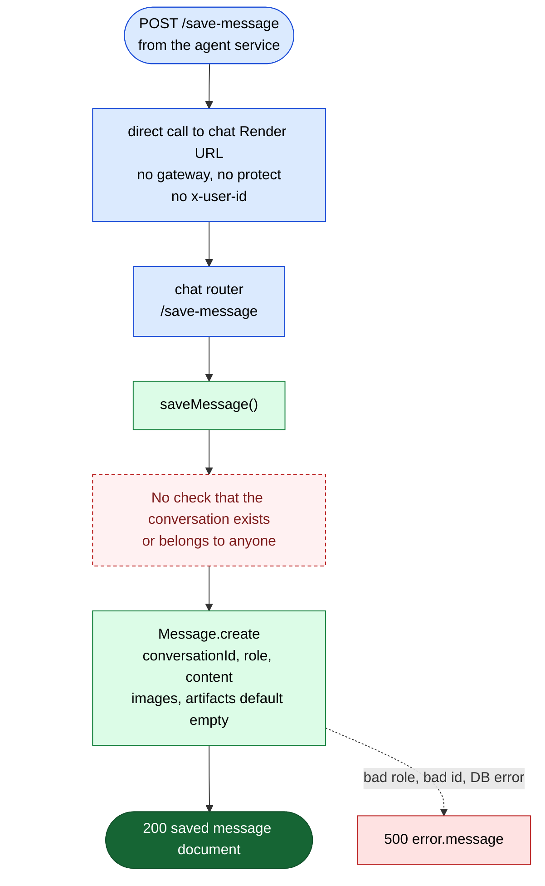

> ⚠️ **Interview point (the worst chat bug):** anyone can write into **anyone's** chat. A logged-in user can do it through the gateway, and anyone at all can do it on the public Render URL. They can even add fake `assistant` messages that the victim will later read as if the AI said them. **Fix:** keep services on a private network with a signed internal header ([S2](../08-known-issues-and-improvements.md#s2)), and check `{ _id: conversationId, userId }` before inserting ([S4](../08-known-issues-and-improvements.md#s4)).

> ⚠️ **Interview point:** the URL is hard-coded in the agent, so local development writes into the **production** database ([F6](../08-known-issues-and-improvements.md#f6)).

> ⚠️ **Interview point:** the agent saves the user's prompt **before** it checks credits and the rate limit. If the agent then fails (400 no credits, 429 too fast, LLM error), the prompt stays in the chat with no answer. And after the user presses Stop, the agent still saves the answer ([S14](../08-known-issues-and-improvements.md#s14)).
 See [F34](../08-known-issues-and-improvements.md#f34).

> ⚠️ **Interview point:** a wrong `role` (not `user` / `assistant`) is a validation error, but the reply is 500, not 400. There is no other input check ([S8](../08-known-issues-and-improvements.md#s8)). `express.json()` keeps its default 100 kb body limit, so a very large artifact would be refused.

---

## 5. GET /api/chat/get-messages/:id: load one chat's messages

**Called from:** [MessageList.jsx](../../frontend/src/components/MessageList.jsx#L134-L150) `useEffect` when the selected chat changes, **and** [Sidebar.jsx](../../frontend/src/components/Sidebar.jsx#L78-L86) `handleSelectConversation()` on the same click. On the server, [getConv.js](../../backend/services/agent/utils/getConv.js#L9) calls `${CHAT_SERVICE}/get-messages/:id` for the agent's memory fallback · **Params:** `id` = the conversation `_id`

**In simple words:** The browser asks "give me every message in chat `id`". The server finds all messages with that `conversationId`, oldest first, and returns them. It does not check that the chat is yours.

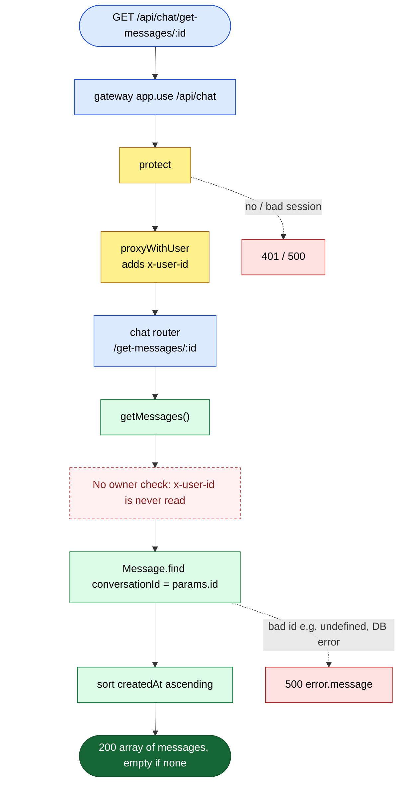

> ⚠️ **Interview point (IDOR):** any logged-in user can read any chat if they have its ID. MongoDB ObjectIds are not secret: they start with a timestamp and end with a counter, so they can be guessed. See [S4](../08-known-issues-and-improvements.md#s4).

> ⚠️ **Interview point:** one click on a chat fetches its messages **twice** (Sidebar and MessageList). The Sidebar then does `setArtifacts(messages.artifacts)` on an **array**, which is `undefined` ([F17](../08-known-issues-and-improvements.md#f17)).

> ⚠️ **Interview point:** MessageList only skips the fetch when the title is "New Chat". When **no** chat is selected (first load, or after "New chat"), it calls `getMessages(undefined)`. That requests `/get-messages/undefined`, the ObjectId cast fails, and the reply is **500**. The effect has no `try/catch`, so the error ends up as an unhandled promise rejection ([F32](../08-known-issues-and-improvements.md#f32)).

> ⚠️ **Interview point:** no pagination ([Q6](../08-known-issues-and-improvements.md#q6)) and no index on `conversationId` ([Q5](../08-known-issues-and-improvements.md#q5)). **Fix:** a compound index `{ conversationId: 1, createdAt: 1 }`, which serves both the filter and the sort.

---

## 6. DELETE /api/chat/delete-conversation/:id: delete one chat

**Called from:** [Sidebar.jsx](../../frontend/src/components/Sidebar.jsx#L128-L142) `handleDelete()` (the bin icon) · **Params:** `id` = the conversation `_id`

**In simple words:** The server deletes the conversation, but only if it belongs to you (it filters by both `_id` and `userId`). Then it deletes all messages of that conversation. The second step has **no** owner filter and runs even if the first step deleted nothing.

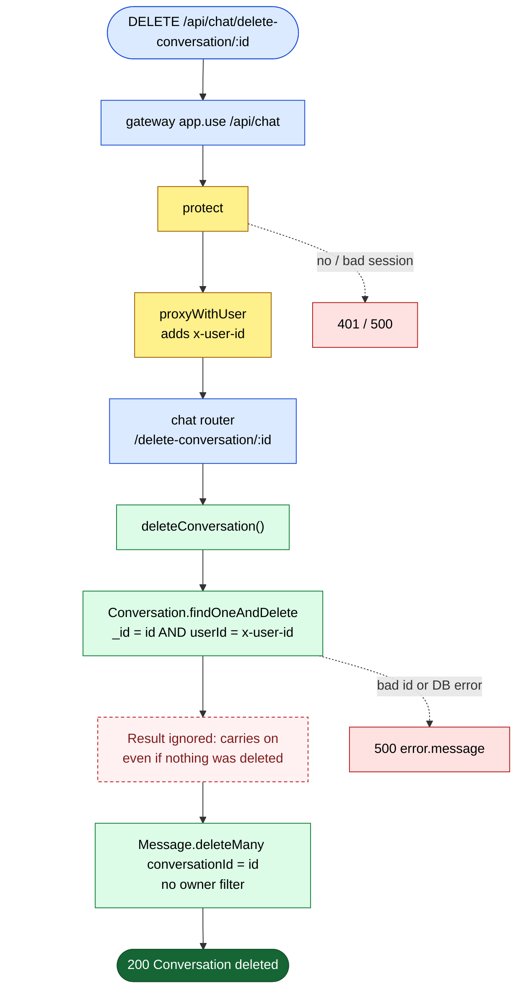

> ⚠️ **Interview point (half an IDOR):** the conversation is safe, but its messages are not. Send another user's conversation ID: their conversation stays, all its messages are wiped, and you get `200 Conversation deleted`. **Fix:** `const conv = await Conversation.findOneAndDelete({ _id, userId }); if (!conv) return res.status(404)...;` and only then delete the messages. See [S4](../08-known-issues-and-improvements.md#s4) and the sequence diagram at the end.

> ⚠️ **Interview point:** this is a manual **cascade delete** (two separate writes, no transaction). If the second write fails, the conversation is gone but its messages stay in MongoDB as orphans. A MongoDB transaction (replica sets support them) would make both steps succeed or fail together. The agent's Redis memory key `conversation:<id>` is not removed either; it simply expires after 24 hours.

---

## 7. DELETE /api/chat/delete-all-conversations: clear my history

**Called from:** [Sidebar.jsx](../../frontend/src/components/Sidebar.jsx#L156-L168) `handleClearAll()`, after a `window.confirm` · **Body/Params/Query:** none

**In simple words:** The server finds all your conversations, collects their IDs, deletes every message in those conversations, then deletes the conversations. Unlike route 6, every step is limited to **your** data, because it starts from `userId`.

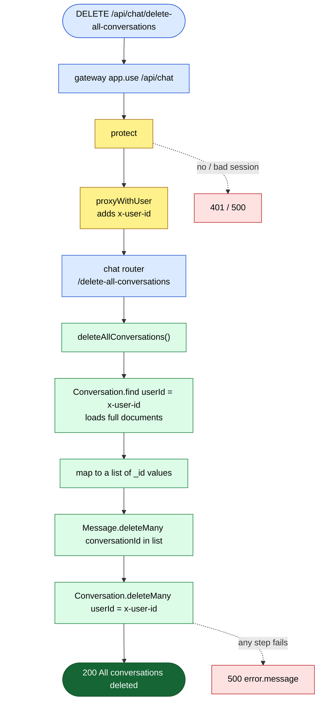

> ⚠️ **Interview point:** this is the **correct** ownership pattern, and it's a good contrast to route 6: start from the user, then delete children, then parents. Messages are deleted first, so if the last step fails you are left with empty conversations, not orphan messages. Small improvement: `Conversation.find({ userId }).distinct("_id")` loads only the IDs instead of whole documents.

> ⚠️ **Interview point:** `DELETE` is the right verb here, and repeating it is harmless (idempotent). So the frontend's auto-retry ([S13](../08-known-issues-and-improvements.md#s13)) can't do damage on this route.

---

## 8. POST /api/chat/toggle-pin: pin or unpin a chat

**Called from:** [Sidebar.jsx](../../frontend/src/components/Sidebar.jsx#L145-L153) `handlePin()` · **Body:** `{ conversationId }`

**In simple words:** The server loads the conversation, flips `isPinned` (true becomes false, false becomes true) and saves it. It returns the updated document. The browser ignores the reply and flips its own copy in Redux.

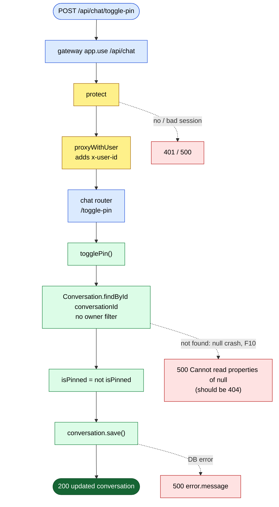

> ⚠️ **Interview point:** there is no `if (!conversation)` check, so an unknown ID crashes on `null.isPinned` and returns 500 instead of 404 ([F10](../08-known-issues-and-improvements.md#f10)). There is no owner check either, so you can pin other people's chats ([S4](../08-known-issues-and-improvements.md#s4)).

> ⚠️ **Interview point:** a **toggle** is not idempotent: sending it twice undoes it. With the frontend's auto-retry ([S13](../08-known-issues-and-improvements.md#s13)), a retried request can flip the pin back. Better: `PATCH /conversations/:id` with `{ isPinned: true }`, which is safe to repeat ([Q7](../08-known-issues-and-improvements.md#q7)). The flip is also read-then-write; an atomic version is an update pipeline: `updateOne({ _id, userId }, [{ $set: { isPinned: { $not: "$isPinned" } } }])`.

---

## 9. POST /api/chat/share-artifact: make a public link for generated code

**Called from:** [ArtifactPanel.jsx](../../frontend/src/components/ArtifactPanel.jsx#L83-L97) `handleShare()` (the Share button). It imports `shareArtifact` from `../features/chat.api`, a file that doesn't exist ([line 14](../../frontend/src/components/ArtifactPanel.jsx#L14)); the function really lives in [conversation.api.js](../../frontend/src/features/conversation.api.js#L59-L62) · **Body:** `{ title, type, files: [{ name, content }] }`

**In simple words:** The browser sends a copy of the artifact (for example `index.html`, `style.css`, `script.js`). The server makes a random 16-character share ID, saves the copy with your user ID as `createdBy`, and returns only the share ID. The browser builds `https://<frontend>/shared/<shareId>` and copies it to the clipboard.

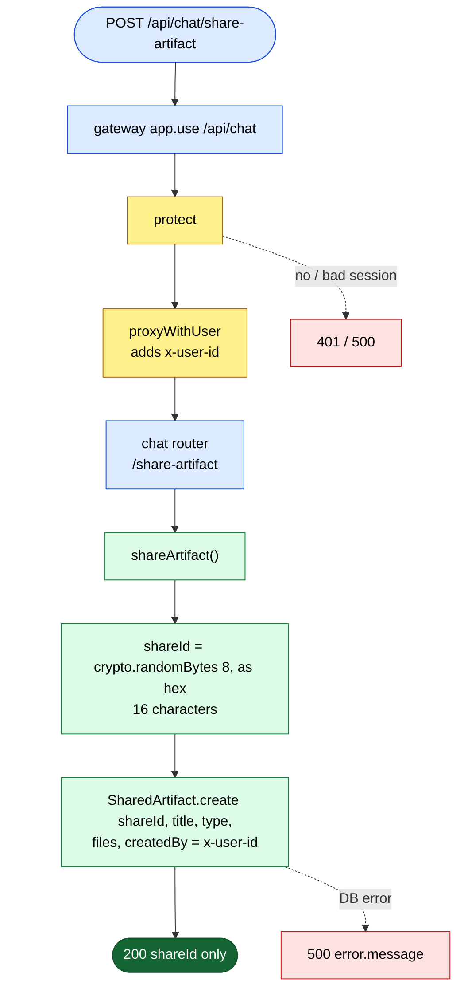

> ⚠️ **Interview point:** the wrong import path breaks the **whole** frontend production build (`vite build` fails with `UNRESOLVED_IMPORT`), not just this button. See [F1](../08-known-issues-and-improvements.md#f1).

> ⚠️ **Interview point (good design):** the share ID is 8 random bytes from `crypto` (64 bits), not a Mongo `_id` or a counter. That makes links practically impossible to guess. `shareId` also has a `unique` index in the model, so a clash would fail instead of overwriting.

> ⚠️ **Interview point:** the server saves a **copy**, not a link to the message. Later edits don't show up, and there is no route to list, revoke or expire a share. Nothing checks the body, so any logged-in user can publish any HTML/JS under the app's name ([S8](../08-known-issues-and-improvements.md#s8)). The share page shows it in an `<iframe sandbox="allow-scripts">`, which runs scripts in an isolated origin, so it can't read the app's cookies or storage.

---

## 10. GET /api/chat/shared/:shareId: open a shared artifact (public)

**Called from:** [SharedArtifact.jsx](../../frontend/src/pages/SharedArtifact.jsx#L39-L56), which calls `axios.get(VITE_SERVER_URL + "/api/chat/shared/" + shareId)` ([line 44](../../frontend/src/pages/SharedArtifact.jsx#L44)) with plain axios, not the shared `api` instance. The page is the React route `/shared/:shareId` ([App.jsx:39](../../frontend/src/App.jsx#L39)) · **Params:** `shareId`

**In simple words:** Anyone with the link (no login) should see the shared code and a live preview. The chat controller looks up the share ID and returns the saved copy. But through the gateway the request never reaches the controller: the gateway drops `/api/chat/shared` from the path, so chat sees `/abc123` and answers 404.

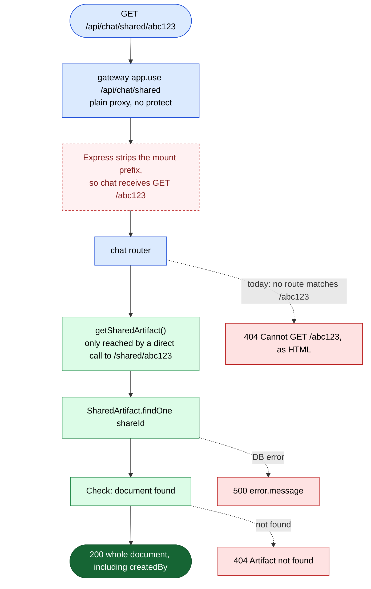

> ⚠️ **Interview point:** every share link is broken in production. The page shows "Failed to load artifact", because Express's default 404 is HTML, so `err.response.data.message` is empty. **Fix:** `proxy(CHAT, { proxyReqPathResolver: req => "/shared" + req.url })`, or mount the router in chat so the paths line up. See [F5](../08-known-issues-and-improvements.md#f5). Opening the page URL directly on the static host may fail too, because there is no SPA rewrite in the repo ([F26](../08-known-issues-and-improvements.md#f26)).

> ⚠️ **Interview point:** once fixed, it returns the **whole** document, including `createdBy` (the owner's Mongo `_id`). That ID is exactly what the public credit routes need ([S1](../08-known-issues-and-improvements.md#s1)). **Fix:** `.select("title type files -_id")`. See [S7](../08-known-issues-and-improvements.md#s7).

> ⚠️ **Interview point (a side effect of the same mount):** because the prefix is stripped, `/api/chat/shared/<anything>` reaches **any** chat route with **no login**. And `express-http-proxy` copies the caller's own headers, including a fake `x-user-id`, because only `proxyWithUser` would overwrite it. So `GET /api/chat/shared/get-conversations` with `x-user-id: <victim>` lists the victim's chats **through the gateway itself**, and `/api/chat/shared/get-messages/<id>` needs no header at all. This makes [S2](../08-known-issues-and-improvements.md#s2) reachable without even knowing the chat service's URL ([S15](../08-known-issues-and-improvements.md#s15)). **Fix:** proxy only `GET /api/chat/shared/:shareId` and always force the path to `/shared/:shareId`.

---

## 11. POST /api/chat/move-to-folder: put a chat in a folder

**Called from:** [Sidebar.jsx](../../frontend/src/components/Sidebar.jsx#L171-L182) `handleMoveToFolder()`, which asks for the name with `window.prompt` · **Body:** `{ conversationId, folder }` (an empty string takes the chat out of its folder)

**In simple words:** A "folder" is just a text field on the conversation; there is no folders table. The server sets `folder` on that conversation and returns the **new** document. The sidebar groups chats by that text.

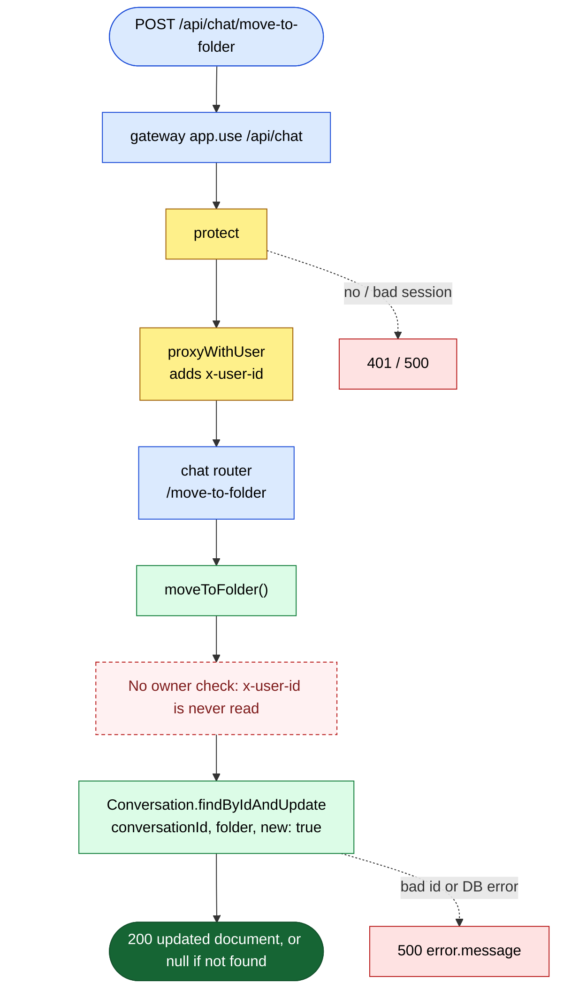

> ⚠️ **Interview point:** same IDOR as rename and pin ([S4](../08-known-issues-and-improvements.md#s4)). Note the inconsistency: this function passes `{ new: true }` and returns the updated document, while `updateConversation` (route 3) doesn't. An unknown ID gives `200 null`.

> ⚠️ **Interview point (design):** storing the folder as a plain string is simple, but you can't have an empty folder, and renaming a folder means updating every chat in it. A separate `Folder` collection (or an array on the user) would fix both.

---

## End-to-end: the first message in a new chat

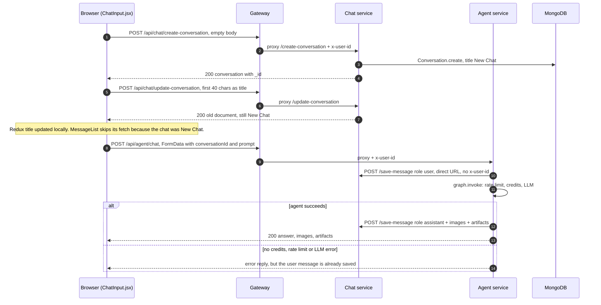

## End-to-end: sharing an artifact and opening the link (F5)

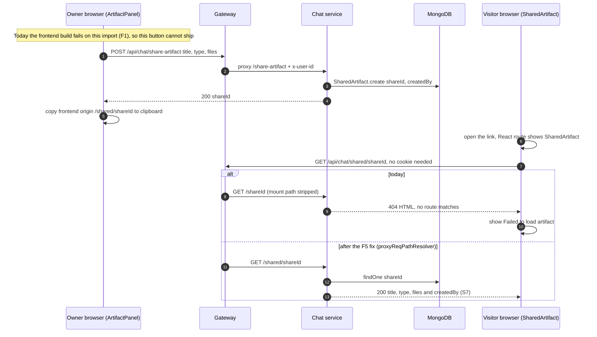

## End-to-end: deleting someone else's chat (IDOR, S4)

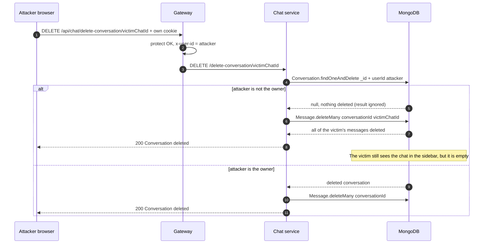
