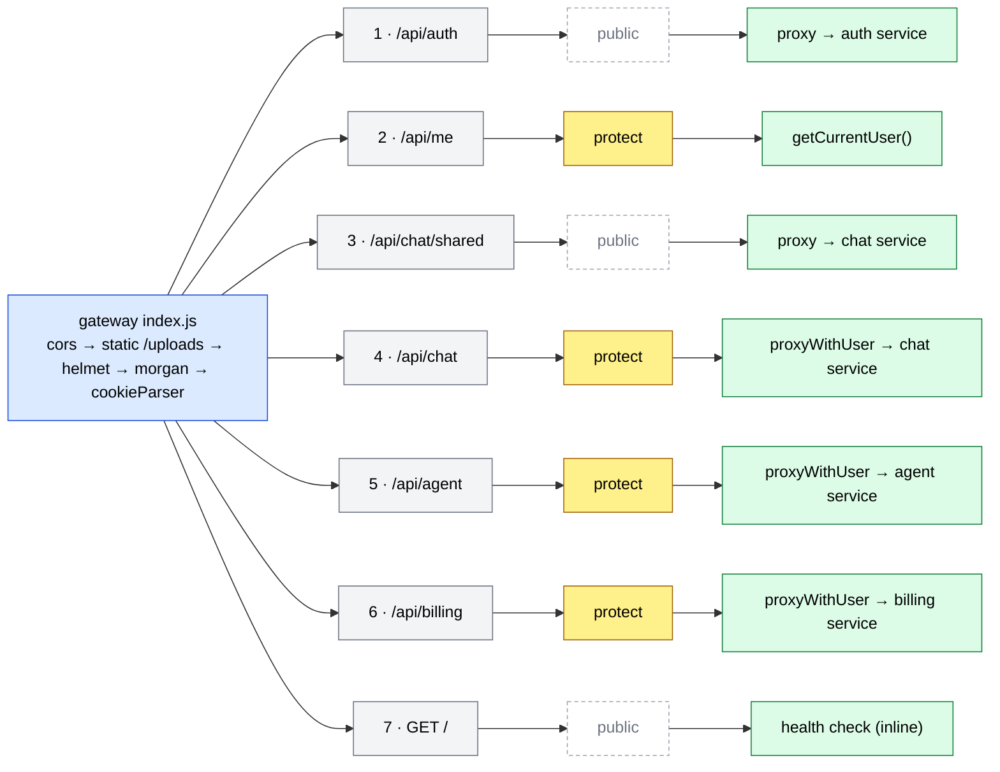
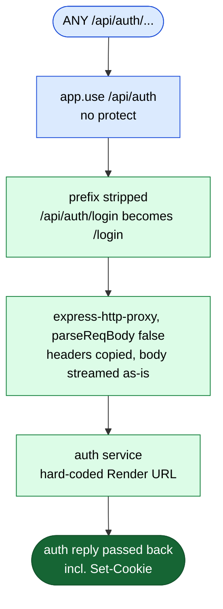
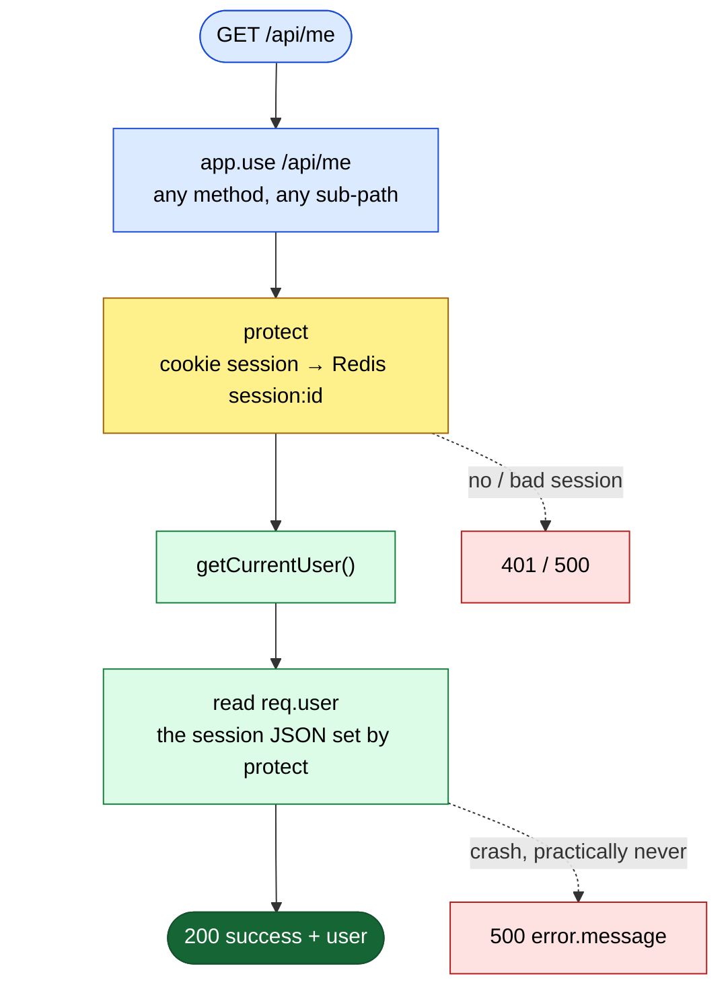
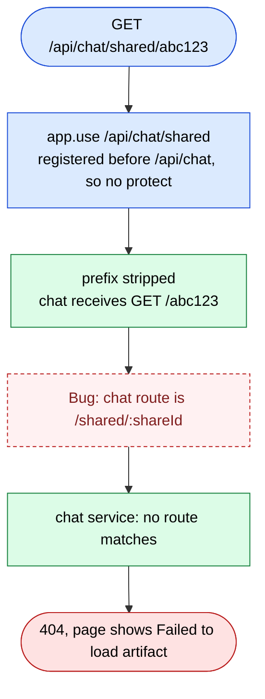
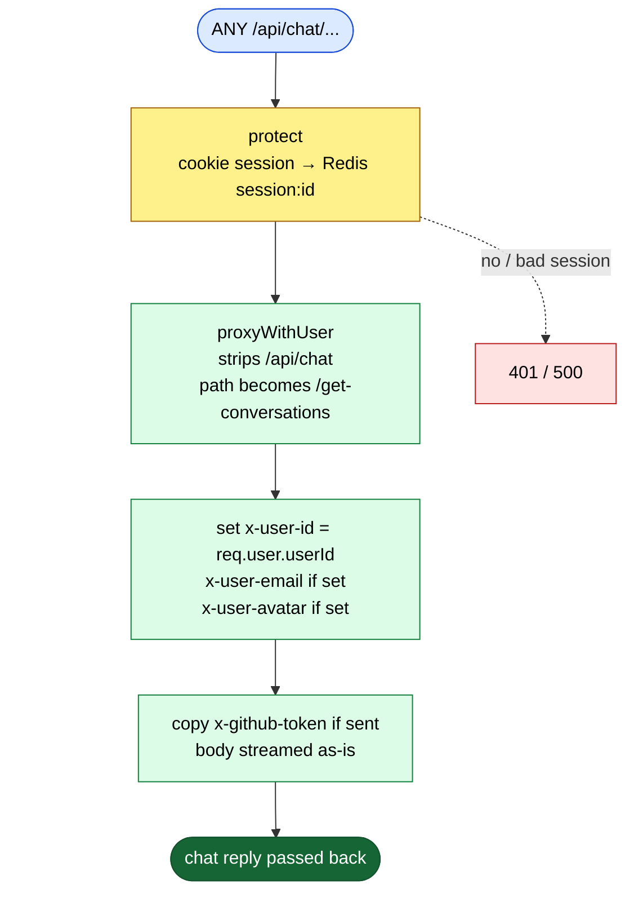
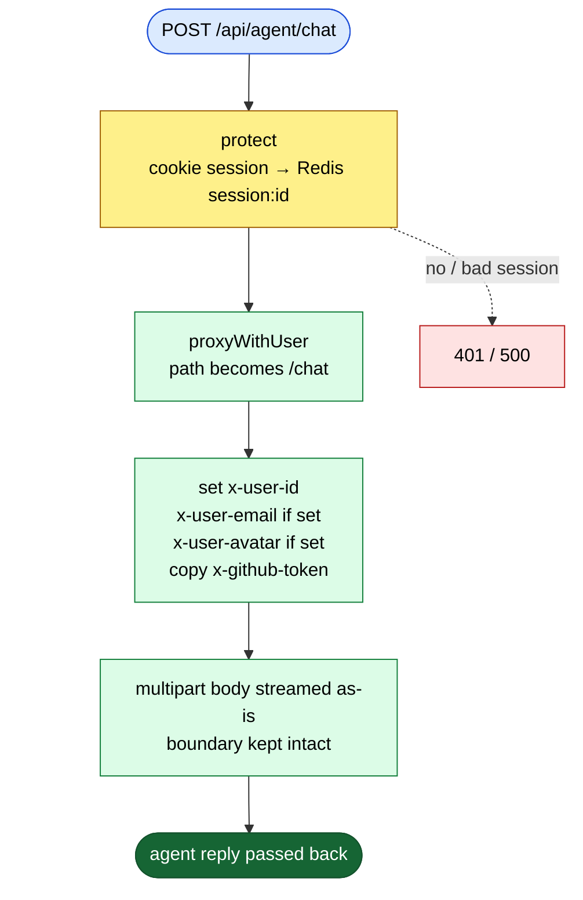
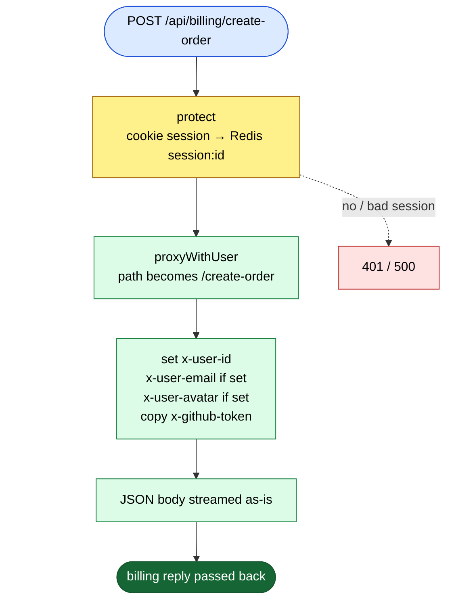
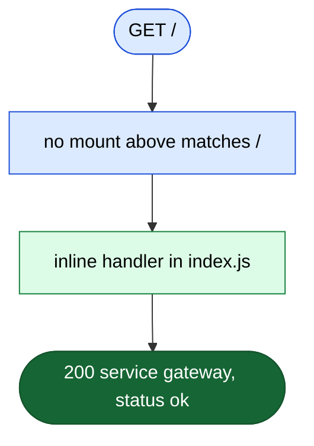
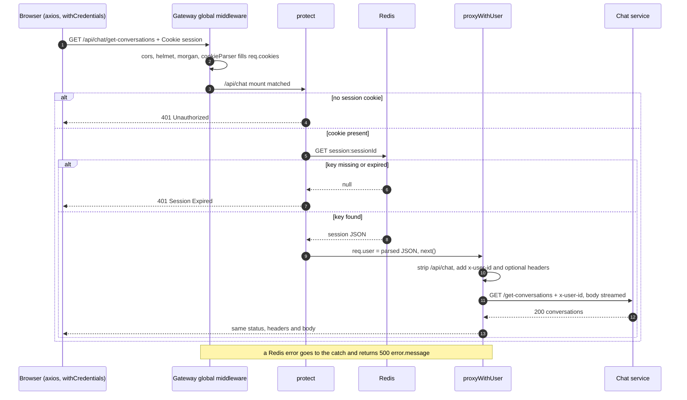

# Gateway routes (the single front door)

**Code:** [gateway index.js](../../backend/gateway/index.js) · [auth.middleware.js](../../backend/gateway/middlewares/auth.middleware.js) · [proxyWithHeaders.js](../../backend/gateway/utils/proxyWithHeaders.js) · [user.controller.js](../../backend/gateway/controllers/user.controller.js) · [package.json](../../backend/gateway/package.json) · [render.yaml](../../render.yaml#L71-L102) · controllers: [gateway.controllers.md](../controllers/gateway.controllers.md)

The **gateway** is the only backend URL the browser talks to (`VITE_SERVER_URL` in [axios.js](../../frontend/src/utils/axios.js#L5-L10)). It is a **reverse proxy**: a server that receives a request and passes it on to another server behind it, then hands the answer back, so the browser never needs to know where the other servers are. Here the servers behind it are the four services: auth, chat, agent and billing.

The gateway does three jobs:

1. **Global safety and logging:** CORS, security headers, request logs, cookie reading.
2. **Login check:** the `protect` middleware reads the `session` cookie and looks it up in Redis.
3. **Forwarding:** `express-http-proxy` sends the request on. For protected routes, `proxyWithUser` also adds the user's ID as a header (`x-user-id`), so the services don't need to look at cookies at all.

It answers only two requests by itself: `/api/me` (who am I?) and `GET /` (health).

> **Where the services are** ([index.js:44-53](../../backend/gateway/index.js#L44-L53)): `getServiceUrl(name)` returns `nameMap[name] || process.env[name]`. The `nameMap` has the four production Render URLs hard-coded, so the environment is **never** used. `render.yaml` passes `AUTH_SERVICE_HOSTPORT`, `CHAT_SERVICE_HOSTPORT`, `AGENT_SERVICE_HOSTPORT` and `BILLING_SERVICE_HOSTPORT`, but the code would look for `AUTH_SERVICE` etc., so those are never read either. Local development still proxies to production. See [F6](../08-known-issues-and-improvements.md#f6).

> **Mount paths and the proxy:** every route is an `app.use(prefix, ...)`. That means it matches **any method** and **any sub-path** under the prefix. `express-http-proxy@2.1.2` forwards `req.url`, and Express removes the mount prefix from `req.url`. So the service gets the path **without** the prefix (query string kept). The mounts are checked **in the order they are registered**, and the first proxy that matches ends the request.

---

## Router map

## Quick table

| # | Mount (in registration order) | Methods | Middleware | Goes to | Login needed | Line |
|---|---|---|---|---|---|---|
| 1 | `/api/auth/*` | any | none | proxy → auth | No | [60](../../backend/gateway/index.js#L60) |
| 2 | `/api/me` (and any sub-path) | any | `protect` | `getCurrentUser()` in the gateway | Yes | [63](../../backend/gateway/index.js#L63) |
| 3 | `/api/chat/shared/*` | any | none | proxy → chat | No | [66](../../backend/gateway/index.js#L66) |
| 4 | `/api/chat/*` | any | `protect` | `proxyWithUser` → chat | Yes | [71](../../backend/gateway/index.js#L71) |
| 5 | `/api/agent/*` | any | `protect` | `proxyWithUser` → agent | Yes | [72](../../backend/gateway/index.js#L72) |
| 6 | `/api/billing/*` | any | `protect` | `proxyWithUser` → billing | Yes | [73](../../backend/gateway/index.js#L73) |
| 7 | `/` | GET | none | inline health handler | No | [76-81](../../backend/gateway/index.js#L76-L81) |
| – | anything else | any | – | Express's default 404 page (there is no custom 404 or error handler) | – | – |

**Global middleware, in order** (runs for every request, drawn once in the router map):

| Order | Middleware | Line | What it does here |
|---|---|---|---|
| 1 | `cors({ origin: [CLIENT_URL, "http://localhost:5173"], credentials: true })` | [27-30](../../backend/gateway/index.js#L27-L30) | **CORS** (the browser rule that blocks a page on one site from reading replies from another site unless the server allows it). Allows the frontend's origin and sends `Access-Control-Allow-Credentials`, so the browser will send and accept the cookie. It also answers the browser's `OPTIONS` pre-check itself, before `protect` runs. If `CLIENT_URL` is not set, both entries are localhost. |
| 2 | `express.static("uploads")` at `/uploads` | [33-36](../../backend/gateway/index.js#L33-L36) | Serves files from an `uploads` folder. The gateway has no such folder and nothing writes one, so this does nothing. It runs before `helmet`, so any file it did serve would skip the security headers. |
| 3 | `helmet()` | [38](../../backend/gateway/index.js#L38) | Adds security headers (for example `X-Content-Type-Options`, `Strict-Transport-Security`). |
| 4 | `morgan("dev")` | [39](../../backend/gateway/index.js#L39) | Logs one line per request. |
| 5 | `cookieParser()` | [41](../../backend/gateway/index.js#L41) | Reads the `Cookie` header into `req.cookies`, so `protect` can find `req.cookies.session`. |
| – | no `express.json()` | – | Removed on purpose in commit `49e88fa` ("fix 502 proxy errors"). The gateway never reads bodies; it streams them through. |
| – | no rate limit | – | `express-rate-limit`, `rate-limit-redis` and `http-proxy-middleware` are in `package.json` but never imported. See [S8](../08-known-issues-and-improvements.md#s8), [Q4](../08-known-issues-and-improvements.md#q4). |

**What the service receives** (prefix stripped):

| Browser calls | Matched mount | Service receives |
|---|---|---|
| `POST /api/auth/login` | `/api/auth` | auth: `POST /login` |
| `GET /api/chat/get-conversations` | `/api/chat` | chat: `GET /get-conversations` |
| `GET /api/chat/shared/abc123` | `/api/chat/shared` | chat: `GET /abc123` (wrong, see [F5](../08-known-issues-and-improvements.md#f5)) |
| `POST /api/agent/chat` | `/api/agent` | agent: `POST /chat` |
| `POST /api/billing/verify-payment` | `/api/billing` | billing: `POST /verify-payment` |

> **How to read the diagrams**
> 🟦 request / router · 🟨 middleware · 🟩 controller step · 🟥 error reply · 🟢 success reply.
> The main (success) path goes straight down. Errors hang off to the **right** on dotted arrows. The global middleware above is not repeated below. `protect` is drawn as **one** yellow node with one merged error arrow: `401 Unauthorized` (no cookie), `401 Session Expired` (no Redis key) or `500` (Redis error).

---

## 1. /api/auth/*: proxy to the auth service (public)

**Called from:** [Home.jsx](../../frontend/src/pages/Home.jsx#L36-L47) (`POST /api/auth/login`), [Sidebar.jsx](../../frontend/src/components/Sidebar.jsx#L45-L54) (`GET /api/auth/logout`) · **Options:** `proxy(AUTH_SERVICE URL, { parseReqBody: false })` · Details of the auth routes: [auth.routes.md](auth.routes.md)

**In simple words:** No login check here, because this is where you log in. The gateway strips `/api/auth` and passes the request, headers and raw body straight to auth. Auth's reply, including its `Set-Cookie` header, comes back to the browser unchanged. That is how the `session` cookie ends up stored for the gateway's domain.

> ⚠️ **Interview point (the most serious bug in the project):** the gateway proxies **everything** under `/api/auth`, not only `/login` and `/logout`. So `PATCH /api/auth/internal/update-plan` and `/internal/deduct-credits` are open to the internet with no login. Anyone can give themselves credits. **Fix:** proxy only the two public paths, and protect `/internal/*` with a shared secret header. See [S1](../08-known-issues-and-improvements.md#s1).

> ⚠️ **Interview point:** `parseReqBody: false` means the proxy does **not** read the body. It pipes the raw bytes. Commit `94e17d9` added it to every proxy to fix corrupted file uploads (it also deleted a `proxyReqBodyDecorator` that re-wrote `req.body` as JSON). Each service parses the body itself.

---

## 2. /api/me: who is logged in? (answered by the gateway)

**Called from:** [useCurrentUser.jsx](../../frontend/src/hooks/useCurrentUser.jsx#L40) `api.get("/api/me")`, run once on page load from [App.jsx](../../frontend/src/App.jsx#L23). The result goes into Redux with `setUserData(data.user)` · **Body/Params/Query:** none; it reads the `session` cookie

**In simple words:** `protect` finds the session in Redis and puts it on `req.user`. `getCurrentUser` just sends that object back. No database call, no other service. It is the cheapest way for the frontend to ask "am I logged in, and how many credits do I have?".

**What `user` contains:** exactly what auth wrote to `session:<id>`: `userId, email, avatar, name, plan, credits, totalCredits`. The credits are fresh, because auth rewrites this JSON after every charge and every purchase.

> ⚠️ **Interview point:** this `user` has `userId` and no `_id`. The login reply has `_id` (the full Mongo document). So Redux's `userData` has two different shapes depending on how you got there. See [F18](../08-known-issues-and-improvements.md#f18).

> ⚠️ **Interview point:** `/api/me` is only called once, on page load. After a payment or an agent call, nothing calls it again, so the credits on screen are stale until a reload. See [F19](../08-known-issues-and-improvements.md#f19).

> ⚠️ **Interview point:** it is `app.use`, not `app.get`, so `POST /api/me/anything` also returns the user. Harmless, but `app.get("/api/me", ...)` is the precise version.

---

## 3. /api/chat/shared/*: public share links (proxy, no login)

**Called from:** [SharedArtifact.jsx](../../frontend/src/pages/SharedArtifact.jsx#L44) with plain `axios` (not the shared instance), `GET /api/chat/shared/<shareId>` · **Options:** `proxy(CHAT_SERVICE URL, { parseReqBody: false })`

**In simple words:** A share link must open for people who are **not** logged in. So this mount skips `protect`, and it is registered **before** `/api/chat` on purpose: Express checks mounts in order, so `/api/chat/shared/...` is caught here first and never reaches the protected `/api/chat` mount. The idea is right. The bug is the path: the prefix `/api/chat/shared` is stripped, so chat receives `GET /abc123`, but chat's route is `/shared/:shareId`.

> ⚠️ **Interview point (order matters):** if this line were moved **below** `/api/chat`, the protected mount would catch the request first, and share links would demand a login. With the current order they skip the login, but still 404 because of the stripped path. **Fix:** `proxyReqPathResolver: (req) => "/shared" + req.url`, or mount chat's share route at `/:shareId` on a separate router. See [F5](../08-known-issues-and-improvements.md#f5).

> ⚠️ **Interview point:** once fixed, the share reply includes `createdBy`, the owner's Mongo `_id`, to anyone with the link. See [S7](../08-known-issues-and-improvements.md#s7).

---

## 4. /api/chat/*: chat service (protected proxy)

**Called from:** [conversation.api.js](../../frontend/src/features/conversation.api.js) and [message.api.js](../../frontend/src/features/message.api.js) (conversations, messages, pin, folders, share) through the shared `api` axios instance · **Options:** `protect`, then `proxyWithUser(CHAT_SERVICE URL)`

**In simple words:** `protect` checks the session. `proxyWithUser` strips `/api/chat`, then adds `x-user-id` (and `x-user-email` / `x-user-avatar` when the session has them) to the outgoing request. Chat trusts `x-user-id` to know whose conversations to load.

> ⚠️ **Interview point:** the gateway proves *who* you are, but chat never checks that a conversation *belongs* to `x-user-id` for most actions. See [S4](../08-known-issues-and-improvements.md#s4).

> ⚠️ **Interview point:** the "gateway does auth" design only holds if nothing else can reach chat. Chat's Render URL is public, so anyone can call it directly with any `x-user-id`. See [S2](../08-known-issues-and-improvements.md#s2).

> ⚠️ **Interview point:** `x-github-token` is sent to chat (and billing) even though only the agent uses it. See [S9](../08-known-issues-and-improvements.md#s9).

---

## 5. /api/agent/*: agent service (protected proxy)

**Called from:** [agent.api.js](../../frontend/src/features/agent.api.js#L13) `sendPrompt()`, `POST /api/agent/chat`, often as `multipart/form-data` with a file · **Options:** `protect`, then `proxyWithUser(AGENT_SERVICE URL)`

**In simple words:** Same as chat. The agent service receives `POST /chat` with `x-user-id` and, for the GitHub agent, `x-github-token`. File uploads are why the body must be streamed untouched: `multipart/form-data` has a "boundary" string that separates the parts, and re-writing the body breaks it. Commit `94e17d9` fixed exactly that.

> ⚠️ **Interview point:** agent calls are long (an LLM call inside one HTTP request). No proxy `timeout` option is set, and the frontend retries any request that gets a 502/503/504 or no response. A retried `POST /api/agent/chat` runs the agent and charges credits again. See [S13](../08-known-issues-and-improvements.md#s13), [Q10](../08-known-issues-and-improvements.md#q10).

---

## 6. /api/billing/*: billing service (protected proxy)

**Called from:** [billing.api.js](../../frontend/src/features/billing.api.js#L13-L16) (`create-order`) and [BillingDrawer.jsx](../../frontend/src/components/BillingDrawer.jsx#L40-L43) (`verify-payment`) · **Options:** `protect`, then `proxyWithUser(BILLING_SERVICE URL)` · Details: [billing.routes.md](billing.routes.md)

**In simple words:** Same pattern. Billing uses `x-user-id` to know who is buying. The JSON body is streamed through and parsed by billing's own `express.json()`.

> ⚠️ **Interview point:** billing's health check (`GET /api/billing/`) is also behind `protect` here, so a monitor without a cookie gets 401. Money routes have no rate limit at the gateway ([S8](../08-known-issues-and-improvements.md#s8)).

---

## 7. GET /: gateway health check

**Called from:** [WakeUp.html](../../WakeUp.html#L50) and [wakeup.js](../../frontend/src/utils/wakeup.js#L9) (the latter at a host name that doesn't match the deployed gateway, see [F23](../08-known-issues-and-improvements.md#f23)) · **Body/Params/Query:** none

**In simple words:** It returns `{ service: "gateway", status: "ok" }`. It is registered last, but no mount above it matches `/`, so it is reached. It only proves the gateway is awake, not that the services behind it are.

---

## End-to-end: one protected request through protect and proxyWithUser

